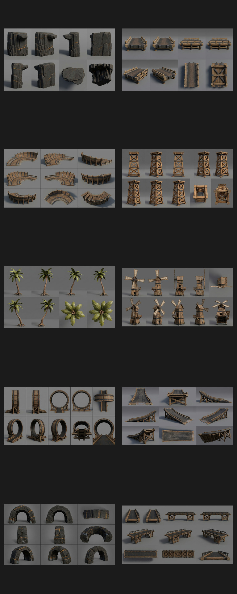
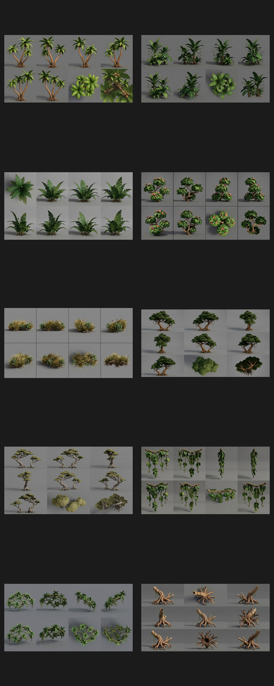
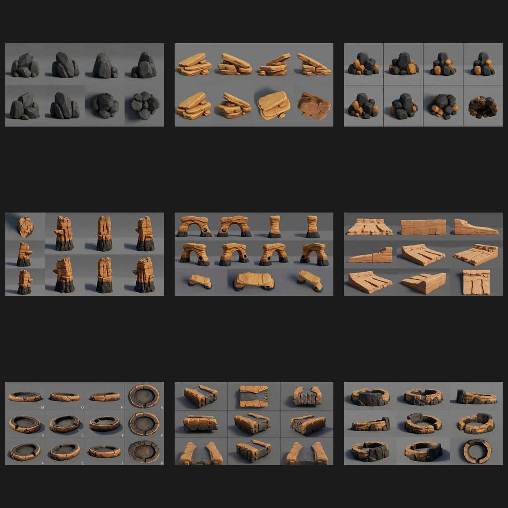
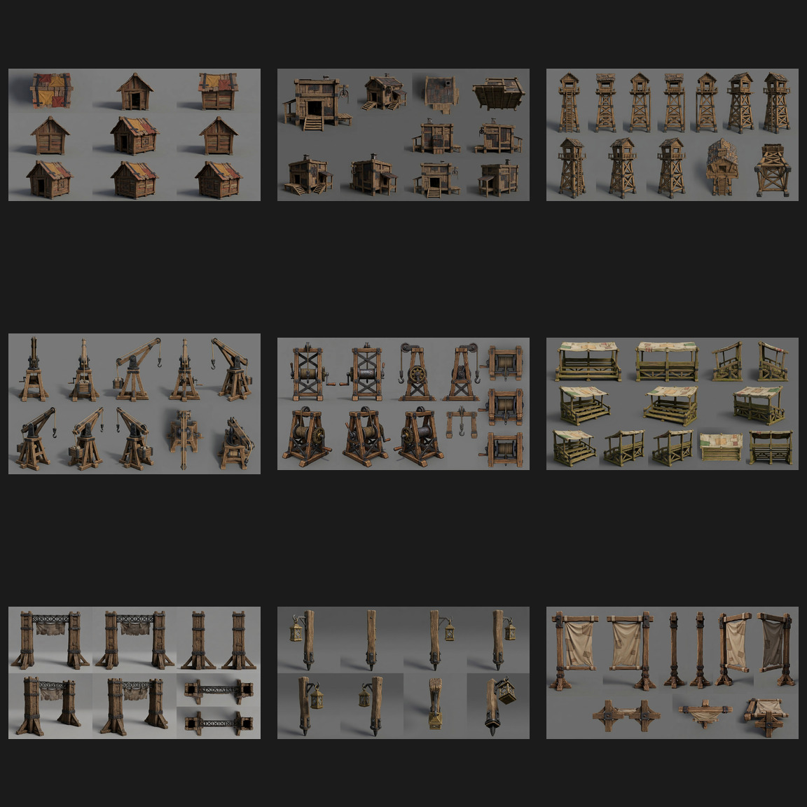
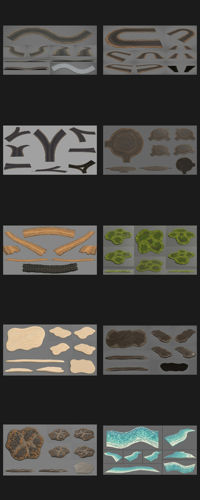
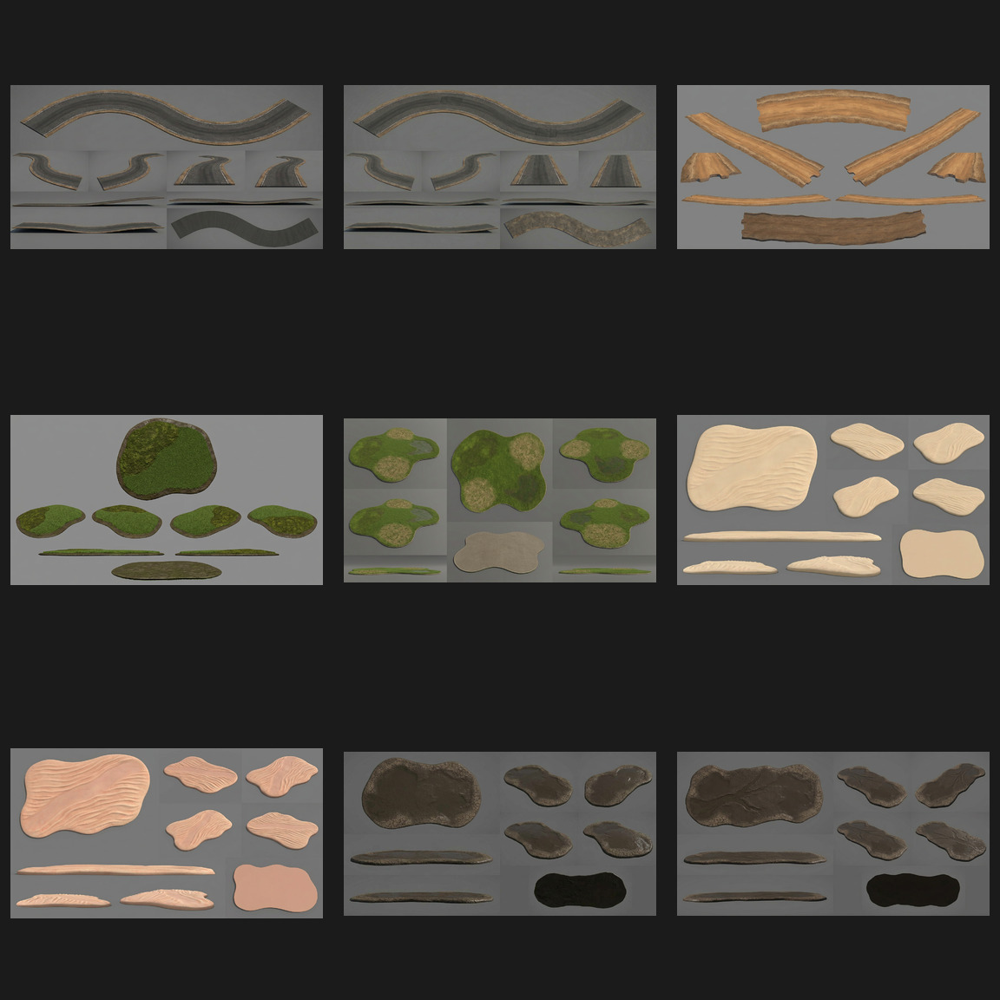

# Basalt Isle high-fidelity Meshy references

These are multi-angle, single-object reference sheets governed by [`docs/ISLAND_HIGH_FIDELITY_STYLE_BIBLE.md`](../../../docs/ISLAND_HIGH_FIDELITY_STYLE_BIBLE.md). Production dimensions, comparisons to the 1 m racing ball / 9 m standard road, and balanced triangle/LOD budgets are defined in [`docs/ISLAND_ASSET_SCALE_AND_TRIANGLE_BUDGET.md`](../../../docs/ISLAND_ASSET_SCALE_AND_TRIANGLE_BUDGET.md). Generated sheets communicate design and shape; the scale registry controls final cleanup.

Finish and approve the entire individual-object run first. A later image-generation pass will use these approved sheets as direct references for optimized modular combinations under [`docs/ISLAND_MODULAR_CLUSTER_STANDARD.md`](../../../docs/ISLAND_MODULAR_CLUSTER_STANDARD.md). Those clusters must remain readable close up and at distant LOD, with strong overlapping silhouettes, durable contact points, no floating thin geometry, and no unnecessary tiny holes.

## Batch 01 — benchmark set

| # | ID | Subject | Status | Review notes |
|---|---|---|---|---|
| 01 | `basalt-cliff-module` | Modular basalt cliff | pass | Eight readable views; coherent fractures, top and overhang; no decorative base. |
| 02 | `race-road-straight` | Straight road module | pass | Clear deck, connector ends, rails and underside bracing. Reads as a bridge-carried road module. |
| 03 | `race-road-banked-curve` | Banked curve module | pass | Nine views clearly describe curve, banking, outer wall and support structure. |
| 04 | `timber-trestle-tall` | Tall timber trestle bay | pass | Strong repeated cross-bracing, cap and structural feet; suitable benchmark construction grammar. |
| 05 | `palm-tall-leaning` | Tall leaning palm | pass | Useful cardinal, three-quarter, canopy-top and canopy-underside views; exposed roots, no sand base. |
| 06 | `goblin-windmill` | Goblin windmill | pass | Ten views with stable tower, blade, platform and rear-construction identity. |
| 07 | `vertical-loop` | Timber-and-iron vertical loop | pass | Side, through-opening, three-quarter, top and support views; clear approach/exit. Engineering dimensions still come from physics blockout. |
| 08 | `launch-ramp-reinforced` | Reinforced launch ramp | pass | Profile, approach, top and underside panels clearly expose launch angle and bracing. |
| 09 | `basalt-tunnel-entrance` | Basalt tunnel entrance | pass | Consistent arch, profiles, top and interior coverage; naturally open bottom with no terrain cookie. |
| 10 | `cliff-bridge-timber-iron` | Timber-and-iron cliff bridge | pass | Strong entry, broadside, three-quarter, top and underside coverage; readable truss and deck. |

## Batch 02 — modular vegetation clusters

| # | ID | Subject | Status | Review notes |
|---|---|---|---|---|
| 11 | `palm-cluster-three` | Three-palm cluster | pass | Strong varied-height silhouette, coherent roots, cardinal views and canopy coverage. |
| 12 | `jungle-understory-cluster` | Broadleaf understory | pass | Compact modular footprint with useful plant-height variation and top/underside views. |
| 13 | `fern-cluster-large` | Large fern cluster | pass | Clean repeatable fern module with strong crown consistency and no terrain base. |
| 14 | `flowering-shrub-cluster` | Flowering shrubs | pass | Readable woody structure, controlled coral accents, top and underside coverage. |
| 15 | `coastal-grass-cluster` | Coastal grass and scrub | pass | Regenerated without labels; eight clean views preserve the compact windswept module. |
| 16 | `broadleaf-tree-cluster` | Two-tree broadleaf cluster | pass | Strong interlocking canopy, exposed roots, readable branch and canopy views. |
| 17 | `windswept-highland-trees` | Wind-shaped highland pair | pass | Clear shared wind direction, sparse crown language, suitable for exposed upper slopes. |
| 18 | `hanging-vine-cluster` | Hanging vine curtain | pass | Multiple hanging silhouettes and useful top attachment views; no wall/support baked in. |
| 19 | `cliff-creeper-cluster` | Cliff creeper network | pass | Low modular creeping mass with varied silhouettes and no included cliff geometry. |
| 20 | `driftwood-root-cluster` | Driftwood/root dressing | pass | Stable root and broken-limb silhouette with complete radial/top coverage. |

## Batch 03 — rocks, coastal terrain, and waterfall geology

| # | ID | Subject | Status | Review notes |
|---|---|---|---|---|
| 21 | `basalt-boulder-cluster` | Basalt boulder cluster | pass | Strong size hierarchy and radial/top coverage; clean natural footprint. |
| 22 | `ochre-rock-slab-cluster` | Layered ochre slabs | pass | Readable eroded strata and low modular silhouette from eight views. |
| 23 | `scree-cluster-mixed` | Mixed scree cluster | pass | Stable basalt/ochre composition with useful top and underside views. |
| 24 | `sea-stack-hero` | Hero coastal sea stack | pass | Strong cardinal silhouette, basalt foot and ochre crown; no ocean or decorative base. |
| 25 | `natural-sea-arch` | Natural coastal arch | pass | Consistent opening and crown thickness with front/rear/profile/top coverage. |
| 26 | `beach-shelf-module` | Coastal shelf transition | pass | Clear land/water-facing profiles, modular edges and top surface. |
| 27 | `tide-pool-rock-ring` | Tide-pool surround | pass | Regenerated without labels; clean radial, top, and underside coverage preserves the overflow notch. |
| 28 | `waterfall-lip-rock-module` | Bare waterfall lip | pass | Channel, spill edge, profiles, connectors and top are clearly exposed. |
| 29 | `plunge-pool-rocks` | Plunge-pool surround | pass | Strong inflow/outflow gaps and radial/top coverage with no water baked in. |

## Batch 04 — settlement and race structures

| # | ID | Subject | Status | Review notes |
|---|---|---|---|---|
| 30 | `goblin-shack` | Small goblin shack | pass | Stable compact building identity, strong roof and wall coverage, no surrounding clutter. |
| 31 | `goblin-workshop-hut` | Medium workshop | pass | Clear platform, awning, chimney, pulley attachment, roof and underside views. |
| 32 | `race-watchtower` | Marshal watchtower | pass | Consistent cabin, tapered bracing, ladder/stair and platform coverage from ten angles. |
| 33 | `fixed-timber-crane` | Fixed goblin crane | pass | Plausible A-frame, boom, pulley, hook and winch with useful top/mechanism views. |
| 34 | `goblin-mine-hoist` | Compact mine hoist | pass | Robust frame, drum, crank and pulley remain thick and readable across views. |
| 35 | `grandstand-straight-bay` | Modular grandstand bay | pass | Empty seating, shade roof, connector ends and full support structure are clearly exposed. |
| 36 | `finish-gate-arch` | Blank finish gate | pass | Strong distant silhouette, clear opening, blank banner and structural feet; no lettering. |
| 37 | `goblin-lantern-post` | Unlit lantern post | pass | Thick LOD-safe post and arm, stable enclosed lantern, clean radial coverage. |
| 38 | `blank-race-banner` | Blank banner assembly | pass | Broad cloth, sturdy post/bars, clear edge/top/underside views and no symbols. |

## Batch 05 — terrain-conforming road and environment carpets

| # | ID | Subject | Status | Review notes |
|---|---|---|---|---|
| 39 | `road-carpet-long-s-curve` | Long S-curve road plane | pass | Strong continuous road silhouette, open connectors, top/grazing/underside coverage. |
| 40 | `road-carpet-hairpin` | Flat hairpin road plane | pass | Clear constant-width 180° path with durable curve and thin profile. |
| 41 | `road-carpet-y-fork` | Y-fork road plane | pass | Broad trunk and branches, large central negative space, clean modular ends. |
| 42 | `road-carpet-arena-blob` | Broad race plaza carpet | pass | Thick rounded footprint and three sturdy connector necks; no fragile holes. |
| 43 | `dirt-path-carpet-curved` | Narrow curved dirt path | pass | Long reusable profile with readable top material and thin deformable construction. |
| 44 | `grass-moss-carpet-blob` | Grass/moss surface patch | pass | Strong organic outline, broad material zones, flat LOD-safe profile. |
| 45 | `sand-carpet-wind-swept` | Wind-swept sand patch | pass | Broad ripple language, rounded outline and useful top/profile views. |
| 46 | `mud-runoff-carpet` | Wet mud/runoff patch | pass | Durable irregular footprint with broad roughness-driven wet/dry regions. |
| 47 | `scree-ground-carpet` | Embedded scree ground patch | pass | Shallow relief and readable stone breakup without becoming a boulder cluster. |
| 48 | `shallow-water-foam-carpet` | Shallow-water/foam ribbon | pass with cleanup constraint | Useful outline and foam direction; production mesh must be flattened and shader-driven rather than preserving generated wave thickness. |

## Batch 06 — small and large carpet scale variants

Reference sheets normalize framing so each object can be inspected. Their actual relative sizes are controlled by the scale registry, not by apparent size within the sheet.

| # | ID | Subject | Status | Review notes |
|---|---|---|---|---|
| 49 | `road-carpet-short-s-curve` | Small two-lane S-curve | pass | Compact 6 × 12 m counterpart to the 9 × 30 m original; clear connectors and thin profile. |
| 50 | `road-carpet-extra-long-curve` | Extra-long road curve | pass | 9 × 60 m large hillside ribbon; broad curve and exact standard-road width. |
| 51 | `dirt-path-carpet-small` | Small dirt-path patch | pass | Short 3 × 8 m secondary path with durable edges and low profile. |
| 52 | `grass-moss-carpet-small` | Small grass/moss patch | pass | Compact 4 × 3 m patch for local seam hiding and small biome breakup. |
| 53 | `grass-meadow-carpet-large` | Large meadow patch | pass | Broad 30 × 22 m zone with large material masses and no small holes. |
| 54 | `sand-drift-carpet-small` | Small sand drift | pass | Compact 5 × 3 m drift with LOD-safe ripples and rounded outline. |
| 55 | `sand-dune-carpet-large` | Large dune patch | pass | Broad 32 × 24 m dune field; large ripple/swale language and durable boundary. |
| 56 | `mud-puddle-carpet-small` | Small wet-mud patch | pass | Compact 4 × 3 m roughness-driven wet patch with no droplets or thin fingers. |
| 57 | `mud-runoff-carpet-large` | Large runoff patch | pass | Broad 24 × 12 m runoff zone with simple continuous material masses. |
| 58 | `scree-ground-carpet-small` | Small scree patch | **pending** | The tenth generation failed and the per-turn cap was reached; generate after refresh. |

## Shared review result

- One object identity per sheet with multiple useful angles.
- Neutral grey floor/background and no visible environmental horizon.
- Neutral, broadly consistent studio lighting.
- No presentation plinths or decorative terrain bases.
- No text, dimensions, arrows, characters, or environmental scenery.
- All sheets remain concept references: Meshy output still requires scale correction, retopology, UV/PBR validation, LODs, and collision.
