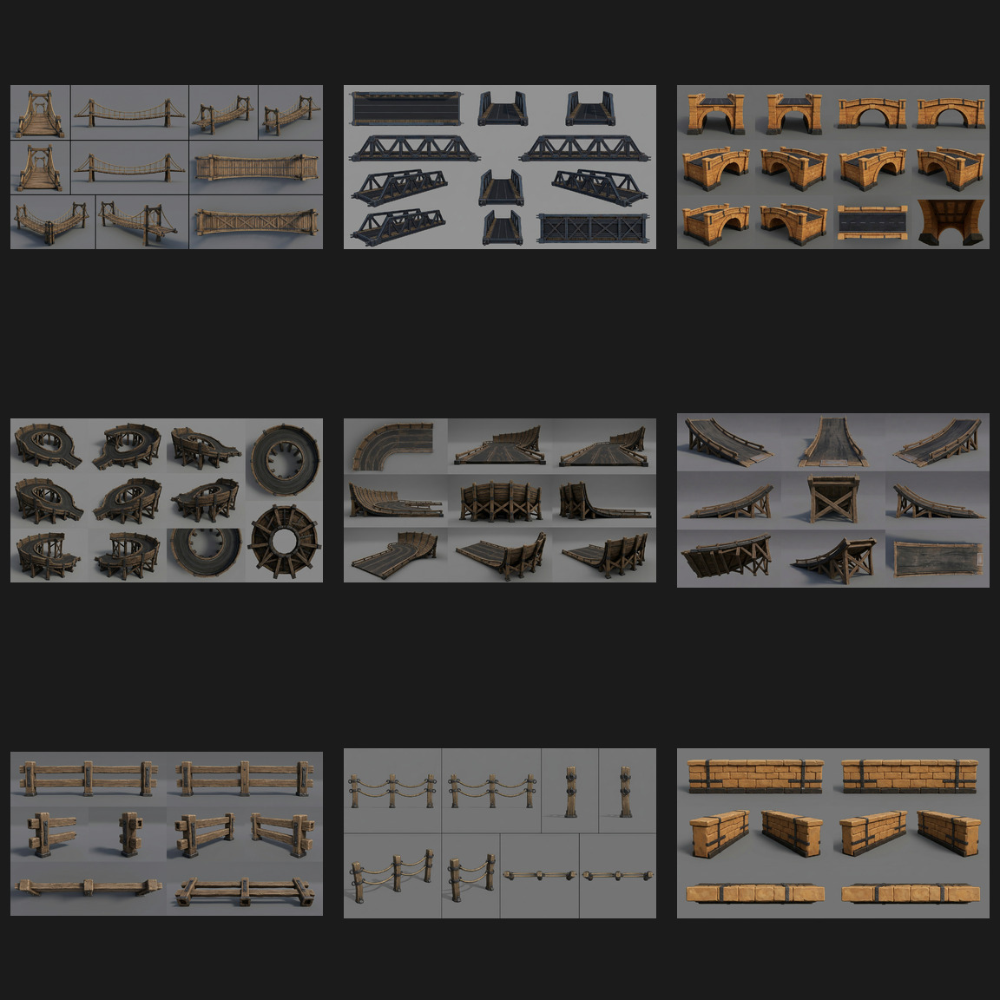
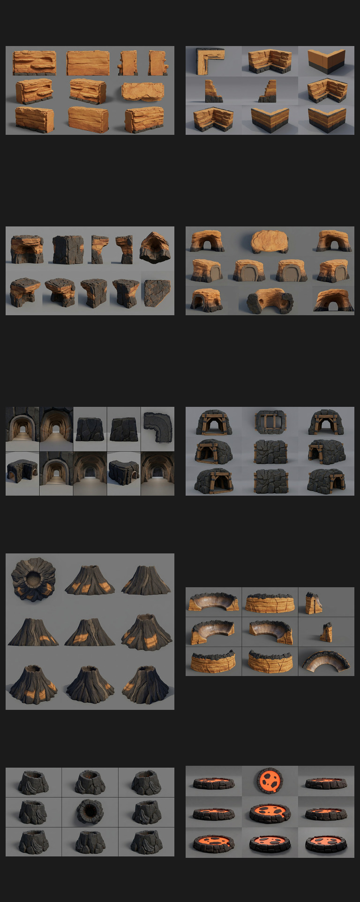
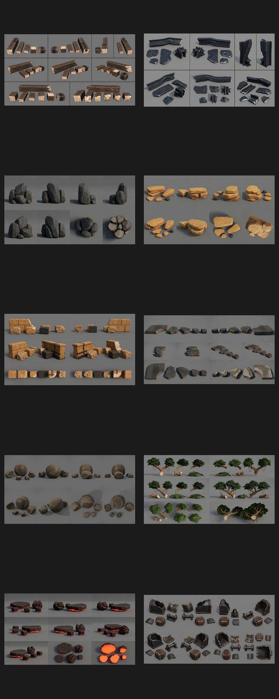
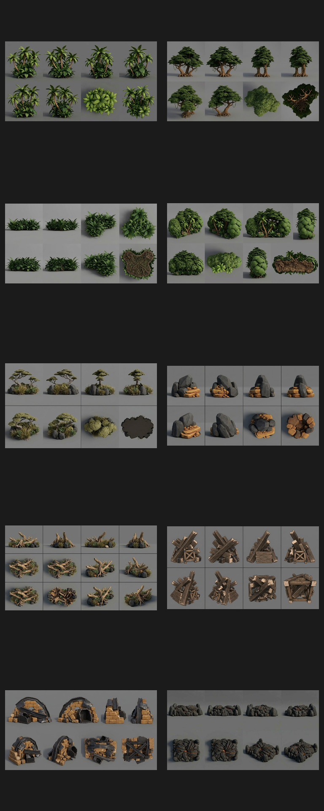
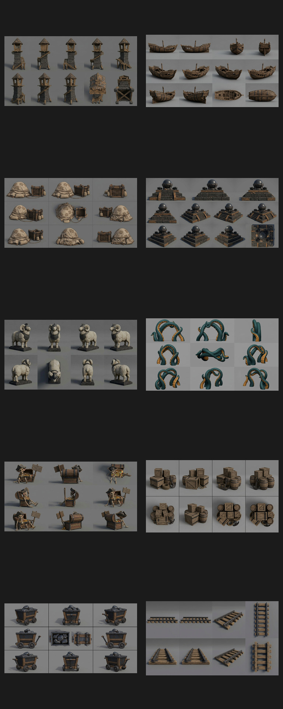
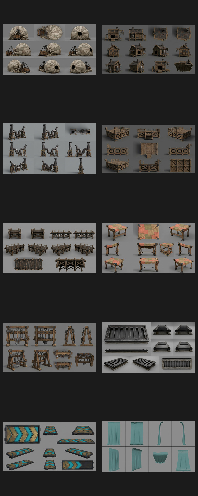
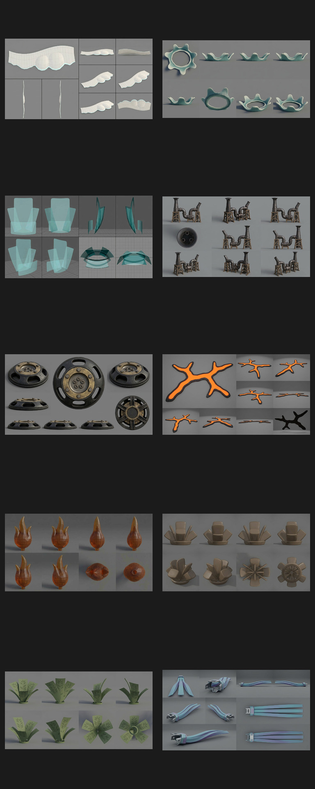
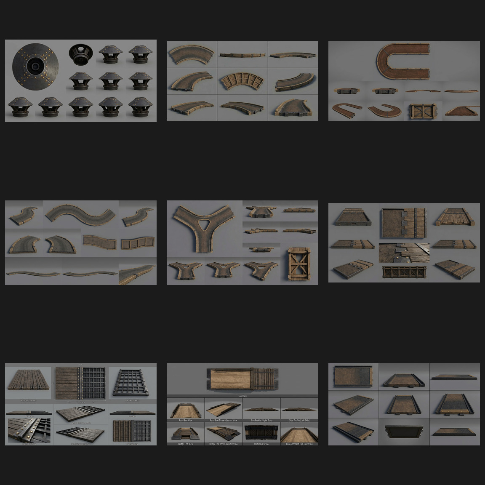

# Basalt Isle high-fidelity Meshy references

These are multi-angle, single-object reference sheets governed by [`docs/ISLAND_HIGH_FIDELITY_STYLE_BIBLE.md`](../../../docs/ISLAND_HIGH_FIDELITY_STYLE_BIBLE.md). Production dimensions, comparisons to the 1 m racing ball / 9 m standard road, and balanced triangle/LOD budgets are defined in [`docs/ISLAND_ASSET_SCALE_AND_TRIANGLE_BUDGET.md`](../../../docs/ISLAND_ASSET_SCALE_AND_TRIANGLE_BUDGET.md). Generated sheets communicate design and shape; the scale registry controls final cleanup.

Finish and approve the entire individual-object run first. A later image-generation pass will use these approved sheets as direct references for optimized modular combinations under [`docs/ISLAND_MODULAR_CLUSTER_STANDARD.md`](../../../docs/ISLAND_MODULAR_CLUSTER_STANDARD.md). Those clusters must remain readable close up and at distant LOD, with strong overlapping silhouettes, durable contact points, no floating thin geometry, and no unnecessary tiny holes.

## Batch 01 — benchmark set

| # | ID | Subject | Status | Review notes |
|---|---|---|---|---|
| 01 | `basalt-cliff-module` | Modular basalt cliff | pass | Eight readable views; coherent fractures, top and overhang; no decorative base. |
| 02 | `race-road-straight` | Straight road module | pass | Clear deck, connector ends, rails and underside bracing. Reads as a bridge-carried road module. |
| 03 | `race-road-banked-curve` | Banked curve module | pass | Nine views clearly describe curve, banking, outer wall and support structure. |
| 04 | `timber-trestle-tall` | Tall timber trestle bay | pass | Strong repeated cross-bracing, cap and structural feet; suitable benchmark construction grammar. |
| 05 | `palm-tall-leaning` | Tall leaning palm | pass | Useful cardinal, three-quarter, canopy-top and canopy-underside views; exposed roots, no sand base. |
| 06 | `goblin-windmill` | Goblin windmill | pass | Ten views with stable tower, blade, platform and rear-construction identity. |
| 07 | `vertical-loop` | Timber-and-iron vertical loop | pass | Side, through-opening, three-quarter, top and support views; clear approach/exit. Engineering dimensions still come from physics blockout. |
| 08 | `launch-ramp-reinforced` | Reinforced launch ramp | pass | Profile, approach, top and underside panels clearly expose launch angle and bracing. |
| 09 | `basalt-tunnel-entrance` | Basalt tunnel entrance | pass | Consistent arch, profiles, top and interior coverage; naturally open bottom with no terrain cookie. |
| 10 | `cliff-bridge-timber-iron` | Timber-and-iron cliff bridge | pass | Strong entry, broadside, three-quarter, top and underside coverage; readable truss and deck. |

## Batch 02 — modular vegetation clusters

| # | ID | Subject | Status | Review notes |
|---|---|---|---|---|
| 11 | `palm-cluster-three` | Three-palm cluster | pass | Strong varied-height silhouette, coherent roots, cardinal views and canopy coverage. |
| 12 | `jungle-understory-cluster` | Broadleaf understory | pass | Compact modular footprint with useful plant-height variation and top/underside views. |
| 13 | `fern-cluster-large` | Large fern cluster | pass | Clean repeatable fern module with strong crown consistency and no terrain base. |
| 14 | `flowering-shrub-cluster` | Flowering shrubs | pass | Readable woody structure, controlled coral accents, top and underside coverage. |
| 15 | `coastal-grass-cluster` | Coastal grass and scrub | pass | Regenerated without labels; eight clean views preserve the compact windswept module. |
| 16 | `broadleaf-tree-cluster` | Two-tree broadleaf cluster | pass | Strong interlocking canopy, exposed roots, readable branch and canopy views. |
| 17 | `windswept-highland-trees` | Wind-shaped highland pair | pass | Clear shared wind direction, sparse crown language, suitable for exposed upper slopes. |
| 18 | `hanging-vine-cluster` | Hanging vine curtain | pass | Multiple hanging silhouettes and useful top attachment views; no wall/support baked in. |
| 19 | `cliff-creeper-cluster` | Cliff creeper network | pass | Low modular creeping mass with varied silhouettes and no included cliff geometry. |
| 20 | `driftwood-root-cluster` | Driftwood/root dressing | pass | Stable root and broken-limb silhouette with complete radial/top coverage. |

## Batch 03 — rocks, coastal terrain, and waterfall geology

| # | ID | Subject | Status | Review notes |
|---|---|---|---|---|
| 21 | `basalt-boulder-cluster` | Basalt boulder cluster | pass | Strong size hierarchy and radial/top coverage; clean natural footprint. |
| 22 | `ochre-rock-slab-cluster` | Layered ochre slabs | pass | Readable eroded strata and low modular silhouette from eight views. |
| 23 | `scree-cluster-mixed` | Mixed scree cluster | pass | Stable basalt/ochre composition with useful top and underside views. |
| 24 | `sea-stack-hero` | Hero coastal sea stack | pass | Strong cardinal silhouette, basalt foot and ochre crown; no ocean or decorative base. |
| 25 | `natural-sea-arch` | Natural coastal arch | pass | Consistent opening and crown thickness with front/rear/profile/top coverage. |
| 26 | `beach-shelf-module` | Coastal shelf transition | pass | Clear land/water-facing profiles, modular edges and top surface. |
| 27 | `tide-pool-rock-ring` | Tide-pool surround | pass | Regenerated without labels; clean radial, top, and underside coverage preserves the overflow notch. |
| 28 | `waterfall-lip-rock-module` | Bare waterfall lip | pass | Channel, spill edge, profiles, connectors and top are clearly exposed. |
| 29 | `plunge-pool-rocks` | Plunge-pool surround | pass | Strong inflow/outflow gaps and radial/top coverage with no water baked in. |

## Batch 04 — settlement and race structures

| # | ID | Subject | Status | Review notes |
|---|---|---|---|---|
| 30 | `goblin-shack` | Small goblin shack | pass | Stable compact building identity, strong roof and wall coverage, no surrounding clutter. |
| 31 | `goblin-workshop-hut` | Medium workshop | pass | Clear platform, awning, chimney, pulley attachment, roof and underside views. |
| 32 | `race-watchtower` | Marshal watchtower | pass | Consistent cabin, tapered bracing, ladder/stair and platform coverage from ten angles. |
| 33 | `fixed-timber-crane` | Fixed goblin crane | pass | Plausible A-frame, boom, pulley, hook and winch with useful top/mechanism views. |
| 34 | `goblin-mine-hoist` | Compact mine hoist | pass | Robust frame, drum, crank and pulley remain thick and readable across views. |
| 35 | `grandstand-straight-bay` | Modular grandstand bay | pass | Empty seating, shade roof, connector ends and full support structure are clearly exposed. |
| 36 | `finish-gate-arch` | Blank finish gate | pass | Strong distant silhouette, clear opening, blank banner and structural feet; no lettering. |
| 37 | `goblin-lantern-post` | Unlit lantern post | pass | Thick LOD-safe post and arm, stable enclosed lantern, clean radial coverage. |
| 38 | `blank-race-banner` | Blank banner assembly | pass | Broad cloth, sturdy post/bars, clear edge/top/underside views and no symbols. |

## Batch 05 — terrain-conforming road and environment carpets

| # | ID | Subject | Status | Review notes |
|---|---|---|---|---|
| 39 | `road-carpet-long-s-curve` | Long S-curve road plane | pass | Strong continuous road silhouette, open connectors, top/grazing/underside coverage. |
| 40 | `road-carpet-hairpin` | Flat hairpin road plane | pass | Clear constant-width 180° path with durable curve and thin profile. |
| 41 | `road-carpet-y-fork` | Y-fork road plane | pass | Broad trunk and branches, large central negative space, clean modular ends. |
| 42 | `road-carpet-arena-blob` | Broad race plaza carpet | pass | Thick rounded footprint and three sturdy connector necks; no fragile holes. |
| 43 | `dirt-path-carpet-curved` | Narrow curved dirt path | pass | Long reusable profile with readable top material and thin deformable construction. |
| 44 | `grass-moss-carpet-blob` | Grass/moss surface patch | pass | Strong organic outline, broad material zones, flat LOD-safe profile. |
| 45 | `sand-carpet-wind-swept` | Wind-swept sand patch | pass | Broad ripple language, rounded outline and useful top/profile views. |
| 46 | `mud-runoff-carpet` | Wet mud/runoff patch | pass | Durable irregular footprint with broad roughness-driven wet/dry regions. |
| 47 | `scree-ground-carpet` | Embedded scree ground patch | pass | Shallow relief and readable stone breakup without becoming a boulder cluster. |
| 48 | `shallow-water-foam-carpet` | Shallow-water/foam ribbon | pass with cleanup constraint | Useful outline and foam direction; production mesh must be flattened and shader-driven rather than preserving generated wave thickness. |

## Batch 06 — small and large carpet scale variants

Reference sheets normalize framing so each object can be inspected. Their actual relative sizes are controlled by the scale registry, not by apparent size within the sheet.

| # | ID | Subject | Status | Review notes |
|---|---|---|---|---|
| 49 | `road-carpet-short-s-curve` | Small two-lane S-curve | pass | Compact 6 × 12 m counterpart to the 9 × 30 m original; clear connectors and thin profile. |
| 50 | `road-carpet-extra-long-curve` | Extra-long road curve | pass | 9 × 60 m large hillside ribbon; broad curve and exact standard-road width. |
| 51 | `dirt-path-carpet-small` | Small dirt-path patch | pass | Short 3 × 8 m secondary path with durable edges and low profile. |
| 52 | `grass-moss-carpet-small` | Small grass/moss patch | pass | Compact 4 × 3 m patch for local seam hiding and small biome breakup. |
| 53 | `grass-meadow-carpet-large` | Large meadow patch | pass | Broad 30 × 22 m zone with large material masses and no small holes. |
| 54 | `sand-drift-carpet-small` | Small sand drift | pass | Compact 5 × 3 m drift with LOD-safe ripples and rounded outline. |
| 55 | `sand-dune-carpet-large` | Large dune patch | pass | Broad 32 × 24 m dune field; large ripple/swale language and durable boundary. |
| 56 | `mud-puddle-carpet-small` | Small wet-mud patch | pass | Compact 4 × 3 m roughness-driven wet patch with no droplets or thin fingers. |
| 57 | `mud-runoff-carpet-large` | Large runoff patch | pass | Broad 24 × 12 m runoff zone with simple continuous material masses. |
| 58 | `scree-ground-carpet-small` | Small scree patch | pass | Regenerated successfully; compact 4 × 3 m shallow-relief patch with clean top/profile coverage. |

## Batch 07 — bridge, stunt, and barrier expansion

| # | ID | Subject | Status | Review notes |
|---|---|---|---|---|
| 59 | `rope-suspension-bridge` | Two-lane rope bridge | pass | Thick LOD-safe cables, readable towers, sagging deck, side and underside coverage. |
| 60 | `iron-girder-bridge` | Three-lane iron bridge | pass | Strong truss bays, deck, connector ends and fully readable underside structure. |
| 61 | `stone-arch-race-bridge` | Stone arch bridge | pass | Broad durable opening, thick masonry and consistent radial/top/underside views. |
| 62 | `corkscrew-descent-module` | Helical descent | pass with engineering constraint | Strong circular silhouette and supported route; exact drop, pitch and connectors must be rebuilt from the physics blockout. |
| 63 | `banked-wall-ride-module` | Banked wall ride | pass | Banking transition, outer support ribs, top and approach views are clearly defined. |
| 64 | `landing-ramp-reinforced` | Gap-jump landing ramp | pass | Concave receiving profile, flat exit, side/underside bracing and durable lip. |
| 65 | `timber-guardrail-module` | Timber guardrail | pass | Thick repeatable rails/posts with clear end sockets and no fragile details. |
| 66 | `rope-post-barrier-module` | Rope/post barrier | pass | Broad rope sag and stout posts remain readable from all required views. |
| 67 | `stone-parapet-module` | Stone parapet | pass | Large block rhythm, iron reinforcement, clean modular ends and durable top profile. |

## Batch 08 — volcanic terrain, cliffs, and caves

| # | ID | Subject | Status | Review notes |
|---|---|---|---|---|
| 68 | `ochre-cliff-straight-module` | Straight layered cliff | pass | Strong strata, ledges, top and connector sides with a durable rectangular module. |
| 69 | `cliff-inner-corner-module` | Concave cliff corner | pass | Clear 90° interior corner and matching modular end profiles. |
| 70 | `cliff-outer-corner-overhang` | Convex overhanging cliff | pass | Thick readable overhang, broad support mass and useful underside views. |
| 71 | `sea-cave-mouth-module` | Coastal cave mouth | pass | Broad opening, thick crown, rear connector and wave-worn interior coverage. |
| 72 | `cave-interior-bend-module` | 90° cave bend | pass with cleanup constraint | Passage and bend read clearly; final shell must be rebuilt to exact clearance with hidden exterior faces removed. |
| 73 | `timber-braced-mine-mouth` | Reinforced mine entrance | pass | Thick portal frames and rock shell remain consistent across opening/rear/side views. |
| 74 | `volcano-summit-cone` | Volcanic summit | pass | Strong crater, radial ridges, four-side silhouette and top coverage. |
| 75 | `crater-rim-segment` | Modular crater rim | pass | Durable curved segment, basalt crown, ochre outer wall and clean repeatable ends. |
| 76 | `volcanic-lava-vent` | Compact lava vent | pass | Broad central opening and cooled folds with restrained separate emissive direction. |
| 77 | `lava-pool-surround` | Lava-pool ring and insert | pass with separation constraint | Rock ring and emissive surface are readable; production lava insert must remain a separate flat shader mesh. |

## Batch 09 — impact-destruction chunk families

| # | ID | Subject | Status | Review notes |
|---|---|---|---|---|
| 78 | `timber-debris-chunk-family` | Timber chunks | pass | Broad beams, plank blocks and fresh end grain; no needle splinters. |
| 79 | `iron-debris-chunk-family` | Iron fragments | pass | Thick bent girders/plates and bracket pieces with durable torn silhouettes. |
| 80 | `basalt-debris-chunk-family` | Basalt fragments | pass with separation constraint | Strong closed rock forms; production kit must separate the six approved chunks rather than retain grouped contact. |
| 81 | `ochre-rock-debris-family` | Layered rock chunks | pass | Clear strata-aligned slabs and fresh fracture faces across size classes. |
| 82 | `masonry-debris-chunk-family` | Masonry rubble | pass | Block, bonded-wall and iron-strapped fragments provide useful collapse hierarchy. |
| 83 | `road-surface-debris-family` | Road crust chunks | pass | Thick compacted-surface slabs and aggregate interiors remain LOD-readable. |
| 84 | `dirt-clod-debris-family` | Dirt/mud clods | pass | Broad rounded clods with simple wet/dry breakup; no thin flakes. |
| 85 | `foliage-debris-chunk-family` | Branch/frond chunks | pass | Attached canopy masses and thick broken stems; production kit omits isolated leaves. |
| 86 | `lava-crust-debris-family` | Lava-crust fragments | pass | Thick dark crust plates and separate emissive fracture direction; no particle geometry. |
| 87 | `machinery-debris-chunk-family` | Machine fragments | pass | Broad housing, axle, bracket and casing pieces with no loose micro-fasteners. |

All destruction families are governed by [`docs/ISLAND_DESTRUCTION_AND_CHUNK_STANDARD.md`](../../../docs/ISLAND_DESTRUCTION_AND_CHUNK_STANDARD.md). The carved/sculpted result is authoritative; these reusable chunks provide pooled impact presentation.

## Batch 10 — dense coverage and texture-bake masses

| # | ID | Subject | Status | Review notes |
|---|---|---|---|---|
| 88 | `dense-palm-grove-coverage` | Dense palm grove | pass | Strong perimeter palms, compact root zone and opaque understory/canopy core. |
| 89 | `dense-broadleaf-forest-coverage` | Broadleaf forest mass | pass | Interlocking canopy lobes and thick trunks form a stable distant silhouette. |
| 90 | `dense-fern-understory-coverage` | Fern/understory mat | pass | Low continuous coverage with recognizable perimeter ferns and dense texture-ready center. |
| 91 | `dense-jungle-edge-coverage` | Mixed jungle edge | pass | Dense palm/broadleaf edge with thick overlapping end lobes and strong elevated-camera top view. |
| 92 | `dense-highland-scrub-coverage` | Windswept scrub field | pass | Shared wind direction, broad rock/grass base and durable sparse-tree contour. |
| 93 | `dense-rock-scree-field-coverage` | Rock/scree field | pass | Large perimeter rocks and tightly merged interior rubble eliminate micro gaps. |
| 94 | `dense-beach-driftwood-coverage` | Driftwood beach pile | pass | Overlapping roots/trunks create broad close and distant silhouettes without loose sticks. |
| 95 | `dense-timber-scrap-pile-coverage` | Timber scrap pile | pass | Strong diagonal beam hierarchy and compact texture-bake-ready interior. |
| 96 | `dense-masonry-salvage-pile-coverage` | Masonry/industrial salvage | pass | Broad masonry steps and iron arcs surround a dense low-hole center. |
| 97 | `dense-lava-rubble-coverage` | Lava rubble field | pass | Continuous crust mass, strong perimeter rocks and restrained broad emissive creases. |

All coverage assets are governed by [`docs/ISLAND_DENSE_COVERAGE_STANDARD.md`](../../../docs/ISLAND_DENSE_COVERAGE_STANDARD.md). Production meshes retain selected perimeter hero forms, replace the dense center with optimized shells/textures, and use aggressive LOD/impostors.

## Batch 11 — landmarks, secrets, and utility props

| # | ID | Subject | Status | Review notes |
|---|---|---|---|---|
| 98 | `goblin-lighthouse` | Crooked coastal lighthouse | pass | Strong tower silhouette with external stairs, lantern room, radial and underside coverage. |
| 99 | `shipwreck-hull` | Broken sailing hull | pass | Stable broadside/bow/stern/interior identity and connected LOD-safe ribs. |
| 100 | `crashed-goblin-balloon` | Deflated balloon wreck | pass | Regenerated with unmistakable radial canvas gores, crown opening, gathered neck, basket and rigging. |
| 101 | `goblin-marble-shrine` | Marble-idol shrine | pass | Strong stepped altar, sphere and paired brazier hierarchy with useful top view. |
| 102 | `armored-sheep-statue` | Armored sheep monument | pass | Stable heroic sheep silhouette and actual monument plinth; armor should be clarified during cleanup. |
| 103 | `kraken-tentacle-arch` | Three-tentacle arch | pass | Broad LOD-safe curves, large suckers and race-clear negative space. |
| 104 | `skeleton-treasure-setpiece` | Skeleton and treasure | pass | Connected storytelling silhouette, blank sign and grouped LOD-safe treasure details. |
| 105 | `dock-supply-cluster` | Crates, barrels, rope and anchor | pass | Dense asymmetrical utility cluster with strong top and perimeter silhouettes. |
| 106 | `goblin-ore-cart` | Loaded mine cart | pass | Stable hopper, wheel, axle and ore identity from all required views. |
| 107 | `modular-mine-rail-segment` | Straight mine rail | pass | Exact repeatable form with open sleepers, approach/end and top/underside coverage. |

## Batch 12 — industrial, settlement, track-detail, and VFX support

| # | ID | Subject | Status | Review notes |
|---|---|---|---|---|
| 108 | `goblin-foundry-hut` | Compact foundry hut | pass | Stable workshop/furnace mass, chimney, open front, roof and underside coverage. |
| 109 | `industrial-chimney-pipe-cluster` | Chimney and pipe cluster | pass | Thick connected pipe routing and broad stacks remain readable through LOD. |
| 110 | `work-platform-module` | Raised work platform | pass | Strong modular deck, broad stair, cross-bracing and useful top/underside views. |
| 111 | `dock-pier-segment` | Modular pier | pass | Exact deck connectors, stout piles, side/underside bracing and bollard rhythm. |
| 112 | `patched-market-awning` | Cloth work awning | pass | Broad connected canvas, clear four-post silhouette and stable patch layout. |
| 113 | `goblin-tool-rack` | Connected tool rack | pass | Thick LOD-safe tool silhouettes, stable rack and complete radial coverage. |
| 114 | `track-drainage-grate` | Road-flush grate | pass | Broad bars, frame, catch channel and exact top/profile/underside definition. |
| 115 | `track-boost-inlay` | Boost-pad inlay | pass | Clean flush frame, three broad chevrons and separate dim emissive channels. |
| 116 | `waterfall-sheet-mesh` | Shader-ready waterfall ribbon | pass with shader constraint | Geometry provides only broad flow silhouette; opacity, scrolling water, foam and motion remain shader/VFX work. |

## Batch 13 — runtime VFX support geometry

| # | ID | Subject | Status | Review notes |
|---|---|---|---|---|
| 117 | `shoreline-foam-ribbon-mesh` | Foam edge ribbon | pass | Clean scalloped outline and thin regular shader-ready surface. |
| 118 | `waterfall-splash-ring-mesh` | Splash ring | pass | Broad connected lobes and low center sheet with no tiny droplets. |
| 119 | `mist-card-cluster` | Mist card volume | pass | Simple intersecting translucent cards with complete radial/top coverage. |
| 120 | `smoke-emitter-housing` | Chimney emitter cap | pass after regeneration | Isolated compact cap now has a clear mounting collar, vent openings, emitter socket and consistent radial views. |
| 121 | `steam-vent-emitter` | Ground steam vent | pass | Strong flush collar, broad holes, brass insert and emitter socket layout. |
| 122 | `lava-crack-decal-mesh` | Emissive crack decal | pass | Thick branching shape with no micro tendrils and clear top/grazing views. |
| 123 | `lantern-flame-insert` | Flame/glow insert | pass | Broad three-tongue silhouette and compact mounting socket; runtime emissive/flicker remains separate. |
| 124 | `impact-dust-card-cluster` | Dust burst cards | pass with cleanup constraint | Useful radial mass; production must preserve intersecting card construction rather than solid petal volume. |
| 125 | `leaf-burst-card-cluster` | Foliage burst cards | pass | Broad grouped leaf cards and radial layout suitable for spin/fade animation. |
| 126 | `boost-trail-ribbon-cluster` | Boost trail ribbons | pass | Three clean tapered ribbons with shared mount and useful side/top profiles. |

## Batch 14 — modular road shapes and material transitions

| # | ID | Subject | Status | Review notes |
|---|---|---|---|---|
| 127 | `race-road-gentle-curve` | 30-degree road curve | pass | Exact broad curve, readable connector ends, complete underside and restrained repair structure. |
| 128 | `race-road-tight-curve` | Tight hairpin road | pass with dimensional correction | Strong U-turn silhouette and clear underside; production spline must enforce the registered 150-degree turn and 8 m lane width. |
| 129 | `race-road-s-curve` | Equal opposing bends | pass | Clean S silhouette, parallel ends and useful profile/underside coverage. |
| 130 | `race-road-split-junction` | Symmetric Y split | pass | Broad junction, three clean connectors and stable triangular negative space. |
| 131 | `race-road-merge-junction` | Asymmetric merge | **pending generation** | Generator returned no image before the per-turn limit; reserve this ID for the next batch. |
| 132 | `road-transition-dirt-to-timber` | Dirt to deck | pass | Clear stepped material handoff, broad connector bands and structural underside. |
| 133 | `road-transition-timber-to-iron` | Timber to iron grate | **weak—regenerate** | Geometry is useful, but generated sheet contains forbidden labels. |
| 134 | `road-transition-bridge-approach` | Dirt to raised bridge deck | **weak—regenerate** | Layout is useful, but generated sheet contains forbidden view labels and must be replaced. |
| 135 | `road-transition-tunnel-approach` | Dirt to tunnel floor | **weak—regenerate** | Clean modular tray, but the basalt-floor handoff is not distinct enough from a generic road segment. |

## Shared review result

- One object identity per sheet with multiple useful angles.
- Neutral grey floor/background and no visible environmental horizon.
- Neutral, broadly consistent studio lighting.
- No presentation plinths or decorative terrain bases.
- No text, dimensions, arrows, characters, or environmental scenery.
- All sheets remain concept references: Meshy output still requires scale correction, retopology, UV/PBR validation, LODs, and collision.
