# Basalt Isle seamless PBR material references

These sheets establish material breakup, color range, weathering scale, and channel intent for the high-fidelity island kit. They are **derivation references**, not engine-ready textures.

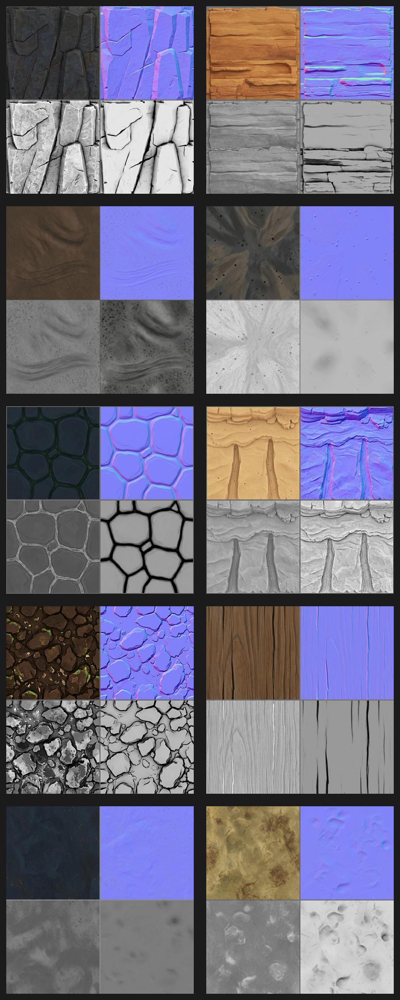

## Four-square convention

Every sheet uses the same fixed 2 × 2 arrangement:

| Position | Channel | Authoring requirement |
|---|---|---|
| Top left | BaseColor | Linear material color only; no baked direct light, highlights, cast shadows, or AO |
| Top right | Normal | Tangent-space RGB normal; DirectX/OpenGL green-channel orientation must be selected during implementation |
| Bottom left | Roughness | Linear grayscale roughness; white is rough, black is smooth |
| Bottom right | AO / height reference | Grayscale form guide; derive separate AO and height maps rather than packing this image directly |

Generated maps may look coordinated but are not mathematically derived from one height field. Production artists must rebuild/bake the channels, remove gutters, make the crop exactly square, verify edge continuity with a 3 × 3 tile test, remove baked lighting, and validate normal vectors before import. Every delivered textured material requires BaseColor, Normal, Roughness, and AO. Add Height and Metallic where the material class needs them.

## Material Batch 01 — terrain and structural foundations

| ID | Material | Primary use | Recommended real-world coverage | Status and production note |
|---|---|---|---:|---|
| M001 | Basalt cliff | Cliffs, cave mouths, boulders | `4 × 4 m` | Pass as derivation reference. Strong broad plates; rebuild cracks from one shared height source. |
| M002 | Ochre layered cliff | Dry cliffs, shelves, strata | `4 × 4 m` | Pass. Good horizontal strata; use macro variation to avoid visible band repetition. |
| M003 | Compacted race dirt | Main drivable road | `4 × 4 m` | Weak—regenerate. Useful color/roughness range, but the radial swirl is too directional and will expose tiling. |
| M004 | Volcanic ash and cinder | Crater slopes, soot beds | `3 × 3 m` | Weak—regenerate. The starburst flow is unsuitable for a seamless general-purpose tile. |
| M005 | Wet coastal basalt | Tide pools, wet cliff feet | `3 × 3 m` | Pass with shape constraint. Keep broad eroded cells irregular and break the cobble-like repetition with macro masks. |
| M006 | Tropical beach sand | Beach shelves, sandbars | `3 × 3 m` | Weak—regenerate. Color is useful, but deep slab-like cuts must become shallow wind ripples. |
| M007 | Mossy jungle soil | Forest floor, humid banks | `2 × 2 m` | Weak—regenerate. Current breakup reads as loose rubble; production needs compact loam with decomposed organic staining. |
| M008 | Weathered structural timber | Trestles, huts, bridges | `1.5 × 1.5 m` | Pass. Broad vertical grain survives LOD; board seams and fasteners remain geometry or trim-sheet details. |
| M009 | Blackened forged iron | Girders, straps, machines | `1 × 1 m` | Pass. Restrained forged variation; use Metallic = 1 except rust/contamination masks. |
| M010 | Aged brass | Rivets, collars, controls | `0.75 × 0.75 m` | Weak—regenerate. Current surface reads like yellow stone; next pass needs finer hammered metal and controlled patina. |

## Material Batch 02 — ground and natural surfaces

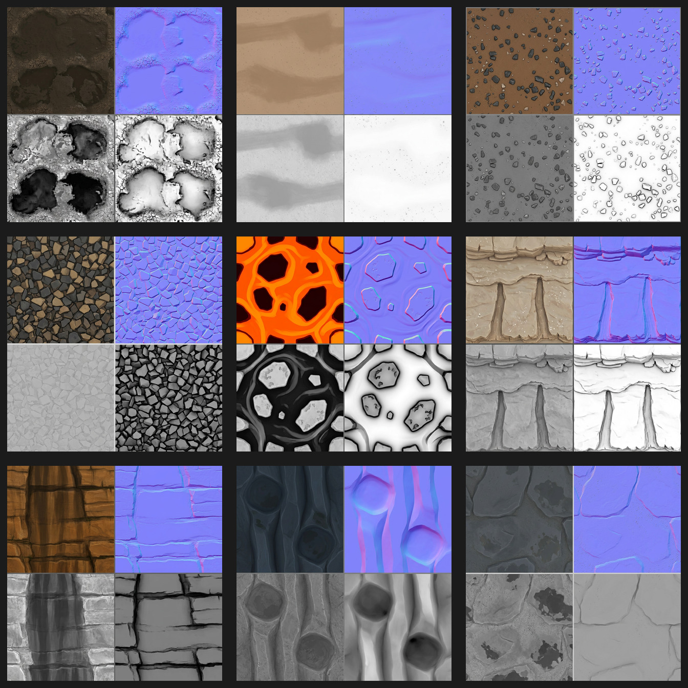

| ID | Material | Primary use | Recommended real-world coverage | Status and production note |
|---|---|---|---:|---|
| M011 | Mud and puddle edge | Runoff, low ground, track margins | `2 × 2 m` | Pass as breakup reference. Separate mud and wetness into blendable layers; soften the repeated round puddle shapes. |
| M012 | Dry dusty dirt | Dry paths, shoulders, disturbed terrain | `3 × 3 m` | Pass. Broad low-relief variation supports tiling and does not over-model individual grains. |
| M013 | Road shoulder aggregate | Track edges and repair zones | `2 × 2 m` | Pass. Controlled embedded basalt chips with clear channel correspondence. |
| M014 | Loose mixed scree | Talus, cliff feet, gravel beds | `2 × 2 m` | Pass. Dense readable packing and useful material/color variation; add macro masks at terrain scale. |
| M015 | Cooled lava crust | Volcanic shelves and crater | `3 × 3 m` | Pass after regeneration. Broad ropy folds, restrained heat staining and strong cross-channel correspondence. |
| M016 | Molten lava | Lava pools and channels | `3 × 3 m` | Pass as mask reference. Derive BaseColor and Emissive separately and animate flow in shader. |
| M017 | Dry coastal rock | Beach shelves and salt rock | `3 × 3 m` | Weak—regenerate. Current deep vertical cuts read as a cliff face rather than a broadly eroded tile. |
| M018 | Wet ochre waterfall rock | Waterfall channels and wet ledges | `3 × 3 m` | Pass. Strong strata and vertical wetness language; BaseColor must exclude generated shading. |
| M019 | Basalt cave wall | Tunnel and cavern walls | `3 × 3 m` | Pass with variation constraint. Broad erosion pockets work; reduce repeated circular cavities in the production height source. |
| M020 | Basalt cave floor | Driveable cave and tunnel floor | `3 × 3 m` | Pass. Low relief, restrained damp patches and broad plate structure support gameplay collision. |

## Material Batch 03 — foliage and organic surfaces

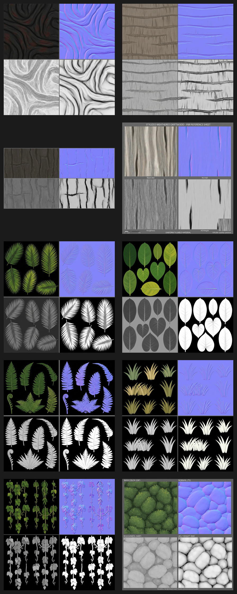

Foliage atlases retain BaseColor, Normal, and Roughness in the first three positions. Their bottom-right quadrant is an **Opacity/AO composite reference**: black is outside the cutout, white is exposed leaf surface, and grey describes internal overlap. Production must derive separate binary/dithered opacity and AO maps from this reference; do not import the composite directly.

| ID | Material | Primary use | Recommended coverage | Status and production note |
|---|---|---|---:|---|
| M015 | Cooled lava crust | Volcanic shelves and crater | `3 × 3 m` | Pass after regeneration. Broad nondirectional rope folds and restrained heat staining. |
| M021 | Palm trunk bark | Palm trunks | `1.5 × 1.5 m` | Pass. Broad horizontal growth rings and simple fibers remain readable through LOD. |
| M022 | Broadleaf tree bark | Jungle tree trunks and branches | `1.5 × 1.5 m` | Pass. Deep irregular vertical plates with restrained color variation. |
| M023 | Salt-weathered driftwood | Wreckage and shore dressing | `1.5 × 1.5 m` | **Weak—regenerate.** Material language is useful, but the sheet contains forbidden generated headings and channel labels. |
| M024 | Palm frond atlas | Palm canopy cards | atlas | Pass. Six complete, well-padded silhouettes with useful age/color variation. |
| M025 | Broadleaf canopy atlas | Jungle canopy cards | atlas | Pass. Eight broad leaf silhouettes and clean channel correspondence. |
| M026 | Fern leaf atlas | Understory cards | atlas | Pass. Complete fronds with varied poses and strong alpha-test silhouettes. |
| M027 | Coastal grass atlas | Grass cards and clump shells | atlas | Pass. Grouped thick blades in green/straw variants; readable at distance. |
| M028 | Hanging vine atlas | Cliff, bridge and canopy vines | atlas | Pass. Six complete vine strips with broad leaves and wind-ready segmentation. |
| M029 | Cushion moss | Damp rock and soil blends | `1 × 1 m` | **Weak—regenerate.** Good cushion forms, but generated channel labels violate the clean-sheet standard. |

## Material Batch 04 — built materials

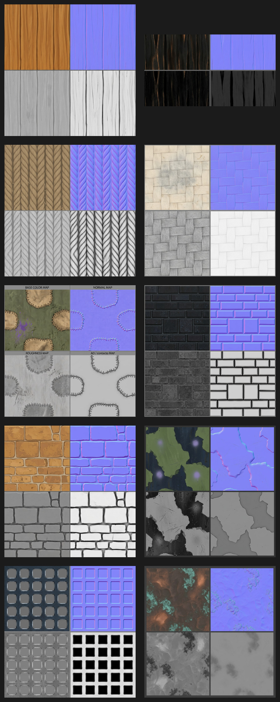

| ID | Material | Primary use | Recommended real-world coverage | Status and production note |
|---|---|---|---:|---|
| M030 | Fresh-cut timber | New repairs, clean structural beams | `1.5 × 1.5 m` | Pass. Warm broad grain complements the older M008 timber without duplicating it. |
| M031 | Charred timber | Burned structures and impact damage | `1.5 × 1.5 m` | **Weak—regenerate.** Material language is useful, but the generator returned a `1408 × 768` landscape sheet instead of the required square 2 × 2 format. |
| M032 | Heavy rope | Bridges, cranes, rigging and moorings | `0.5 × 0.5 m` | Pass with construction constraint. Use the bold braid as a tiling rope surface; geometry must provide the cable silhouette. |
| M033 | Weathered sailcloth | Shipwreck sails, banners and shade cloth | `1 × 1 m` | **Weak—regenerate.** Current basket-like weave is too coarse and reads as interlocking strips rather than woven canvas. |
| M034 | Patched goblin canvas | Awnings, tents and workshop covers | `2 × 2 m` | **Weak—regenerate.** Patch language works, but forbidden generated channel labels must be removed. |
| M035 | Cut basalt masonry | Shrines, tunnel retaining walls | `3 × 3 m` | Pass. Strong regular courses, readable mortar and restrained surface variation. |
| M036 | Ochre rubble masonry | Settlement walls and retaining structures | `3 × 3 m` | Pass. Warm irregular blocks contrast clearly with basalt masonry. |
| M037 | Painted goblin metal | Machines, carts and race structures | `1 × 1 m` | Pass with cleanup. Preserve broad chipped green paint but remove highlight-like purple spots from production BaseColor. |
| M038 | Galvanized grate iron | Drains, work decks and vents | `1 × 1 m` | Pass. Broad openings and thick bars remain stable through LOD; openings become geometry/opacity as required. |
| M039 | Aged copper with patina | Lighthouse, trim and machinery | `0.75 × 0.75 m` | Pass. Controlled verdigris coverage and warm rubbed copper give a useful metallic mask basis. |

## Material Batch 05 — race, interface, and workshop surfaces

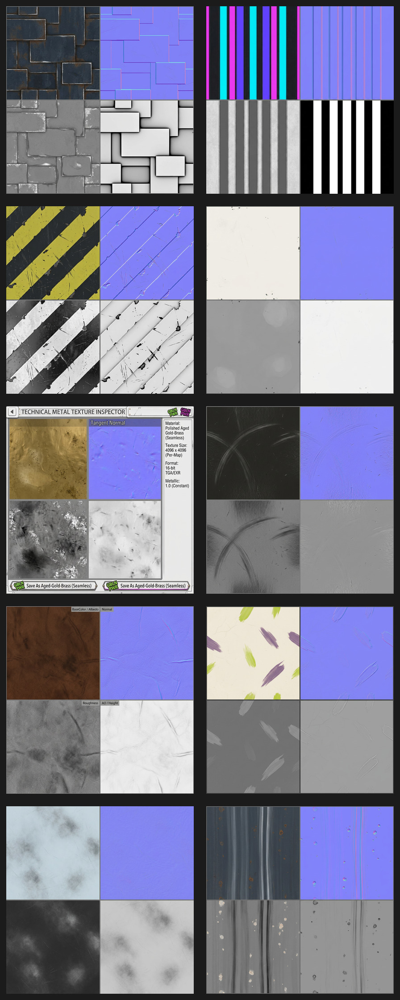

Specialized transparent or emissive sheets replace bottom-right AO/Height with a documented Emissive or Opacity/Transmission mask. Production still requires AO where materially relevant; the special mask is an additional authored channel, not a waiver.

| ID | Material | Primary use | Recommended real-world coverage | Status and production note |
|---|---|---|---:|---|
| M040 | Road repair plate | Track patches and industrial floors | `2 × 2 m` | Pass with material check. Good overlapping structure; production BaseColor must clearly retain metallic plate rather than stone-tile response. |
| M041 | Boost emissive inlay | Boost pads and racing-line inserts | `2 × 2 m` | Pass. Excellent broad cyan/magenta channels and clean emissive mask; animate UV flow separately. |
| M042 | Chipped hazard paint | Track edges and workshop hazards | `2 × 2 m` | Pass. Strong readable stripe rhythm, restrained chips and coordinated relief. |
| M043 | White enamel interface metal | White void UI and clean race structures | `1 × 1 m` | Pass. Dominant warm white with appropriately minimal scratches and chips. |
| M044 | Gold rivet metal | Interface rivets and premium fasteners | `0.5 × 0.5 m` | **Weak—regenerate.** Surface is useful but the image contains extensive forbidden generated UI, headings and buttons. |
| M045 | Racing rubber | Bumpers, grips and flexible guards | `1 × 1 m` | Pass. Restrained compressed grain and broad abrasion arcs without tire-tread literalism. |
| M046 | Weathered leather | Harnesses, straps and balloon rigging | `1 × 1 m` | **Weak—regenerate.** Useful leather breakup, but tiny generated channel labels violate the clean-sheet standard. |
| M047 | Painted ceramic | Race markers and goblin props | `1 × 1 m` | Pass. Clean off-white glaze with controlled green/purple handmade accents. |
| M048 | Dirty lantern glass | Lanterns and workshop glazing | `1 × 1 m` | Pass. Restrained soot and transmission-mask concept; final glass uses proper transmission/refraction shader. |
| M049 | Worn rail steel | Mine rail and machine contact surfaces | `1 × 1 m` | Pass. Strong longitudinal wear, restrained pitting and usable metallic/roughness separation. |

## Material Batch 06 — scrolling water and projected effects

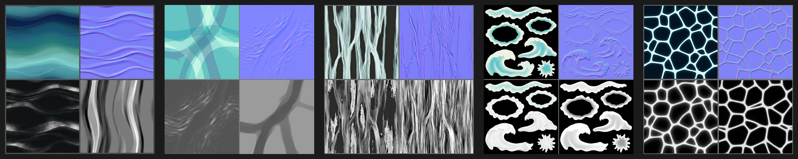

| ID | Material | Primary use | Recommended coverage | Status and production note |
|---|---|---|---:|---|
| M050 | Deep-ocean scrolling water | Open sea and deep channels | `12 × 12 m` | Pass. Broad current bands support two offset scrolling normal/flow layers without noisy texture swimming. |
| M051 | Shallow tropical water | Lagoons, shallows and tide pools | `6 × 6 m` | Pass. Clear intersecting currents and calm wavelets; depth absorption comes from the water shader, not BaseColor alone. |
| M052 | Waterfall flow | Vertical waterfall ribbons | `4 × 8 m` | Pass. Strong continuous top-to-bottom strands for looped downward scrolling and opacity breakup. |
| M053 | Water foam mask atlas | Shore foam, wakes, churn and splash rings | atlas | Pass. Eight broad alpha-ready shapes with useful normal, roughness and opacity references. |
| M054 | Underwater caustic projector | Submerged rock, sand and props | `4 × 4 m` | Pass. Broad cells and secondary phase mask support inexpensive animated cross-fade projection. |

Water textures are shader inputs rather than opaque material replacements. Use world-space or stable local-space coordinates, depth fade, shoreline intersection masks and two incommensurate scroll speeds. Never scroll BaseColor, Normal and foam at the same rate. Keep ocean collision and buoyancy independent from visual displacement.

## Kitbash Stamp Batch 01 — vehicle and machine construction

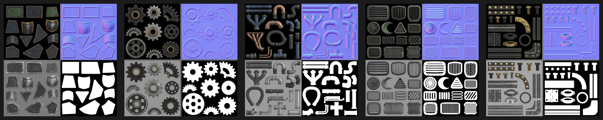

| ID | Stamp family | Contents | Status and production note |
|---|---|---|---|
| K001 | Armor plates | 12 rectangular, trapezoid, curved and repair plates | Pass. Strong varied silhouettes, large fasteners and clean alpha masks. |
| K002 | Gears and mechanisms | 12 gears, sprockets, flywheels and toothed arcs | Pass. Low tooth counts and broad holes remain readable after scaling and LOD. |
| K003 | Engine pipes | 12 pipe bends, manifolds, headers and hose loops | Pass. Excellent one-click engine-bay vocabulary with thick tubing and clear masks. |
| K004 | Vents and grilles | 12 louvers, meshes, intakes and radiator faces | Pass. Wide range of opening patterns with stable frames and useful cutout alpha. |
| K005 | Fasteners and welds | 16 rivet, bolt, weld, hinge, collar and seam details | Pass. Good secondary-detail family for joining primary stamps without random noise. |

Stamp atlases use BaseColor, Normal, Roughness/metal reference and Alpha. Production exports separate Roughness, Metallic, AO and Opacity maps; the displayed roughness/metal quadrant is a derivation guide, not a packed runtime texture. Runtime projection, raised-mesh selection, engine-bay recipes, recursive editing, water scrolling and bake rules are defined in [`docs/PRESET_STAMP_AND_SCROLLING_MATERIAL_STANDARD.md`](../../../docs/PRESET_STAMP_AND_SCROLLING_MATERIAL_STANDARD.md).

## Required validation before engine use

1. Re-author all channels from one shared height/mask stack.
2. Confirm perfect left/right and top/bottom continuity with offset and 3 × 3 tile tests.
3. Remove directional lighting, highlights, shadows, perspective, and ambient occlusion from BaseColor.
4. Normalize tangent-space normals and document Y+ or Y− convention.
5. Check roughness under neutral overcast, hard key light, and grazing light.
6. Produce macro-variation masks so large terrain does not reveal repetition.
7. Check the material at its registered physical coverage and through every gameplay LOD.
8. Supply 2K masters by default; reserve 4K for hero cliffs or trims justified by screen coverage.
9. Use texture arrays/atlases by shader family and mip-chain every channel consistently.
10. Never infer roughness from BaseColor at runtime; roughness is authored and required.

## Material Batch 07 — alpha coverage and scatter patches

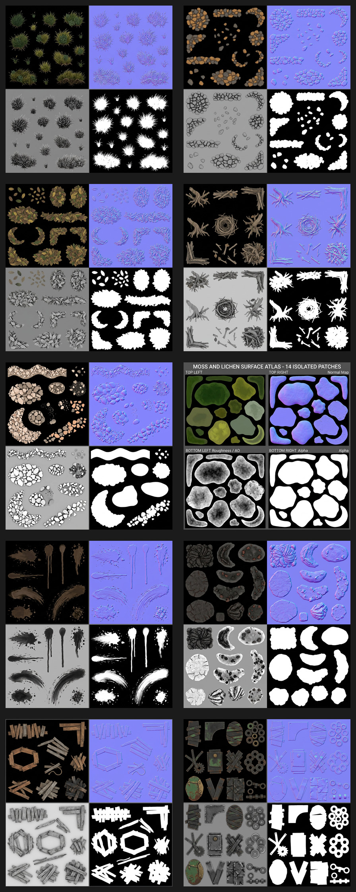

These atlases use BaseColor, Normal, Roughness/AO reference and Alpha. Production exports separate authored Roughness and AO maps. Dense patch centers may collapse into a texture/decal at distance while selected edge elements remain geometry.

| ID | Coverage family | Contents | Status and production note |
|---|---|---|---|
| M055 | Grass patches | 12 tuft, strip, edge and dense grass shapes | Pass. Excellent silhouette variety and clean alpha, with green/straw age variation. |
| M056 | Scattered rocks | 12 basalt/ochre scatter groups | Pass. Strong top-down groups from sparse scatter to connected dense patches. |
| M057 | Leaf litter | 14 broadleaf ground patches | Pass. Dense attractive packing, curved windrows and clear connected masks. |
| M058 | Twig and root litter | 12 chunky forest-floor arrangements | Pass. Broad root/twig forms avoid fragile hair-thin geometry and remain readable. |
| M059 | Beach shells and pebbles | 12 shoreline scatter patches | Pass with content adjustment. Strong pebble coverage; production should increase recognizable shell fragments without adding micro-noise. |
| M060 | Moss and lichen | 14 organic surface patches | **Weak—regenerate.** Useful shapes and channel correspondence, but generated headings and channel labels violate the clean-sheet standard. |
| M061 | Mud splash | 12 drips, arcs, smears and impact stamps | Pass. Excellent decal vocabulary with controlled soft alpha fringes and limited micro-droplets. |
| M062 | Volcanic cinder | 12 ash/cinder accumulation shapes | Pass with material correction. Silhouettes work; production must strengthen porous charcoal cinder language and remove any organic/leaf-like read. |
| M063 | Timber scrap | 12 plank, splinter and rope-remnant groups | Pass. Strong connected arrangements suitable for decals, conforming meshes or geometry spawning. |
| M064 | Metal scrap | 12 plate, washer, gear and collar groups | Pass. Highly reusable goblin salvage vocabulary with stable alpha and broad LOD-safe pieces. |

## Material Batch 08 — environmental decals and accumulation masks

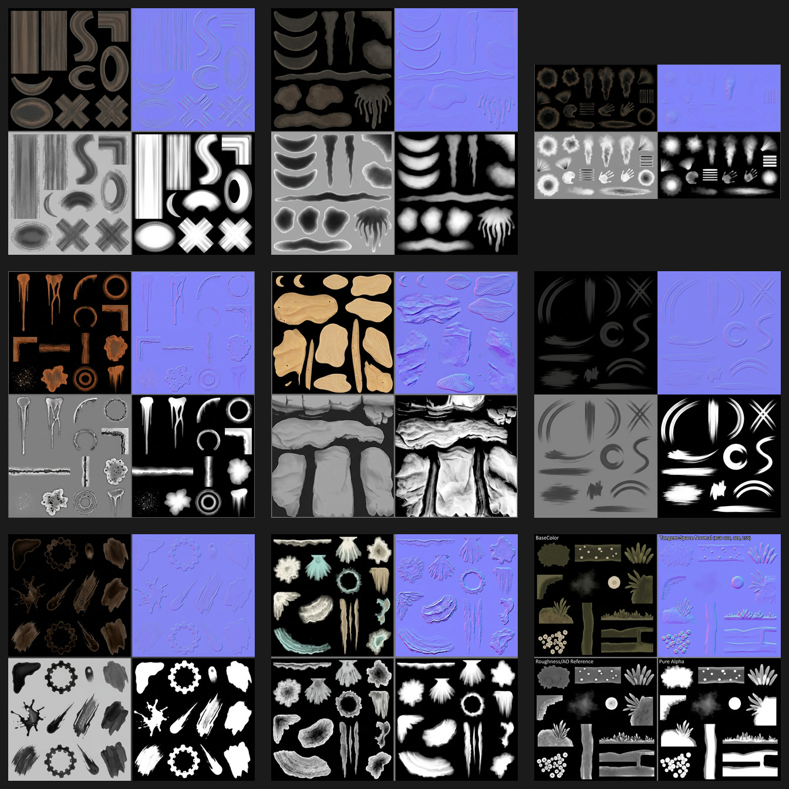

| ID | Decal family | Contents | Status and production note |
|---|---|---|---|
| M065 | Road wear | Lanes, bends, intersections and shoulder polish | Pass. Broad directional shapes support painted racing lines without literal tire tread. |
| M066 | Dampness | Seepage, puddle edges, drips and waterlines | Pass. Strong reusable material-response masks; color stays subordinate to roughness change. |
| M067 | Soot and smoke | Plumes, blast rings, vent bars and hand smears | Pass. Useful soft-to-hard range with controlled feathering and no opaque smoke geometry. |
| M068 | Rust runoff | Drips, seam strips, halos and corrosion blooms | Pass. Clear oxidation language and excellent isolated alpha forms. |
| M069 | Sand accumulation | Drifts, crescents, corners and seam buildup | **Weak—regenerate.** Masks are useful, but several forms read as thick plaster slabs rather than shallow windblown sand. |
| M070 | Tire scuffs | Arcs, braking streaks, scrub and donut marks | Pass. Clean low-relief racing vocabulary without repeated tread patterns. |
| M071 | Chipped paint | Edge chips, scrapes and impact flakes | Pass after regeneration. Clean alpha-ready wear shapes with paint relief and broad LOD-safe damage. |
| M072 | Oil and grease | Pools, wipes, leaks, rings and machine smears | Pass. Good variation from smooth oil to rough drying fringes. |
| M073 | Salt and mineral deposits | Tide marks, drip fans, rings and crystalline blooms | Pass. Broad readable deposits suitable for cliffs, masonry, metal and timber. |
| M074 | Waterline growth | Algae, seaweed, barnacles and wet staining | **Weak—regenerate.** Content variety is strong, but generated channel labels violate the clean-sheet standard. |

## Material Batch 09 — aerial grand-landscape materials

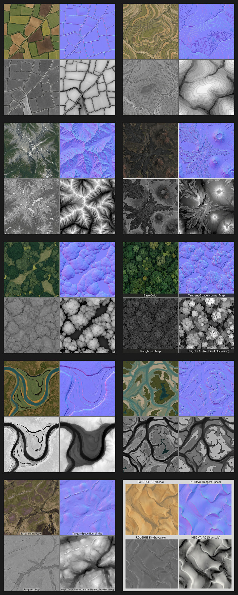

| ID | Macro landscape | Nominal coverage | Status and production note |
|---|---|---:|---|
| M075 | Patchwork farmland | `512 × 512 m` | Pass. Strong field boundaries, crop variation and shallow drainage suitable for grand vistas. |
| M076 | Terraced hills | `512 × 512 m` | Pass. Excellent contour rhythm and broad stepped height language; randomize rotation with care. |
| M077 | Alpine mountain ridges | `1 × 1 km` | Pass. Strong watershed structure, branching valleys and usable displacement guide. |
| M078 | Volcanic mountain field | `1 × 1 km` | Weak—regenerate. Flow structure is strong, but bright crater centers can read as emissive or baked lighting. |
| M079 | Temperate forest canopy | `512 × 512 m` | Pass. Broad clustered crown masses read from satellite distance without micro-tree noise. |
| M080 | Tropical jungle canopy | `512 × 512 m` | **Weak—regenerate.** Useful canopy structure, but generated channel labels violate the clean-sheet standard. |
| M081 | Meandering river valley | `1 × 1 km` | Pass. Clear river/floodplain/upland hierarchy and useful flow/height masks. |
| M082 | Coastal wetlands | `512 × 512 m` | Pass. Strong channel network, mudflats and mangrove islands for expansive coastal scenes. |
| M083 | Highland moor and scrub | `512 × 512 m` | **Weak—regenerate.** Good macro breakup but contains forbidden generated channel labels. |
| M084 | Desert dune sea | `1 × 1 km` | **Weak—regenerate.** Dune forms are useful, but generated headings and channel labels must be removed. |

These are macro terrain layers, not replacements for near-ground materials or geometry. Their runtime role, nested scale stack, displacement limits and biome spawning rules are defined in [`docs/GRAND_LANDSCAPE_MATERIAL_STANDARD.md`](../../../docs/GRAND_LANDSCAPE_MATERIAL_STANDARD.md).

## Material Batch 10 — flora, markings, damage, and utility decals

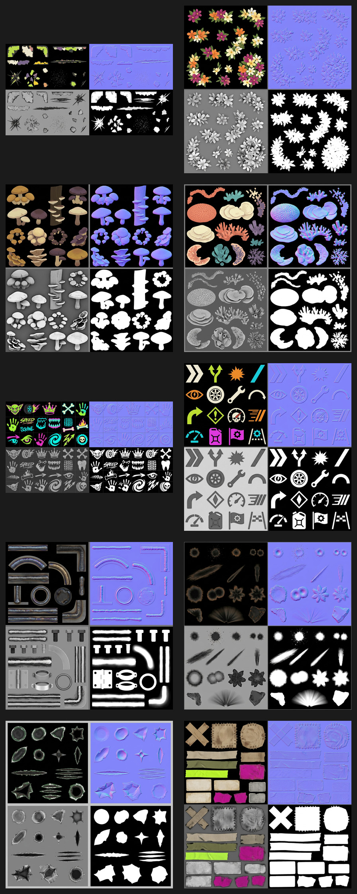

| ID | Atlas family | Contents | Status and production note |
|---|---|---|---|
| M071 | Chipped paint | Edge wear, scrapes, flakes and impact chips | Pass after regeneration. Useful color variants and clean alpha-ready damage shapes. |
| M085 | Flowers and pollen | 14 tropical flower scatter groups | Pass. Excellent color restraint, connected patches and clear distance-readable silhouettes. |
| M086 | Mushrooms and fungi | 12 mushroom clusters and bracket growths | Pass. Strong cap diversity, shelf forms and low-poly-friendly alpha masks. |
| M087 | Coral and reef growth | 12 brain, plate, sponge and stubby branch patches | Pass. Broad underwater forms with restrained tropical colors and stable silhouettes. |
| M088 | Goblin doodle graffiti | Faces, crowns, teeth, handprints and racing scribbles | **Weak—regenerate.** Visual language is strong, but generated words such as `SPEED` violate the symbol-only rule. |
| M089 | Number-free racing symbols | Chevrons, turns, boost, wheel, wrench and checkpoint marks | Pass. Crisp, varied, readable symbols without numbers or lettering. |
| M090 | Weld heat and joining | Weld beads, rings, seams and repair joins | Pass with content constraint. Useful construction shapes; production should reduce pipe-like forms and emphasize weld/heat halos. |
| M091 | Impact scorch | Blast blooms, streaks, rings and directional burns | Pass. Good range of hard impact centers and soft soot feathering. |
| M092 | Dents and punctures | Concave hits, raised lips, tears and gouges | Pass. Excellent normal-driven damage vocabulary for non-silhouette deformation. |
| M093 | Tape, stickers and fabric patches | 16 blank quick-repair pieces | Pass. Strong sharp-edged customization kit with no text or logos. |

## Material Batch 11 — grand-world infrastructure macros

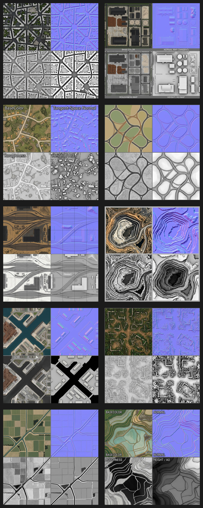

| ID | Macro landscape | Nominal coverage | Status and production note |
|---|---|---:|---|
| M094 | City blocks | `1 × 1 km` | Weak—regenerate. Channel consistency is useful, but the radial central avenue/monument makes repetition obvious. |
| M095 | Industrial yard | `1 × 1 km` | **Weak—regenerate.** Strong district zoning, but generated channel labels violate the clean-sheet standard. |
| M096 | Rural village pattern | `512 × 512 m` | **Weak—regenerate.** Good settlement grammar, but extensive generated labels violate the standard. |
| M097 | Regional road network | `1 × 1 km` | Weak—regenerate. Current organic cell pattern reads more like fields than a deliberate road hierarchy. |
| M098 | Rail and mine logistics yard | `512 × 512 m` | Pass. Parallel corridors, switches, yards and large structures are readable at macro scale. |
| M099 | Quarry and excavation | `1 × 1 km` | Pass. Excellent terraced depth, haul-road logic and displacement hierarchy. |
| M100 | Port and dock district | `1 × 1 km` | Pass. Strong harbor channels, quays, piers and service blocks with clear height separation. |
| M101 | Overgrown ruins | `512 × 512 m` | Pass. Readable broken wall network, courtyards and vegetation takeover suitable for modular spawning. |
| M102 | Irrigation canals | `1 × 1 km` | Pass with waterway constraint. Clear field/canal hierarchy; production channels must guarantee connected downhill flow. |
| M103 | Flooded rice terraces | `512 × 512 m` | **Weak—regenerate.** Strong contour logic, but generated map labels must be removed. |

## Material Batch 12 — goblin creator surfaces

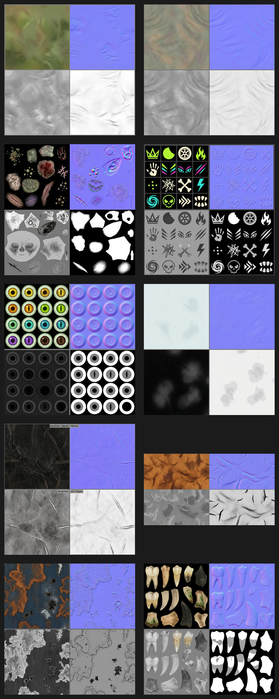

| ID | Creator material | Use | Status and production note |
|---|---|---|---|
| M104 | Olive-green goblin skin | Primary skin base | Pass. Soft mottling, pores and broad folds provide a flexible non-photoreal PBR base. |
| M105 | Moss-grey goblin skin | Tintable alternate skin base | Pass. Useful sage/tan/violet range for procedural color variation. |
| M106 | Skin blemishes and scars | Freckles, warts, scars and dry patches | **Weak—regenerate.** Channel concept works, but several patches read too raw or tumorous; final set must stay appealing and non-gory. |
| M107 | Face paint and tattoos | Punk racer customization | Pass. Strong original symbol language with clean alpha and no words. |
| M108 | Eye and iris atlas | Iris, pupil and sclera variants | Pass. Excellent color/pupil variety and aligned eye masks for deep customization. |
| M109 | Clear weathered lens glass | Goggles, visors and lenses | Pass. Restrained scratches/fog with useful transmission and roughness guidance. |
| M110 | Weathered black leather | Jackets, boots, gloves and seats | **Weak—regenerate.** Surface breakup is strong, but generated channel labels violate the clean-sheet standard. |
| M111 | Cracked tan leather | Harnesses, belts and armor pads | Pass. Broad creases, worn dye and dry cracking remain readable without excessive noise. |
| M112 | Layered rusted iron | Armor, buckles, weapons and vehicle parts | Pass. Strong large-scale rust/metal separation and useful pitting relief. |
| M113 | Tooth, tusk, horn and bone | Teeth, accessories and armor details | Pass. Broad varied creature-material samples with clean masks and no gore. |

## Material Batch 13 — additional goblin creator surfaces

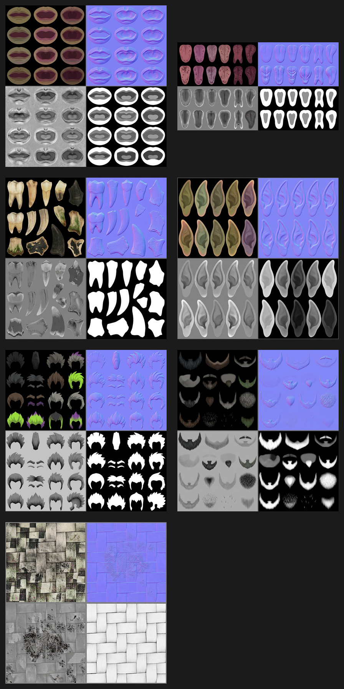

| ID | Creator material | Use | Status and production note |
|---|---|---|---|
| M114 | Lips, gums and inner mouth | Mouth color and moisture variation | Pass. Strong expressive lip/gum variants with useful roughness and material masks. |
| M115 | Tongues | Tongue shape and color variants | Pass. Broad stylized silhouettes, center grooves and clean alpha masks. |
| M116 | Nails and claws | Fingernails, toenails and claw tips | **Weak—regenerate.** The result repeated tooth/horn forms from its source reference instead of producing clear nail plates and claws. |
| M117 | Ear skin and translucency | Ear color, thickness and subsurface scattering | Pass. Excellent ear variants with aligned thickness masks and appealing color range. |
| M118 | Hair and eyebrows | Mohawks, tufts, brows and sideburn cards | Pass. Strong punk silhouettes, controlled dyed accents and LOD-safe alpha shapes. |
| M119 | Stubble and facial hair | Beard shadow, moustaches and short beards | Pass. Broad connected shapes provide efficient customization without hair noise. |
| M120 | Weathered racing cloth | Suits, jackets, gloves and upholstery | **Weak—regenerate.** Current patchwork/checker structure reads as tiled fabric strips rather than a seamless racing weave. |

## Material Batch 14 — goblin equipment and condition overlays

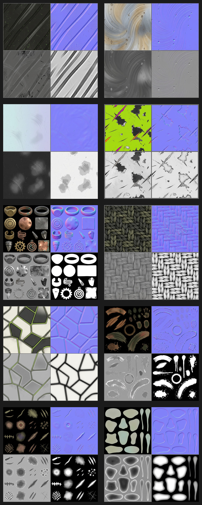

| ID | Material | Use | Status and production note |
|---|---|---|---|
| M121 | Racing grip rubber | Grips, pedals and flexible armor | Pass. Broad compression ribs, worn contact bands and restrained green flecks remain readable through LOD. |
| M122 | Polished goggle-frame metal | Frames, buckles and accessory trim | Pass. Useful polished swirl and scratch response; production BaseColor must remain free of reflected environment. |
| M123 | Scratched tinted lens | Goggles and visors | Pass. Subtle cyan tint, wipe arcs, scratches and transmission masks support proper lens shaders. |
| M124 | Painted racing armor | Armor plates and vehicle protection | Pass. Strong acid-green enamel, restrained racing accents and broad chipped-metal breakup. |
| M125 | Oxidized jewelry | Rings, ear cuffs, tooth caps and charms | Pass. Excellent brass, copper, silver and patina variants with clean masks. |
| M126 | Coarse knit | Shirts, cuffs, socks and padding | Pass. Chunky interlocked yarn is seamless, tactile and distinct from canvas. |
| M127 | Padded racing suit | Suits, jackets and upholstery | **Weak—regenerate.** The current irregular cell pattern reads as fractured stone/glass rather than padded technical fabric. |
| M128 | Dirt and sweat overlays | Skin and clothing condition | Pass. Useful broad wipes, rings and smears with rough/damp separation. |
| M129 | Healed damage overlays | Old scars, burns and character history | Pass with cleanup. Strong variety; remove stitch-like and overly raw shapes to keep the character appealing and non-gory. |
| M130 | Wet-skin sheen masks | Rain, sweat and water response | Pass. Broad roughness masks provide moisture without transparent geometry or baked highlights. |

## Material Batch 15 — cosmetics and creator finish layers

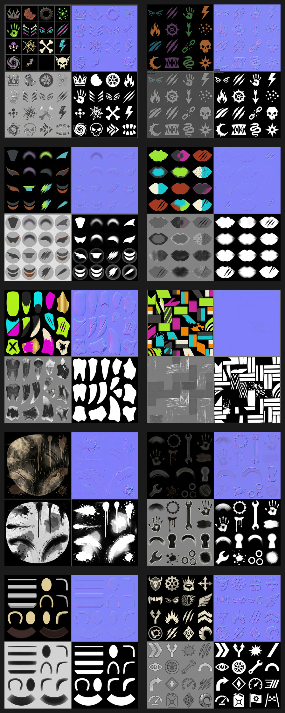

| ID | Finish layer | Use | Status and production note |
|---|---|---|---|
| M131 | Cosmetic glitter and mica | Face/body sparkle accents | **Weak—regenerate.** Channel structure is usable, but many shapes became full graffiti symbols instead of restrained glitter sweeps and clusters. |
| M132 | Emissive body paint | Night racing and active markings | Pass. Strong original symbol set with clean emissive/alpha masks and no baked glow. |
| M133 | Eye shadow and liner | Eye-area cosmetics | Pass. Broad wings, smoky arcs and asymmetrical punk shapes provide good creator variety. |
| M134 | Lip paint and stain | Lip color customization | Pass. Useful fill, split, chipped, stain and racing-slash masks. |
| M135 | Nail paint | Nail and claw enamel overlays | Pass. Excellent broad nail-compatible shapes, color range and chipped variants. |
| M136 | Fabric dye masks | Suits, jackets, banners and upholstery | Pass with density constraint. Strong color-block vocabulary; production presets should combine only a few patterns at once. |
| M137 | Dusted goggles | Dust, mud, rain, salt and wipe states | Pass. Strong lens-scale condition layers and clean wiper/roughness separation. |
| M138 | Armor grease and workshop wear | Armor and machine condition | Pass with content constraint. Smears and rings work; use wrench/handprint shapes sparingly so they do not read as repeated symbols. |
| M139 | Polished edge wear | Smart-mask reference for contact points | Pass. Clean straight, curved and oval high-point masks for metal and leather. |
| M140 | Colorable team markings | Runtime-tinted team identity | Pass. Bold symbol variety, clean alpha and no lettering or numbers. |

## Material Batch 16 — biome transitions and world-scale blend masks

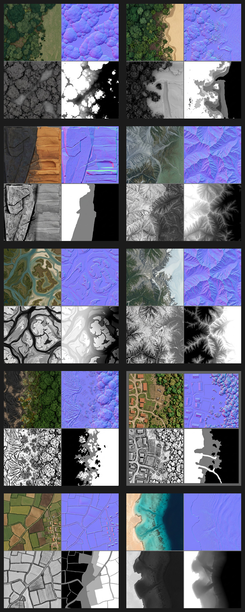

| ID | Transition | Nominal coverage | Status and production note |
|---|---|---:|---|
| M141 | Forest to grassland | `256 × 256 m` | Pass with channel-rebuild constraint. Strong canopy breakup and broad irregular meadow edge; rebuild all maps from one authoritative transition mask. |
| M142 | Jungle to beach | `256 × 256 m` | Pass. Excellent layered jungle, root/scrub fringe and clean sand handoff. |
| M143 | Basalt to ochre rock | `16 × 16 m` | Weak—regenerate. Material identity is strong, but the boundary is too straight and narrow to feel naturally interlocked. |
| M144 | Mountain to valley | `1 × 1 km` | Pass. Clear elevation descent, branching foothills and broad valley hierarchy. |
| M145 | Wetland to upland | `512 × 512 m` | Weak—regenerate. Water/channel masks are strong, but the BaseColor does not show enough distinct dry upland material. |
| M146 | Alpine snowline | `512 × 512 m` | Pass. Natural ridge/aspect-driven snow fingers and exposed-rock islands. |
| M147 | Volcanic field to forest | `512 × 512 m` | Pass. Strong succession sequence from crust through pioneer growth to canopy. |
| M148 | Settlement to wilderness | `512 × 512 m` | Pass. Readable occupancy edge, gardens, service gaps and forest takeover. |
| M149 | Farm to village | `512 × 512 m` | Pass. Field boundaries and roads transition naturally into settlement footprints. |
| M150 | Coast to deep water | `1 × 1 km` | Pass. Excellent shore, shallows, reef/channel and deep-ocean bathymetric progression. |

## Material Batch 17 — weather, season, and world-condition layers

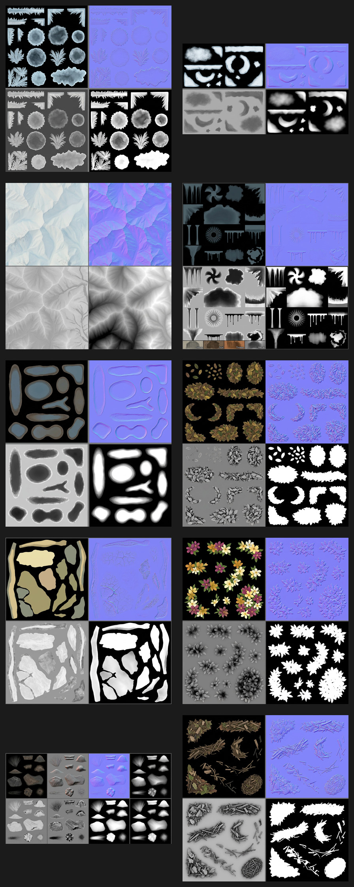

| ID | Condition layer | Use | Status and production note |
|---|---|---|---|
| M151 | Frost and rime | Props, glass, foliage, rock and metal | Pass. Strong edge strips, crystalline fans and broad frost blooms with clean alpha. |
| M152 | Light snow cover | Thin seasonal deposits and ledges | Pass. Useful strips, crescents and low-cover masks; shader controls powder depth and exposed base material. |
| M153 | Heavy snowpack | Deep seasonal terrain surface | Pass. Excellent broad wind dunes, compacted hollows and usable height structure. |
| M154 | Rain darkening | Wet material response and runoff | **Weak—regenerate.** Mask variety is useful, but small generated footer labels violate the clean-sheet standard. |
| M155 | Puddle accumulation | Standing water in ruts and low ground | Pass. Strong shape variety with good depth, edge and roughness separation. |
| M156 | Windblown leaves | Seasonal windrows and corner buildup | Pass. Excellent connected leaf groups, warm seasonal colors and LOD-safe silhouettes. |
| M157 | Dry-season bleaching | Terrain and foliage stress | Pass. Broad pale stress masks support tint, density and roughness changes without replacing geometry. |
| M158 | Spring bloom | Flower and fresh-growth coverage | Pass. Strong verge strips, islands and meadow patches with controlled color. |
| M159 | Volcanic ashfall | Event deposition on terrain and props | **Weak—regenerate.** Content is useful, but the generated sheet broke the required four-quadrant channel layout. |
| M160 | Storm debris | Windrows of leaves, twigs, timber, rope and scrap | Pass. Excellent directional piles and connected masks for decal/geometry hybrid spawning. |

Layer ordering, accumulation, melt/dry behavior, geometry response and event baking are defined in [`docs/WEATHER_AND_SEASON_MATERIAL_STANDARD.md`](../../../docs/WEATHER_AND_SEASON_MATERIAL_STANDARD.md).

## Material Batch 18 — environmental media and recovery states

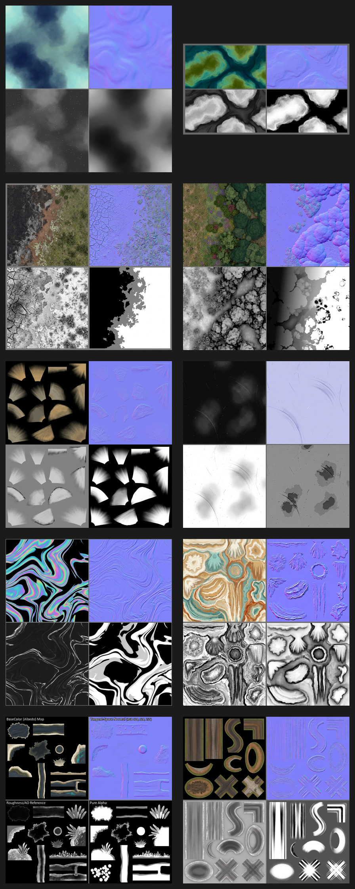

| ID | State or medium | Use | Status and production note |
|---|---|---|---|
| M161 | Underwater depth haze | Volumetric absorption and suspended particles | Pass. Excellent broad low-frequency density, distortion and depth-phase references. |
| M162 | Water algae bloom | Flowing bloom density and absorption | **Weak—regenerate.** Material language is strong, but the generator returned a `1408 × 768` landscape sheet instead of the square channel layout. |
| M163 | Burned-ground recovery | Ash-to-pioneer-growth succession | Pass. Strong material and recovery-mask progression without active fire or smoke. |
| M164 | Regrowing forest | Clearing-to-mature-canopy succession | Pass. Excellent staged meadow, shrub, sapling and canopy transition. |
| M165 | Dust-storm deposition | Post-storm dust buildup | Pass. Useful directional fans and sheltered deposits with clean alpha. |
| M166 | Fog condensation | Dew, fogged film and cleared wipes | Pass. Restrained low-relief moisture masks suitable for glass, metal and foliage. |
| M167 | Oil-on-water sheen | Thin-film industrial runoff | Pass. Strong restrained interference color, flow normal, thickness and film masks. |
| M168 | Hot-spring mineral deposits | Travertine, crust and mineral flow | Pass with cleanup. Useful palette/relief; production should consolidate decorative splash-like shapes into seamless mineral terraces. |
| M169 | Tidal wet/dry cycle | Waterline wetness, salt and growth | **Weak—regenerate.** Content range is useful, but generated channel labels violate the clean-sheet standard. |
| M170 | Post-race track recovery | Ruts, repairs and regrowth over time | Pass with sequencing constraint. Treat displayed shapes as staged masks driven by recovery time, not permanent road markings. |

## Material Batch 19 — workshop, interior, and lived-in details

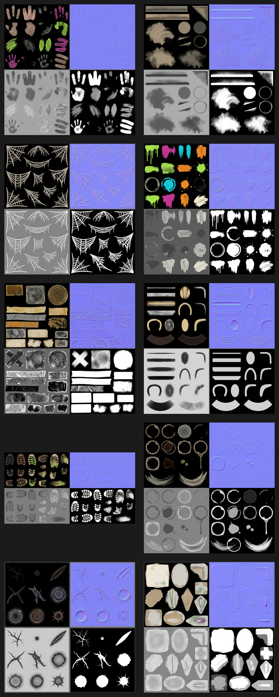

| ID | Detail family | Use | Status and production note |
|---|---|---|---|
| M171 | Fingerprints and hand smudges | Walls, tools, glass, controls and vehicles | Pass. Strong skin-oil, grime and colored-paint marks with broad readable shapes. |
| M172 | Dusty shelf accumulation | Ledges, shelves and long-idle equipment | Pass. Useful strips, object ghosts, wipes and settled powder islands. |
| M173 | Cobwebs | Sparse abandoned corners and ruins | Pass. Excellent thick grouped strands that remain readable without micro-line noise. |
| M174 | Paint drips and splashes | White-stage walls, props and workshop history | Pass. Strong color range, brush texture, can rings and wet/dry roughness variants. |
| M175 | Adhesive residue | Removed tape and sticker history | Weak—regenerate. Many forms still read as intact tape/patches rather than translucent glue ghosts and torn fiber residue. |
| M176 | Tool scratches and gouges | Machines, worktops, armor and timber | Weak—regenerate. The clean edge/arc vocabulary is useful, but needs more unmistakable screwdriver slips, saw drags and chisel gouges. |
| M177 | Boot scuffs and partial prints | Floors, vehicles and workshop stages | Pass. Excellent chunky tread abstraction, paint/mud variants and incomplete foot traffic. |
| M178 | Drink rings and spills | Benches, consoles and lived-in interiors | Pass. Strong incomplete rings, overlapping cups, drips and wiped crescents. |
| M179 | Electrical scorch | Machines, wiring zones and vehicles | Pass. Good branching arcs, heat rings and pitted short-circuit damage. |
| M180 | Repaired wall and plaster | White-stage repairs and settlement interiors | Pass. Broad filler, mortar and trowel shapes with clean alpha and restrained overspray. |

## Material Batch 20 — workshop consumables and mechanical residues

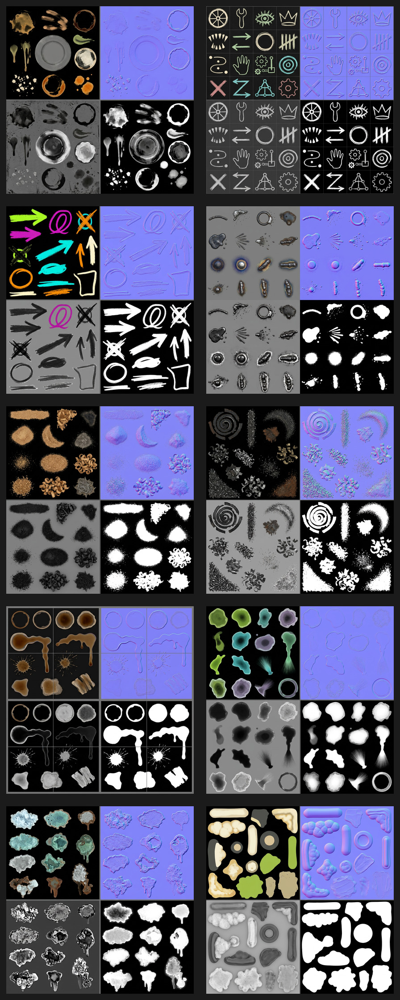

| ID | Residue family | Use | Status and production note |
|---|---|---|---|
| M181 | Food grease and crumbs | Workbenches and inhabited interiors | Pass. Strong rings, smears, drips and grouped crumbs without branded food clutter. |
| M182 | Chalk symbols | Workshop notes and temporary route marks | Pass. Excellent original symbol vocabulary with powder breakup and no words or numbers. |
| M183 | Wax crayon marks | Bold temporary annotation and punk accents | Pass. Strong colored arrows, loops, cross-outs and broad wax relief. |
| M184 | Welding spatter | Machine joins and repair history | Pass. Useful fused beads, fans, rings and heat-affected residue with LOD-safe grouping. |
| M185 | Sawdust and wood shavings | Carpentry zones, docks and repair benches | Pass. Excellent powder/shaving mix and varied accumulation footprints. |
| M186 | Metal filings and machining chips | Machine shops and foundries | Pass. Strong steel/brass chip groups, drill curls and magnetic windrows. |
| M187 | Fuel and solvent stains | Floors, tanks and machinery | Pass. Useful fresh pools, evaporated halos, leaks and wipe states. |
| M188 | Coolant leaks | Engines, pipes and machine floors | Pass. Distinct green/cyan/purple condition language without emissive slime. |
| M189 | Battery corrosion | Electrical and chemical weathering | Pass. Strong broad crystalline crust, copper salts and leak trails without micro-noise. |
| M190 | Expanding foam and sealant | Improvised repairs and gap filling | Pass. Chunky foam lobes, gasket beads, plugs and overflow patches with clear alpha. |

## Material Batch 21 — vehicle paint, metals, and heat finishes

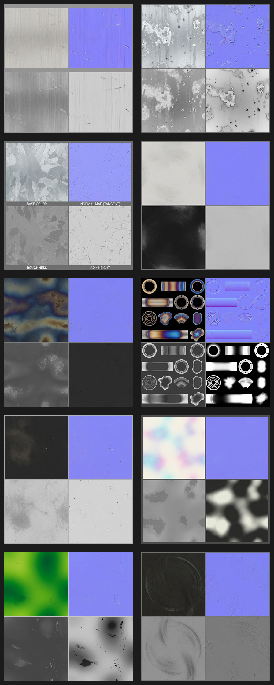

| ID | Vehicle finish | Use | Status and production note |
|---|---|---|---|
| M191 | Brushed aluminum | Body panels, trim and machinery | Pass. Clean grouped grain, restrained scratches and useful polished wear zones. |
| M192 | Oxidized aluminum | Old bodywork and exposed structures | Pass. Strong chalky oxide, pits and broad weathering with good metal separation. |
| M193 | Galvanized steel | Panels, ducts and workshop structures | **Weak—regenerate.** The surface reads too leafy/crystalline, and generated channel labels violate the clean-sheet standard. |
| M194 | Polished chrome | Mirrors, trim and accessories | Pass. Appropriately neutral source maps leave environment reflection to runtime lighting. |
| M195 | Heat-blued steel | Engines, exhausts and high-temperature parts | Pass. Excellent blue/violet/straw temper colors with restrained scale and no glow. |
| M196 | Exhaust heat tint | Thermal gradients around pipes and welds | Pass. Strong rings, fans and bands with clean reusable masks. |
| M197 | Matte ceramic coating | Protective armor and dark vehicle panels | Pass. Restrained charcoal coating, abrasion and highly matte response. |
| M198 | Pearlescent racing paint | Premium bodywork and creator accents | Pass. Soft cyan/magenta/violet pearl zones support runtime view-angle color shift. |
| M199 | Candy-color enamel | Deep green translucent vehicle paint | Pass with shader constraint. Runtime clearcoat and substrate must provide depth; source BaseColor contains no fixed highlights. |
| M200 | Tire sidewall rubber | Tires and flexible wheel parts | Pass. Broad abrasion rings, low rubber grain and no branding or tread literalism. |

## Material Batch 22 — vehicle interiors and soft construction

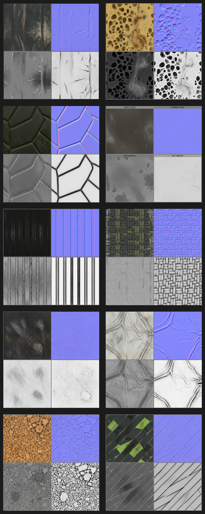

| ID | Interior material | Use | Status and production note |
|---|---|---|---|
| M201 | Worn seat vinyl | Seats, door pads and interior covers | Pass. Strong contact polish, creases and restrained cracks without shredded noise. |
| M202 | Exposed seat foam | Torn upholstery and improvised padding | Pass. Excellent broad pores, compressed zones and age staining. |
| M203 | Padded seat leather | Racing seats and interior panels | **Weak—regenerate.** The irregular cell pattern reads as fractured stone rather than intentional upholstered padding. |
| M204 | Molded dashboard plastic | Dashboards, consoles and interior trim | **Weak—regenerate.** Surface response is useful, but generated channel labels violate the clean-sheet standard. |
| M205 | Ribbed floor rubber | Footwells, cargo decks and floor mats | Pass. Strong continuous ribs, groove dirt and worn crown response. |
| M206 | Harness webbing | Belts, restraints and heavy straps | Pass. Excellent broad basket weave with restrained green thread variation. |
| M207 | Acoustic felt | Interior lining and vibration control | Pass. Calm compressed fiber mass with appropriate extreme roughness. |
| M208 | Crinkled heat-shield foil | Engine bays and hot interior bulkheads | Pass. Broad foil folds, soot variation and useful metal/roughness breakup. |
| M209 | Compressed cork gasket | Gaskets, insulation and improvised pads | Pass. Strong chunky cork/binder structure with oily condition variation. |
| M210 | Steering-wrap tape | Wheels, grips and handles | Pass. Clean diagonal overlap, woven grain and restrained acid-green repairs. |

## Material Batch 23 — vehicle optics, electrical, and engine soft parts

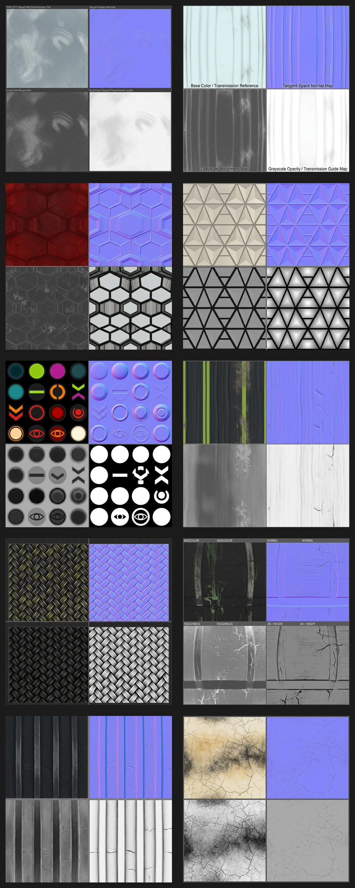

| ID | Material | Use | Status and production note |
|---|---|---|---|
| M211 | Dusty instrument glass | Gauges and protected displays | **Weak—regenerate.** Useful wipe/fingerprint response, but generated channel headings violate the clean-sheet standard. |
| M212 | Clear ribbed headlamp lens | Headlamps and work lights | **Weak—regenerate.** Optical-rib language is strong, but generated channel labels must be removed. |
| M213 | Red taillight lens | Rear lights and warning lamps | Pass. Broad hexagonal lens cells and clean transmission/emissive structure. |
| M214 | Prismatic reflector | Safety reflectors and passive markers | Pass. Excellent triangular prism field and retroreflection mask reference. |
| M215 | LED indicator atlas | Dashboards, status lights and machine controls | Pass. Strong off-state colors, domes, bars, rings and clean emissive masks. |
| M216 | Wire insulation | Electrical looms and cable geometry | Pass. Useful extrusion grain, green identification bands and restrained age cracking. |
| M217 | Braided cable sleeve | Wiring looms and protected hoses | Pass. Excellent broad braid with strong AO and distance readability. |
| M218 | Coolant rubber hose | Engine hoses and fluid lines | **Weak—regenerate.** Surface response is useful, but duplicated channel labels violate the clean-sheet format. |
| M219 | Reinforced drive belt | Belts and flexible engine components | Pass. Broad continuous ribs, reinforcement grain and controlled wear. |
| M220 | Spark-plug ceramic | Ignition parts and heat-resistant insulators | Pass. Strong heat staining, soot bands and subtle glaze crazing. |

## Material Batch 24 — engine and mechanical hard surfaces

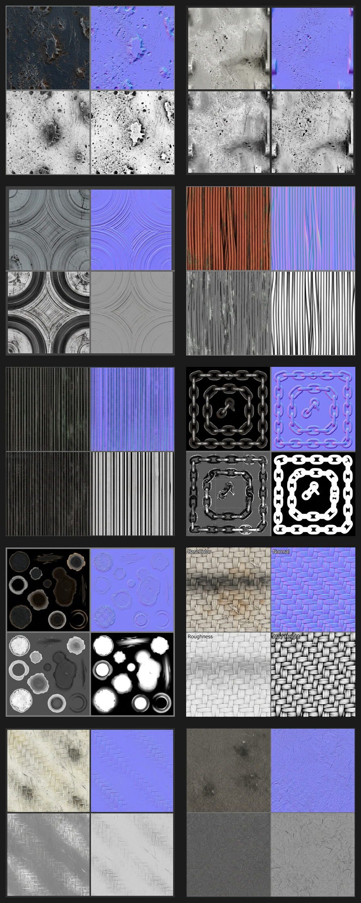

| ID | Mechanical material | Use | Status and production note |
|---|---|---|---|
| M221 | Cast iron | Blocks, housings and heavy machinery | Pass. Strong dark casting grain, pits, oxidation and rubbed high points. |
| M222 | Cast aluminum | Engine housings and light structures | Pass. Excellent broad cast porosity, chalky oxidation and oily handling zones. |
| M223 | Machined steel | Shafts, faces and precision parts | Pass. Strong overlapping mill/tool paths without a single central pivot. |
| M224 | Copper windings | Motors, generators and coils | Pass. Excellent broad wire grouping, dark varnish and restrained oxidation. |
| M225 | Radiator fins | Cooling cores and vent internals | Pass. Continuous thick rows, packed dirt and LOD-readable depth. |
| M226 | Heavy chains | Drives, hoists and restraint systems | Pass. Strong complete link silhouettes, grease/rust variation and clean alpha. |
| M227 | Carbon and baked oil | Combustion and exhaust deposits | Pass. Useful rings, crust blooms and smooth glazed centers. |
| M228 | Exhaust heat wrap | Wrapped pipes and thermal protection | **Weak—regenerate.** Weave and staining are useful, but generated channel labels violate the clean-sheet standard. |
| M229 | Fiberglass composite | Vehicle shells and repair patches | Pass. Strong translucent weave, aged resin and broad abrasion response. |
| M230 | Gasket-paper fiber | Gaskets, sheet insulation and seals | Pass. Calm compressed pulp variation with oil-darkened zones and subtle cracks. |

## Material Batch 25 — settlement architecture and roofing

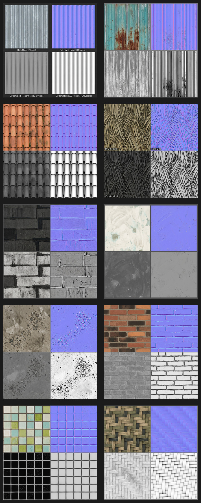

| ID | Architecture material | Use | Status and production note |
|---|---|---|---|
| M231 | Galvanized corrugated iron | Walls, roofs and improvised enclosures | **Weak—regenerate.** Corrugation profile is useful, but generated channel labels violate the clean-sheet standard. |
| M232 | Rusted painted roof sheet | Aged roofs, walls and repair panels | Pass. Strong turquoise paint, trough rust, exposed crowns and continuous corrugations. |
| M233 | Clay roof tile | Settlement and shrine roofing | Pass. Excellent chunky curved courses, offset repetition, overlap depth and subtle moss. |
| M234 | Palm thatch | Roofs, awnings and hut cladding | **Weak—regenerate.** Dense strip layering is strong, but generated channel labels violate the clean-sheet standard. |
| M235 | Tar-paper roofing | Low-cost roofs and waterproof repairs | **Weak—regenerate.** Current result reads as dark masonry blocks rather than mineral felt and broad lap bands. |
| M236 | Limewashed plaster | Settlement walls and interior surfaces | Pass. Calm trowel clouding, chalk response and restrained damp/undercoat variation. |
| M237 | Rough concrete | Foundations, walls and utility structures | Pass. Excellent broad aggregate, air pockets and trowel drag without disruptive slab seams. |
| M238 | Fired brick | Walls, ovens and structural infill | Pass. Strong handmade staggered bond, varied firing and deeply readable mortar. |
| M239 | Glazed wall tile | Kitchens, garages and wash areas | Pass. Clean handmade tile grid with varied glaze, crazing and useful grout depth. |
| M240 | Woven shade mat | Awnings, partitions and shade panels | Pass. Strong packed reed weave, muted variation and LOD-readable crossings. |

## Material Batch 26 — settlement floors, interiors, and screens

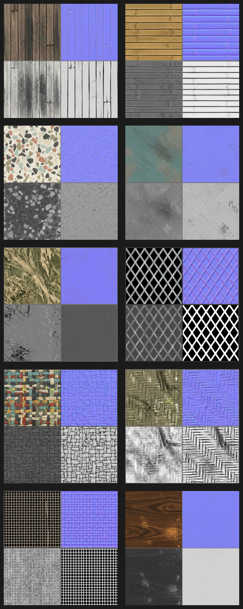

| ID | Interior material | Use | Status and production note |
|---|---|---|---|
| M241 | Rough timber planks | Floors, decks and wall lining | Pass. Strong broad plank construction, saw wear, damp joints and readable height. |
| M242 | Bamboo slats | Floors, wall panels and screens | Pass. Clean slat rhythm, node bands and rounded LOD-readable crowns. |
| M243 | Terrazzo floor | Durable settlement and workshop interiors | Pass. Excellent broad chips, calm matrix and appropriately subtle height response. |
| M244 | Painted concrete floor | Workshops, garages and utility rooms | Pass. Strong teal paint wear, oil haze, aggregate exposure and traffic polish. |
| M245 | Worn linoleum | Domestic and service interiors | **Weak—regenerate.** Current BaseColor reads as crushed organic stone or leaf litter rather than smooth marbled sheet flooring. |
| M246 | Galvanized diamond mesh | Screens, partitions and machine guards | Pass. Clean thick expanded-metal silhouette, matched normal response and production-ready alpha. |
| M247 | Woven rag rug | Domestic floors and lived-in accents | Pass. Excellent chunky colored strips, dense packing and broad cloth depth. |
| M248 | Heavy canvas | Tarps, curtains and upholstery | Pass with constraint. Strong weathered fiber response; preserve the broad herringbone-like weave as a deliberate canvas variant. |
| M249 | Mosquito net | Beds, windows and breathable partitions | Pass. Crisp mip-conscious square grid with matched channels and clean alpha. |
| M250 | Stained interior wood | Counters, shelves, trim and furniture | Pass. Strong warm grain, stain pooling, water marks and calm satin wear. |

## Material Batch 27 — domestic, market, and service materials

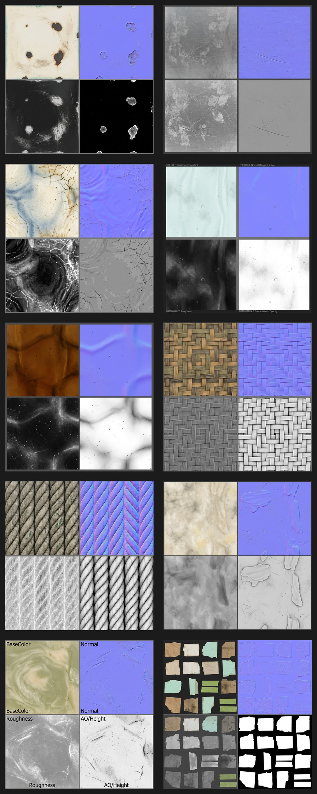

| ID | Domestic material | Use | Status and production note |
|---|---|---|---|
| M251 | Chipped enamelware | Cookware, fixtures and appliances | Pass. Strong ivory glaze, rounded steel chips, rust halos and coordinated condition masks. |
| M252 | Brushed sink steel | Sinks, counters and service equipment | Pass. Calm directional brushing, hard-water haze and convincing utensil wear. |
| M253 | Glazed porcelain | Dishes, basins and sanitary fixtures | Pass. Excellent ivory-blue glaze pooling, crazing and mineral-age variation. |
| M254 | Clear bottle glass | Bottles, jars and salvaged glazing | **Weak—regenerate.** Glass waviness and haze are useful, but generated channel labels violate the clean-sheet standard. |
| M255 | Amber bottle glass | Bottles, lamps and translucent details | Pass. Strong amber absorption, broad waviness and restrained trapped bubbles. |
| M256 | Woven basket reed | Baskets, panels and market storage | Pass. Excellent dense basket pattern, broad reed strips and handled crowns. |
| M257 | Utility rope | Ties, rails and wrapped geometry | Pass. Strong thick twist, grime variation and LOD-safe strand height. |
| M258 | Candle wax | Candles, seals and melted-wax buildup | Pass. Calm creamy clouding, broad cooled drips, soot and subtle surface damage. |
| M259 | Handmade soap | Domestic and workshop cleaning props | **Weak—regenerate.** Soap response is usable, but generated channel labels violate the clean-sheet standard. |
| M260 | Weathered paper packaging | Blank labels, wraps, patches and decals | Pass. Excellent text-free kraft, tape and paper silhouettes with clean alpha. |

## Material Batch 28 — market storage and utility surfaces

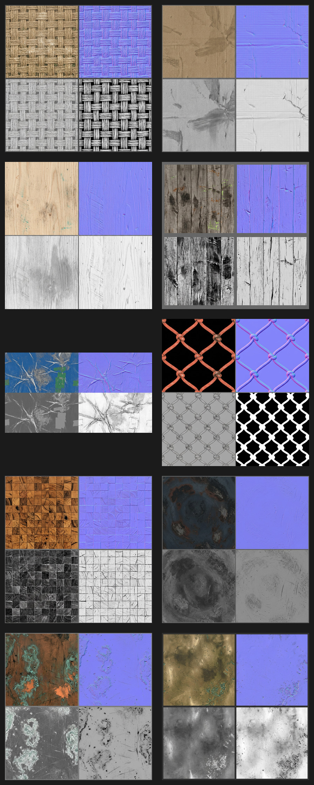

| ID | Utility material | Use | Status and production note |
|---|---|---|---|
| M261 | Burlap sack cloth | Sacks, wraps and coarse upholstery | Pass. Excellent open jute weave, thick crossings and calm grime variation. |
| M262 | Corrugated cardboard | Boxes, dividers and disposable repairs | Pass. Useful kraft pulp, water marks, pressed dents and subtle corrugation telegraphing. |
| M263 | Produce-crate wood | Crates, shelves and light construction | Pass. Strong pale unfinished grain, saw wear, stains and paint transfer. |
| M264 | Pallet wood | Pallets, heavy crates and workshop construction | Pass. Excellent grey weathering, oil rubs, paint scars and deep rough-sawn damage. |
| M265 | Plastic tarpaulin | Covers, awnings and waterproof dividers | **Weak—regenerate.** Returned at `1408×768` rather than the required square four-channel sheet. |
| M266 | Woven produce net | Market sacks and breathable storage | Pass. Clean diamond silhouette, chunky knots, matched channels and mip-safe alpha. |
| M267 | Butcher block | Counters, worktops and food-preparation props | Pass. Excellent end-grain blocks, oil staining and broad crossing knife wear. |
| M268 | Blackened cookware steel | Pans, pots, griddles and stove surfaces | Pass. Strong seasoned steel, soot, baked-oil halos and restrained scrub wear. |
| M269 | Patinated copper | Roof details, vessels and decorative fixtures | Pass. Excellent copper, turquoise patina, exposed rubs and coordinated crust height. |
| M270 | Aged brass | Handles, taps, lamps and mechanical trim | Pass. Strong tarnish, hand oils, polished wear and restrained green oxidation. |

## Material Batch 29 — coastal and maritime utility materials

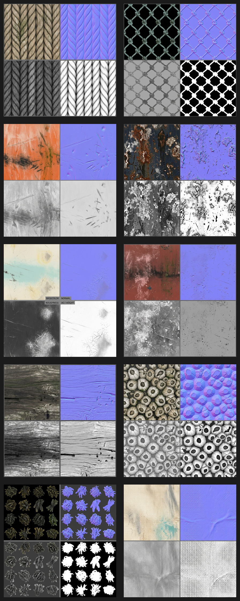

| ID | Maritime material | Use | Status and production note |
|---|---|---|---|
| M271 | Marine rope | Moorings, railings and wrapped geometry | Pass. Strong salt-aged twist, algae tint and LOD-safe strand depth. |
| M272 | Fishing net | Nets, traps and breathable barriers | Pass. Clean broad diamond mesh, chunky knots and matched mip-safe alpha. |
| M273 | Weathered buoy plastic | Buoys, floats and marine safety props | Pass. Strong orange UV fade, dock rubs, salt streaks and shallow gouges. |
| M274 | Salt-crusted steel | Marine machinery, hulls and dock hardware | Pass. Excellent steel, rust, salt crust and pitting separation. |
| M275 | Boat fiberglass | Hulls, small craft and marine repairs | **Weak—regenerate.** Gelcoat wear is useful, but generated channel labels violate the clean-sheet standard. |
| M276 | Antifouling paint | Hull undersides and submerged structures | Pass. Strong copper-red chalking, erosion, waterline grime and bio-staining. |
| M277 | Wet dock timber | Piers, jetties and waterside structures | Pass. Excellent water-darkened grain, algae bands, splits and marine-borer pits. |
| M278 | Barnacle shell coverage | Dense intertidal carpets and marine buildup | Pass. Excellent packed shell silhouettes, deep openings and LOD-readable coverage. |
| M279 | Dried seaweed atlas | Shore carpets, debris and coastal decals | Pass. Strong varied ribbon clusters, clean alpha and multiple rearrangeable scales. |
| M280 | Aged sailcloth | Sails, awnings, screens and marine canvas | Pass. Calm heavy weave, salt staining, mildew and turquoise repair transfer. |

## Material Batch 30 — shoreline ground and tidal materials

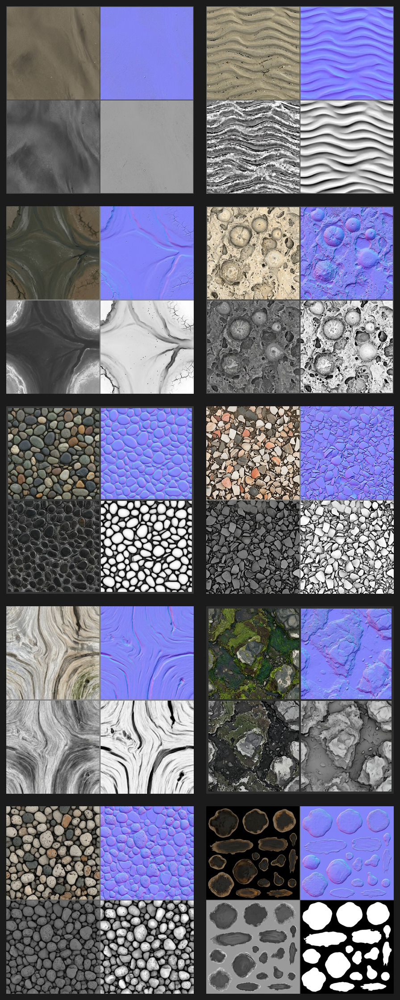

| ID | Shoreline material | Use | Status and production note |
|---|---|---|---|
| M281 | Wet compact sand | Waterline flats and compact beach paths | Pass. Calm moisture clouding, fine drag and appropriately subtle height response. |
| M282 | Rippled tidal sand | Shallow tidal flats and submerged shoreline | Pass. Excellent broad sinuous ripples, silted troughs and meter-readable relief. |
| M283 | Tidal mud | Estuaries, mangroves and drainage pockets | Pass. Strong slurry flow, wetness separation, soft channels and restrained drying cracks. |
| M284 | Coral limestone | Coastal bedrock, walls and eroded ground | Pass. Excellent broad fossil inclusions, porous matrix and dissolution relief. |
| M285 | Sea-polished stones | Beaches, stream mouths and shore carpets | Pass. Strong packed rounded pebbles, varied color and clean LOD-readable height. |
| M286 | Shell hash | High-tide bands and pale coastal carpets | Pass. Dense blunt shell fragments with a texture-like center and useful packed depth. |
| M287 | Driftwood | Shore props, construction and salt-aged timber | Pass. Excellent flowing bleached grain, water streaks, erosion and borer holes. |
| M288 | Algae-coated rock | Intertidal rock and permanently damp surfaces | Pass. Strong dark stone, thick green mats, wet pockets and exposed pale rubs. |
| M289 | Pumice gravel | Volcanic shoreline and lightweight gravel carpets | Pass. Excellent vesicular chunks, broad value variation and packed ground read. |
| M290 | Tar-ball beach residue | Pollution patches and contact-condition decals | Pass. Strong varied lumps and smears, sand-crusted edges and clean rearrangeable alpha. |

## Material Batch 31 — tropical vegetation surfaces and carpets

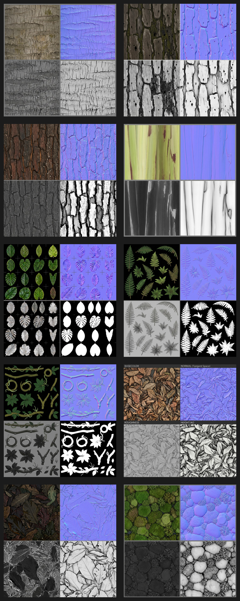

| ID | Vegetation material | Use | Status and production note |
|---|---|---|---|
| M291 | Palm trunk | Palm trunks, posts and wrapped cylindrical geometry | Pass. Strong horizontal scar bands, dry fibers and deep LOD-readable relief. |
| M292 | Mangrove bark | Mangrove trunks, prop roots and wetland timber | Pass. Excellent broad corky plates, salt bleaching, algae and wet recesses. |
| M293 | Tropical hardwood bark | Mature jungle trees and rugged timber | Pass. Strong reddish plates, charcoal fissures and restrained pale lichen. |
| M294 | Banana pseudostem | Banana plants and lush stem clusters | Pass. Excellent layered green sheaths, wax response, bruising and vertical overlap. |
| M295 | Broadleaf foliage atlas | Canopy, shrubs and modular foliage cards | Pass. Strong varied leaf silhouettes, clean alpha and useful normal/roughness separation. |
| M296 | Tropical fern atlas | Understory and damp transition foliage | Pass. Excellent varied fronds and chunky clusters with distance-readable leaflets. |
| M297 | Jungle vine atlas | Climbers, hanging growth and modular tendrils | Pass. Strong loops, forks, leafy clusters and clean modular silhouettes. |
| M298 | Dry leaf litter | Dry forest-floor carpets and debris | **Weak—regenerate.** Dense layered leaf result is useful, but generated channel labels violate the clean-sheet standard. |
| M299 | Wet leaf litter | Damp jungle-floor carpets and recovery states | Pass. Strong compressed dark leaves, decay edges and low wet relief. |
| M300 | Tropical moss carpet | Damp stone, roots and shaded ground | Pass. Excellent packed cushion forms, varied greens and LOD-readable soft depth. |

## Next material batches

### Batch 32 — tropical canopy and understory kits

Palm frond atlas, banana-leaf atlas, tropical grass clumps, wetland reeds, mangrove seedlings, flowering groundcover, jungle fungi, exposed root atlas, epiphyte clusters and dead branch/debris atlas.
