# Basalt Isle seamless PBR material references

These sheets establish material breakup, color range, weathering scale, and channel intent for the high-fidelity island kit. They are **derivation references**, not engine-ready textures.

> **AI and automation checkout requirement:** before interpreting any image in this directory, read [`AI_TEXTURE_PRESET_GUIDE.md`](./AI_TEXTURE_PRESET_GUIDE.md), resolve its `M###` ID in [`texture-preset-catalog.json`](./texture-preset-catalog.json), and follow [`docs/TEXTURE_PRESET_NAMING_STANDARD.md`](../../../docs/TEXTURE_PRESET_NAMING_STANDARD.md). M371 onward requires a validated canonical preset code and reconstruction recipe.

## Four-square convention

Every sheet uses the same fixed 2 × 2 arrangement:

| Position | Channel | Authoring requirement |
|---|---|---|
| Top left | BaseColor | Linear material color only; no baked direct light, highlights, cast shadows, or AO |
| Top right | Normal | Tangent-space RGB normal; DirectX/OpenGL green-channel orientation must be selected during implementation |
| Bottom left | Roughness | Linear grayscale roughness; white is rough, black is smooth |
| Bottom right | AO / height reference | Grayscale form guide; derive separate AO and height maps rather than packing this image directly |

Generated maps may look coordinated but are not mathematically derived from one height field. Production artists must rebuild/bake the channels, remove gutters, make the crop exactly square, verify edge continuity with a 3 × 3 tile test, remove baked lighting, and validate normal vectors before import. Every delivered textured material requires BaseColor, Normal, Roughness, and AO. Add Height and Metallic where the material class needs them.

## Material Batch 01 — terrain and structural foundations

| ID | Material | Primary use | Recommended real-world coverage | Status and production note |
|---|---|---|---:|---|
| M001 | Basalt cliff | Cliffs, cave mouths, boulders | `4 × 4 m` | Pass as derivation reference. Strong broad plates; rebuild cracks from one shared height source. |
| M002 | Ochre layered cliff | Dry cliffs, shelves, strata | `4 × 4 m` | Pass. Good horizontal strata; use macro variation to avoid visible band repetition. |
| M003 | Compacted race dirt | Main drivable road | `4 × 4 m` | Pass after regeneration. Broad compacted ruts and aggregate relief without radial flow. |
| M004 | Volcanic ash and cinder | Crater slopes, soot beds | `3 × 3 m` | Pass after regeneration. Broad ash/cinder breakup without starburst flow. |
| M005 | Wet coastal basalt | Tide pools, wet cliff feet | `3 × 3 m` | Pass with shape constraint. Keep broad eroded cells irregular and break the cobble-like repetition with macro masks. |
| M006 | Tropical beach sand | Beach shelves, sandbars | `3 × 3 m` | Pass after regeneration. Shallow sand ripples and grain relief without slab cuts. |
| M007 | Mossy jungle soil | Forest floor, humid banks | `2 × 2 m` | Pass after regeneration. Compact humid loam with moss, roots and decomposed organics. |
| M008 | Weathered structural timber | Trestles, huts, bridges | `1.5 × 1.5 m` | Pass. Broad vertical grain survives LOD; board seams and fasteners remain geometry or trim-sheet details. |
| M009 | Blackened forged iron | Girders, straps, machines | `1 × 1 m` | Pass. Restrained forged variation; use Metallic = 1 except rust/contamination masks. |
| M010 | Aged brass | Rivets, collars, controls | `0.75 × 0.75 m` | Pass after regeneration. Text-free aged brass with no preview inset and real pitting relief. |

## Material Batch 02 — ground and natural surfaces

| ID | Material | Primary use | Recommended real-world coverage | Status and production note |
|---|---|---|---:|---|
| M011 | Mud and puddle edge | Runoff, low ground, track margins | `2 × 2 m` | Pass as breakup reference. Separate mud and wetness into blendable layers; soften the repeated round puddle shapes. |
| M012 | Dry dusty dirt | Dry paths, shoulders, disturbed terrain | `3 × 3 m` | Pass. Broad low-relief variation supports tiling and does not over-model individual grains. |
| M013 | Road shoulder aggregate | Track edges and repair zones | `2 × 2 m` | Pass. Controlled embedded basalt chips with clear channel correspondence. |
| M014 | Loose mixed scree | Talus, cliff feet, gravel beds | `2 × 2 m` | Pass. Dense readable packing and useful material/color variation; add macro masks at terrain scale. |
| M015 | Cooled lava crust | Volcanic shelves and crater | `3 × 3 m` | Pass after regeneration. Broad ropy folds, restrained heat staining and strong cross-channel correspondence. |
| M016 | Molten lava | Lava pools and channels | `3 × 3 m` | Pass as mask reference. Derive BaseColor and Emissive separately and animate flow in shader. |
| M017 | Dry coastal rock | Beach shelves and salt rock | `3 × 3 m` | Pass after regeneration. Broad mineral weathering and shallow coastal-rock relief. |
| M018 | Wet ochre waterfall rock | Waterfall channels and wet ledges | `3 × 3 m` | Pass. Strong strata and vertical wetness language; BaseColor must exclude generated shading. |
| M019 | Basalt cave wall | Tunnel and cavern walls | `3 × 3 m` | Pass with variation constraint. Broad erosion pockets work; reduce repeated circular cavities in the production height source. |
| M020 | Basalt cave floor | Driveable cave and tunnel floor | `3 × 3 m` | Pass. Low relief, restrained damp patches and broad plate structure support gameplay collision. |

## Material Batch 03 — foliage and organic surfaces

Foliage atlases retain BaseColor, Normal, and Roughness in the first three positions. Their bottom-right quadrant is an **Opacity/AO composite reference**: black is outside the cutout, white is exposed leaf surface, and grey describes internal overlap. Production must derive separate binary/dithered opacity and AO maps from this reference; do not import the composite directly.

| ID | Material | Primary use | Recommended coverage | Status and production note |
|---|---|---|---:|---|
| M015 | Cooled lava crust | Volcanic shelves and crater | `3 × 3 m` | Pass after regeneration. Broad nondirectional rope folds and restrained heat staining. |
| M021 | Palm trunk bark | Palm trunks | `1.5 × 1.5 m` | Pass. Broad horizontal growth rings and simple fibers remain readable through LOD. |
| M022 | Broadleaf tree bark | Jungle tree trunks and branches | `1.5 × 1.5 m` | Pass after square ingestion regeneration. Deep irregular vertical plates; real relief guide; no inset or text. |
| M023 | Salt-weathered driftwood | Wreckage and shore dressing | `1.5 × 1.5 m` | Pass after ingestion regeneration. Text-free driftwood with no preview inset and real fibrous relief. |
| M024 | Palm frond atlas | Palm canopy cards | atlas | Pass. Six complete, well-padded silhouettes with useful age/color variation. |
| M025 | Broadleaf canopy atlas | Jungle canopy cards | atlas | Pass. Eight broad leaf silhouettes and clean channel correspondence. |
| M026 | Fern leaf atlas | Understory cards | atlas | Pass. Complete fronds with varied poses and strong alpha-test silhouettes. |
| M027 | Coastal grass atlas | Grass cards and clump shells | atlas | Pass. Grouped thick blades in green/straw variants; readable at distance. |
| M028 | Hanging vine atlas | Cliff, bridge and canopy vines | atlas | Pass. Six complete vine strips with broad leaves and wind-ready segmentation. |
| M029 | Cushion moss | Damp rock and soil blends | `1 × 1 m` | Pass after regeneration. Text-free densely packed cushion forms with usable relief. |

## Material Batch 04 — built materials

| ID | Material | Primary use | Recommended real-world coverage | Status and production note |
|---|---|---|---:|---|
| M030 | Fresh-cut timber | New repairs, clean structural beams | `1.5 × 1.5 m` | Pass. Warm broad grain complements the older M008 timber without duplicating it. |
| M031 | Charred timber | Burned structures and impact damage | `1.5 × 1.5 m` | Pass after square ingestion regeneration. Text-free char relief with no preview inset. |
| M032 | Heavy rope | Bridges, cranes, rigging and moorings | `0.5 × 0.5 m` | Pass with construction constraint. Use the bold braid as a tiling rope surface; geometry must provide the cable silhouette. |
| M033 | Weathered sailcloth | Shipwreck sails, banners and shade cloth | `1 × 1 m` | Pass after regeneration. Fine woven sailcloth, broad stains and restrained crease relief. |
| M034 | Patched goblin canvas | Awnings, tents and workshop covers | `2 × 2 m` | Pass after regeneration. Text-free patched canvas with weave and patch-edge relief. |
| M035 | Cut basalt masonry | Shrines, tunnel retaining walls | `3 × 3 m` | Pass. Strong regular courses, readable mortar and restrained surface variation. |
| M036 | Ochre rubble masonry | Settlement walls and retaining structures | `3 × 3 m` | Pass. Warm irregular blocks contrast clearly with basalt masonry. |
| M037 | Painted goblin metal | Machines, carts and race structures | `1 × 1 m` | Pass with cleanup. Preserve broad chipped green paint but remove highlight-like purple spots from production BaseColor. |
| M038 | Galvanized grate iron | Drains, work decks and vents | `1 × 1 m` | Pass. Broad openings and thick bars remain stable through LOD; openings become geometry/opacity as required. |
| M039 | Aged copper with patina | Lighthouse, trim and machinery | `0.75 × 0.75 m` | Pass. Controlled verdigris coverage and warm rubbed copper give a useful metallic mask basis. |

## Material Batch 05 — race, interface, and workshop surfaces

Specialized transparent or emissive sheets replace bottom-right AO/Height with a documented Emissive or Opacity/Transmission mask. Production still requires AO where materially relevant; the special mask is an additional authored channel, not a waiver.

| ID | Material | Primary use | Recommended real-world coverage | Status and production note |
|---|---|---|---:|---|
| M040 | Road repair plate | Track patches and industrial floors | `2 × 2 m` | Pass with material check. Good overlapping structure; production BaseColor must clearly retain metallic plate rather than stone-tile response. |
| M041 | Boost emissive inlay | Boost pads and racing-line inserts | `2 × 2 m` | Pass. Excellent broad cyan/magenta channels and clean emissive mask; animate UV flow separately. |
| M042 | Chipped hazard paint | Track edges and workshop hazards | `2 × 2 m` | Pass. Strong readable stripe rhythm, restrained chips and coordinated relief. |
| M043 | White enamel interface metal | White void UI and clean race structures | `1 × 1 m` | Pass. Dominant warm white with appropriately minimal scratches and chips. |
| M044 | Gold rivet metal | Interface rivets and premium fasteners | `0.5 × 0.5 m` | Pass after ingestion regeneration. Text-free aged gold-brass with real shallow relief. |
| M045 | Racing rubber | Bumpers, grips and flexible guards | `1 × 1 m` | Pass. Restrained compressed grain and broad abrasion arcs without tire-tread literalism. |
| M046 | Weathered leather | Harnesses, straps and balloon rigging | `1 × 1 m` | Pass after ingestion regeneration. Text-free broad hide grain and crack relief. |
| M047 | Painted ceramic | Race markers and goblin props | `1 × 1 m` | Pass. Clean off-white glaze with controlled green/purple handmade accents. |
| M048 | Dirty lantern glass | Lanterns and workshop glazing | `1 × 1 m` | Pass. Restrained soot and transmission-mask concept; final glass uses proper transmission/refraction shader. |
| M049 | Worn rail steel | Mine rail and machine contact surfaces | `1 × 1 m` | Pass. Strong longitudinal wear, restrained pitting and usable metallic/roughness separation. |

## Material Batch 06 — scrolling water and projected effects

| ID | Material | Primary use | Recommended coverage | Status and production note |
|---|---|---|---:|---|
| M050 | Deep-ocean scrolling water | Open sea and deep channels | `12 × 12 m` | Pass. Broad current bands support two offset scrolling normal/flow layers without noisy texture swimming. |
| M051 | Shallow tropical water | Lagoons, shallows and tide pools | `6 × 6 m` | Pass. Clear intersecting currents and calm wavelets; depth absorption comes from the water shader, not BaseColor alone. |
| M052 | Waterfall flow | Vertical waterfall ribbons | `4 × 8 m` | Pass. Strong continuous top-to-bottom strands for looped downward scrolling and opacity breakup. |
| M053 | Water foam mask atlas | Shore foam, wakes, churn and splash rings | atlas | Pass. Eight broad alpha-ready shapes with useful normal, roughness and opacity references. |
| M054 | Underwater caustic projector | Submerged rock, sand and props | `4 × 4 m` | Pass. Broad cells and secondary phase mask support inexpensive animated cross-fade projection. |

Water textures are shader inputs rather than opaque material replacements. Use world-space or stable local-space coordinates, depth fade, shoreline intersection masks and two incommensurate scroll speeds. Never scroll BaseColor, Normal and foam at the same rate. Keep ocean collision and buoyancy independent from visual displacement.

## Kitbash Stamp Batch 01 — vehicle and machine construction

| ID | Stamp family | Contents | Status and production note |
|---|---|---|---|
| K001 | Armor plates | 12 rectangular, trapezoid, curved and repair plates | Pass. Strong varied silhouettes, large fasteners and clean alpha masks. |
| K002 | Gears and mechanisms | 12 gears, sprockets, flywheels and toothed arcs | Pass. Low tooth counts and broad holes remain readable after scaling and LOD. |
| K003 | Engine pipes | 12 pipe bends, manifolds, headers and hose loops | Pass. Excellent one-click engine-bay vocabulary with thick tubing and clear masks. |
| K004 | Vents and grilles | 12 louvers, meshes, intakes and radiator faces | Pass. Wide range of opening patterns with stable frames and useful cutout alpha. |
| K005 | Fasteners and welds | 16 rivet, bolt, weld, hinge, collar and seam details | Pass. Good secondary-detail family for joining primary stamps without random noise. |

Stamp atlases use BaseColor, Normal, Roughness/metal reference and Alpha. Production exports separate Roughness, Metallic, AO and Opacity maps; the displayed roughness/metal quadrant is a derivation guide, not a packed runtime texture. Runtime projection, raised-mesh selection, engine-bay recipes, recursive editing, water scrolling and bake rules are defined in [`docs/PRESET_STAMP_AND_SCROLLING_MATERIAL_STANDARD.md`](../../../docs/PRESET_STAMP_AND_SCROLLING_MATERIAL_STANDARD.md).

## Required validation before engine use

1. Re-author all channels from one shared height/mask stack.
2. Confirm perfect left/right and top/bottom continuity with offset and 3 × 3 tile tests.
3. Remove directional lighting, highlights, shadows, perspective, and ambient occlusion from BaseColor.
4. Normalize tangent-space normals and document Y+ or Y− convention.
5. Check roughness under neutral overcast, hard key light, and grazing light.
6. Produce macro-variation masks so large terrain does not reveal repetition.
7. Check the material at its registered physical coverage and through every gameplay LOD.
8. Supply 2K masters by default; reserve 4K for hero cliffs or trims justified by screen coverage.
9. Use texture arrays/atlases by shader family and mip-chain every channel consistently.
10. Never infer roughness from BaseColor at runtime; roughness is authored and required.

## Material Batch 07 — alpha coverage and scatter patches

These atlases use BaseColor, Normal, Roughness/AO reference and Alpha. Production exports separate authored Roughness and AO maps. Dense patch centers may collapse into a texture/decal at distance while selected edge elements remain geometry.

| ID | Coverage family | Contents | Status and production note |
|---|---|---|---|
| M055 | Grass patches | 12 tuft, strip, edge and dense grass shapes | Pass. Excellent silhouette variety and clean alpha, with green/straw age variation. |
| M056 | Scattered rocks | 12 basalt/ochre scatter groups | Pass. Strong top-down groups from sparse scatter to connected dense patches. |
| M057 | Leaf litter | 14 broadleaf ground patches | Pass. Dense attractive packing, curved windrows and clear connected masks. |
| M058 | Twig and root litter | 12 chunky forest-floor arrangements | Pass. Broad root/twig forms avoid fragile hair-thin geometry and remain readable. |
| M059 | Beach shells and pebbles | 12 shoreline scatter patches | Pass with content adjustment. Strong pebble coverage; production should increase recognizable shell fragments without adding micro-noise. |
| M060 | Moss and lichen | 14 organic surface patches | Pass after regeneration. Text-free moss/lichen islands with alpha and relief correspondence. |
| M061 | Mud splash | 12 drips, arcs, smears and impact stamps | Pass. Excellent decal vocabulary with controlled soft alpha fringes and limited micro-droplets. |
| M062 | Volcanic cinder | 12 ash/cinder accumulation shapes | Pass with material correction. Silhouettes work; production must strengthen porous charcoal cinder language and remove any organic/leaf-like read. |
| M063 | Timber scrap | 12 plank, splinter and rope-remnant groups | Pass. Strong connected arrangements suitable for decals, conforming meshes or geometry spawning. |
| M064 | Metal scrap | 12 plate, washer, gear and collar groups | Pass. Highly reusable goblin salvage vocabulary with stable alpha and broad LOD-safe pieces. |

## Material Batch 08 — environmental decals and accumulation masks

| ID | Decal family | Contents | Status and production note |
|---|---|---|---|
| M065 | Road wear | Lanes, bends, intersections and shoulder polish | Pass. Broad directional shapes support painted racing lines without literal tire tread. |
| M066 | Dampness | Seepage, puddle edges, drips and waterlines | Pass. Strong reusable material-response masks; color stays subordinate to roughness change. |
| M067 | Soot and smoke | Plumes, blast rings, vent bars and hand smears | Pass after square ingestion regeneration. Text-free alpha data with real caked-soot relief. |
| M068 | Rust runoff | Drips, seam strips, halos and corrosion blooms | Pass. Clear oxidation language and excellent isolated alpha forms. |
| M069 | Sand accumulation | Drifts, crescents, corners and seam buildup | Pass after regeneration. Broad shallow windblown accumulation masks and relief. |
| M070 | Tire scuffs | Arcs, braking streaks, scrub and donut marks | Pass. Clean low-relief racing vocabulary without repeated tread patterns. |
| M071 | Chipped paint | Edge chips, scrapes and impact flakes | Pass after square ingestion regeneration. Clean alpha-ready wear with real raised-edge relief. |
| M072 | Oil and grease | Pools, wipes, leaks, rings and machine smears | Pass. Good variation from smooth oil to rough drying fringes. |
| M073 | Salt and mineral deposits | Tide marks, drip fans, rings and crystalline blooms | Pass. Broad readable deposits suitable for cliffs, masonry, metal and timber. |
| M074 | Waterline growth | Algae, seaweed, barnacles and wet staining | Pass after regeneration. Text-free tileable horizontal waterline fringe with alpha and relief. |

## Material Batch 09 — aerial grand-landscape materials

| ID | Macro landscape | Nominal coverage | Status and production note |
|---|---|---:|---|
| M075 | Patchwork farmland | `512 × 512 m` | Pass. Strong field boundaries, crop variation and shallow drainage suitable for grand vistas. |
| M076 | Terraced hills | `512 × 512 m` | Pass. Excellent contour rhythm and broad stepped height language; randomize rotation with care. |
| M077 | Alpine mountain ridges | `1 × 1 km` | Pass. Strong watershed structure, branching valleys and usable displacement guide. |
| M078 | Volcanic mountain field | `1 × 1 km` | Pass after regeneration. Distributed diagonal volcanic shelves and gullies with fixed four-channel layout and no radial focus. |
| M079 | Temperate forest canopy | `512 × 512 m` | Pass. Broad clustered crown masses read from satellite distance without micro-tree noise. |
| M080 | Tropical jungle canopy | `512 × 512 m` | Pass after regeneration. Dense text-free canopy with broad height hierarchy. |
| M081 | Meandering river valley | `1 × 1 km` | Pass. Clear river/floodplain/upland hierarchy and useful flow/height masks. |
| M082 | Coastal wetlands | `512 × 512 m` | Pass. Strong channel network, mudflats and mangrove islands for expansive coastal scenes. |
| M083 | Highland moor and scrub | `512 × 512 m` | Pass after ingestion regeneration. Text-free broad moor/peat terrain breakup and real relief. |
| M084 | Desert dune sea | `1 × 1 km` | Pass after regeneration. Text-free asymmetric dune field with real macro relief. |

These are macro terrain layers, not replacements for near-ground materials or geometry. Their runtime role, nested scale stack, displacement limits and biome spawning rules are defined in [`docs/GRAND_LANDSCAPE_MATERIAL_STANDARD.md`](../../../docs/GRAND_LANDSCAPE_MATERIAL_STANDARD.md).

## Material Batch 10 — flora, markings, damage, and utility decals

| ID | Atlas family | Contents | Status and production note |
|---|---|---|---|
| M071 | Chipped paint | Edge wear, scrapes, flakes and impact chips | Pass after square ingestion regeneration. Useful clean alpha-ready damage shapes. |
| M085 | Flowers and pollen | 14 tropical flower scatter groups | Pass. Excellent color restraint, connected patches and clear distance-readable silhouettes. |
| M086 | Mushrooms and fungi | 12 mushroom clusters and bracket growths | Pass. Strong cap diversity, shelf forms and low-poly-friendly alpha masks. |
| M087 | Coral and reef growth | 12 brain, plate, sponge and stubby branch patches | Pass. Broad underwater forms with restrained tropical colors and stable silhouettes. |
| M088 | Goblin doodle graffiti | Faces, crowns, teeth, handprints and racing scribbles | Pass after square ingestion regeneration. Symbol-only crown, handprint, wheel and scratch decals. |
| M089 | Number-free racing symbols | Chevrons, turns, boost, wheel, wrench and checkpoint marks | Pass. Crisp, varied, readable symbols without numbers or lettering. |
| M090 | Weld heat and joining | Weld beads, rings, seams and repair joins | Pass with content constraint. Useful construction shapes; production should reduce pipe-like forms and emphasize weld/heat halos. |
| M091 | Impact scorch | Blast blooms, streaks, rings and directional burns | Pass. Good range of hard impact centers and soft soot feathering. |
| M092 | Dents and punctures | Concave hits, raised lips, tears and gouges | Pass. Excellent normal-driven damage vocabulary for non-silhouette deformation. |
| M093 | Tape, stickers and fabric patches | 16 blank quick-repair pieces | Pass. Strong sharp-edged customization kit with no text or logos. |

## Material Batch 11 — grand-world infrastructure macros

| ID | Macro landscape | Nominal coverage | Status and production note |
|---|---|---:|---|
| M094 | City blocks | `1 × 1 km` | Pass after regeneration. Square text-free city blocks with distributed hierarchy and no radial monument. |
| M095 | Industrial yard | `1 × 1 km` | Pass after regeneration. Text-free industrial zoning and broad height hierarchy. |
| M096 | Rural village pattern | `512 × 512 m` | Pass after ingestion regeneration. Text-free settlement pattern with broad height hierarchy. |
| M097 | Regional road network | `1 × 1 km` | Pass after regeneration. Connected primary/secondary road hierarchy with no radial hub. |
| M098 | Rail and mine logistics yard | `512 × 512 m` | Pass. Parallel corridors, switches, yards and large structures are readable at macro scale. |
| M099 | Quarry and excavation | `1 × 1 km` | Pass. Excellent terraced depth, haul-road logic and displacement hierarchy. |
| M100 | Port and dock district | `1 × 1 km` | Pass. Strong harbor channels, quays, piers and service blocks with clear height separation. |
| M101 | Overgrown ruins | `512 × 512 m` | Pass. Readable broken wall network, courtyards and vegetation takeover suitable for modular spawning. |
| M102 | Irrigation canals | `1 × 1 km` | Pass with waterway constraint. Clear field/canal hierarchy; production channels must guarantee connected downhill flow. |
| M103 | Flooded rice terraces | `512 × 512 m` | Pass after ingestion regeneration. Text-free flooded terrace contours and real stepped relief. |

## Material Batch 12 — goblin creator surfaces

| ID | Creator material | Use | Status and production note |
|---|---|---|---|
| M104 | Olive-green goblin skin | Primary skin base | Pass. Soft mottling, pores and broad folds provide a flexible non-photoreal PBR base. |
| M105 | Moss-grey goblin skin | Tintable alternate skin base | Pass. Useful sage/tan/violet range for procedural color variation. |
| M106 | Skin blemishes and scars | Freckles, warts, scars and dry patches | Pass after regeneration. Appealing non-gory blemish and healed-scar decals with shallow relief. |
| M107 | Face paint and tattoos | Punk racer customization | Pass. Strong original symbol language with clean alpha and no words. |
| M108 | Eye and iris atlas | Iris, pupil and sclera variants | Pass. Excellent color/pupil variety and aligned eye masks for deep customization. |
| M109 | Clear weathered lens glass | Goggles, visors and lenses | Pass. Restrained scratches/fog with useful transmission and roughness guidance. |
| M110 | Weathered black leather | Jackets, boots, gloves and seats | Pass after ingestion regeneration. Text-free black hide grain with sparse crack relief. |
| M111 | Cracked tan leather | Harnesses, belts and armor pads | Pass after square ingestion regeneration. Broad tan hide grain and sparse crack relief. |
| M112 | Layered rusted iron | Armor, buckles, weapons and vehicle parts | Pass. Strong large-scale rust/metal separation and useful pitting relief. |
| M113 | Tooth, tusk, horn and bone | Teeth, accessories and armor details | Pass. Broad varied creature-material samples with clean masks and no gore. |

## Material Batch 13 — additional goblin creator surfaces

| ID | Creator material | Use | Status and production note |
|---|---|---|---|
| M114 | Lips, gums and inner mouth | Mouth color and moisture variation | Pass. Strong expressive lip/gum variants with useful roughness and material masks. |
| M115 | Tongues | Tongue shape and color variants | Pass after square ingestion regeneration. Detached tissue material with broad folds and no object render. |
| M116 | Nails and claws | Fingernails, toenails and claw tips | Pass after regeneration. Fixed four-channel hard keratin plate grain with amber edge wear and ridge relief. |
| M117 | Ear skin and translucency | Ear color, thickness and subsurface scattering | Pass. Excellent ear variants with aligned thickness masks and appealing color range. |
| M118 | Hair and eyebrows | Mohawks, tufts, brows and sideburn cards | Pass. Strong punk silhouettes, controlled dyed accents and LOD-safe alpha shapes. |
| M119 | Stubble and facial hair | Beard shadow, moustaches and short beards | Pass. Broad connected shapes provide efficient customization without hair noise. |
| M120 | Weathered racing cloth | Suits, jackets, gloves and upholstery | Pass after regeneration. Text-free charcoal/olive racing weave with abstract paint wear and real relief. |

## Material Batch 14 — goblin equipment and condition overlays

| ID | Material | Use | Status and production note |
|---|---|---|---|
| M121 | Racing grip rubber | Grips, pedals and flexible armor | Pass. Broad compression ribs, worn contact bands and restrained green flecks remain readable through LOD. |
| M122 | Polished goggle-frame metal | Frames, buckles and accessory trim | Pass. Useful polished swirl and scratch response; production BaseColor must remain free of reflected environment. |
| M123 | Scratched tinted lens | Goggles and visors | Pass. Subtle cyan tint, wipe arcs, scratches and transmission masks support proper lens shaders. |
| M124 | Painted racing armor | Armor plates and vehicle protection | Pass. Strong acid-green enamel, restrained racing accents and broad chipped-metal breakup. |
| M125 | Oxidized jewelry | Rings, ear cuffs, tooth caps and charms | Pass. Excellent brass, copper, silver and patina variants with clean masks. |
| M126 | Coarse knit | Shirts, cuffs, socks and padding | Pass. Chunky interlocked yarn is seamless, tactile and distinct from canvas. |
| M127 | Padded racing suit | Suits, jackets and upholstery | Pass after regeneration. Soft woven cloth with open-ended flowing stitched channels and no hard closed cells. |
| M128 | Dirt and sweat overlays | Skin and clothing condition | Pass. Useful broad wipes, rings and smears with rough/damp separation. |
| M129 | Healed damage overlays | Old scars, burns and character history | Pass with cleanup. Strong variety; remove stitch-like and overly raw shapes to keep the character appealing and non-gory. |
| M130 | Wet-skin sheen masks | Rain, sweat and water response | Pass. Broad roughness masks provide moisture without transparent geometry or baked highlights. |

## Material Batch 15 — cosmetics and creator finish layers

| ID | Finish layer | Use | Status and production note |
|---|---|---|---|
| M131 | Cosmetic glitter and mica | Face/body sparkle accents | Pass after regeneration. Sparse restrained mica flakes with alpha and real shallow relief. |
| M132 | Emissive body paint | Night racing and active markings | Pass after text-free ingestion regeneration. Angular paint marks, emissive/alpha mask and no baked glow. |
| M133 | Eye shadow and liner | Eye-area cosmetics | Pass. Broad wings, smoky arcs and asymmetrical punk shapes provide good creator variety. |
| M134 | Lip paint and stain | Lip color customization | Pass. Useful fill, split, chipped, stain and racing-slash masks. |
| M135 | Nail paint | Nail and claw enamel overlays | Pass. Excellent broad nail-compatible shapes, color range and chipped variants. |
| M136 | Fabric dye masks | Suits, jackets, banners and upholstery | Pass with density constraint. Strong color-block vocabulary; production presets should combine only a few patterns at once. |
| M137 | Dusted goggles | Dust, mud, rain, salt and wipe states | Pass. Strong lens-scale condition layers and clean wiper/roughness separation. |
| M138 | Armor grease and workshop wear | Armor and machine condition | Pass with content constraint. Smears and rings work; use wrench/handprint shapes sparingly so they do not read as repeated symbols. |
| M139 | Polished edge wear | Smart-mask reference for contact points | Pass. Clean straight, curved and oval high-point masks for metal and leather. |
| M140 | Colorable team markings | Runtime-tinted team identity | Pass. Bold symbol variety, clean alpha and no lettering or numbers. |

## Material Batch 16 — biome transitions and world-scale blend masks

| ID | Transition | Nominal coverage | Status and production note |
|---|---|---:|---|
| M141 | Forest to grassland | `256 × 256 m` | Pass with channel-rebuild constraint. Strong canopy breakup and broad irregular meadow edge; rebuild all maps from one authoritative transition mask. |
| M142 | Jungle to beach | `256 × 256 m` | Pass. Excellent layered jungle, root/scrub fringe and clean sand handoff. |
| M143 | Basalt to ochre rock | `16 × 16 m` | Pass after regeneration. Natural interlocked left-to-right basalt/ochre fringe with aligned repeating edges. |
| M144 | Mountain to valley | `1 × 1 km` | Pass. Clear elevation descent, branching foothills and broad valley hierarchy. |
| M145 | Wetland to upland | `512 × 512 m` | Pass after regeneration. Distinct wetland and dry upland materials with continuous terrain relief. |
| M146 | Alpine snowline | `512 × 512 m` | Pass. Natural ridge/aspect-driven snow fingers and exposed-rock islands. |
| M147 | Volcanic field to forest | `512 × 512 m` | Pass. Strong succession sequence from crust through pioneer growth to canopy. |
| M148 | Settlement to wilderness | `512 × 512 m` | Pass. Readable occupancy edge, gardens, service gaps and forest takeover. |
| M149 | Farm to village | `512 × 512 m` | Pass. Field boundaries and roads transition naturally into settlement footprints. |
| M150 | Coast to deep water | `1 × 1 km` | Pass. Excellent shore, shallows, reef/channel and deep-ocean bathymetric progression. |

## Material Batch 17 — weather, season, and world-condition layers

| ID | Condition layer | Use | Status and production note |
|---|---|---|---|
| M151 | Frost and rime | Props, glass, foliage, rock and metal | Pass. Strong edge strips, crystalline fans and broad frost blooms with clean alpha. |
| M152 | Light snow cover | Thin seasonal deposits and ledges | Pass after square ingestion regeneration. Broad coverage alpha and real shallow drift relief. |
| M153 | Heavy snowpack | Deep seasonal terrain surface | Pass. Excellent broad wind dunes, compacted hollows and usable height structure. |
| M154 | Rain darkening | Wet material response and runoff | Pass after regeneration. Text-free neutral rain-darkening masks and pooled-water relief. |
| M155 | Puddle accumulation | Standing water in ruts and low ground | Pass. Strong shape variety with good depth, edge and roughness separation. |
| M156 | Windblown leaves | Seasonal windrows and corner buildup | Pass. Excellent connected leaf groups, warm seasonal colors and LOD-safe silhouettes. |
| M157 | Dry-season bleaching | Terrain and foliage stress | Pass. Broad pale stress masks support tint, density and roughness changes without replacing geometry. |
| M158 | Spring bloom | Flower and fresh-growth coverage | Pass. Strong verge strips, islands and meadow patches with controlled color. |
| M159 | Volcanic ashfall | Event deposition on terrain and props | Pass after square ingestion regeneration. Clean ash coverage alpha and powder relief. |
| M160 | Storm debris | Windrows of leaves, twigs, timber, rope and scrap | Pass. Excellent directional piles and connected masks for decal/geometry hybrid spawning. |

Layer ordering, accumulation, melt/dry behavior, geometry response and event baking are defined in [`docs/WEATHER_AND_SEASON_MATERIAL_STANDARD.md`](../../../docs/WEATHER_AND_SEASON_MATERIAL_STANDARD.md).

## Material Batch 18 — environmental media and recovery states

| ID | State or medium | Use | Status and production note |
|---|---|---|---|
| M161 | Underwater depth haze | Volumetric absorption and suspended particles | Pass. Excellent broad low-frequency density, distortion and depth-phase references. |
| M162 | Water algae bloom | Flowing bloom density and absorption | Pass after square ingestion regeneration. Broad algae density masks for independent shader scrolling. |
| M163 | Burned-ground recovery | Ash-to-pioneer-growth succession | Pass. Strong material and recovery-mask progression without active fire or smoke. |
| M164 | Regrowing forest | Clearing-to-mature-canopy succession | Pass. Excellent staged meadow, shrub, sapling and canopy transition. |
| M165 | Dust-storm deposition | Post-storm dust buildup | Pass. Useful directional fans and sheltered deposits with clean alpha. |
| M166 | Fog condensation | Dew, fogged film and cleared wipes | Pass. Restrained low-relief moisture masks suitable for glass, metal and foliage. |
| M167 | Oil-on-water sheen | Thin-film industrial runoff | Pass. Strong restrained interference color, flow normal, thickness and film masks. |
| M168 | Hot-spring mineral deposits | Travertine, crust and mineral flow | Pass with cleanup. Useful palette/relief; production should consolidate decorative splash-like shapes into seamless mineral terraces. |
| M169 | Tidal wet/dry cycle | Waterline wetness, salt and growth | Pass after regeneration. Text-free wet/dry fringe with alpha and shallow tideline relief. |
| M170 | Post-race track recovery | Ruts, repairs and regrowth over time | Pass with sequencing constraint. Treat displayed shapes as staged masks driven by recovery time, not permanent road markings. |

## Material Batch 19 — workshop, interior, and lived-in details

| ID | Detail family | Use | Status and production note |
|---|---|---|---|
| M171 | Fingerprints and hand smudges | Walls, tools, glass, controls and vehicles | Pass. Strong skin-oil, grime and colored-paint marks with broad readable shapes. |
| M172 | Dusty shelf accumulation | Ledges, shelves and long-idle equipment | Pass. Useful strips, object ghosts, wipes and settled powder islands. |
| M173 | Cobwebs | Sparse abandoned corners and ruins | Pass. Excellent thick grouped strands that remain readable without micro-line noise. |
| M174 | Paint drips and splashes | White-stage walls, props and workshop history | Pass. Strong color range, brush texture, can rings and wet/dry roughness variants. |
| M175 | Adhesive residue | Removed tape and sticker history | Pass after regeneration. Sparse translucent glue ghosts, torn gum edges, alpha and shallow residue relief. |
| M176 | Tool scratches and gouges | Machines, worktops, armor and timber | Pass after regeneration. Clear varied scratch groups, screwdriver slips, chisel gouges and recessed alpha relief. |
| M177 | Boot scuffs and partial prints | Floors, vehicles and workshop stages | Pass after square ingestion regeneration. Sparse incomplete tread fragments with contact relief. |
| M178 | Drink rings and spills | Benches, consoles and lived-in interiors | Pass. Strong incomplete rings, overlapping cups, drips and wiped crescents. |
| M179 | Electrical scorch | Machines, wiring zones and vehicles | Pass. Good branching arcs, heat rings and pitted short-circuit damage. |
| M180 | Repaired wall and plaster | White-stage repairs and settlement interiors | Pass. Broad filler, mortar and trowel shapes with clean alpha and restrained overspray. |

## Material Batch 20 — workshop consumables and mechanical residues

| ID | Residue family | Use | Status and production note |
|---|---|---|---|
| M181 | Food grease and crumbs | Workbenches and inhabited interiors | Pass. Strong rings, smears, drips and grouped crumbs without branded food clutter. |
| M182 | Chalk symbols | Workshop notes and temporary route marks | Pass. Excellent original symbol vocabulary with powder breakup and no words or numbers. |
| M183 | Wax crayon marks | Bold temporary annotation and punk accents | Pass. Strong colored arrows, loops, cross-outs and broad wax relief. |
| M184 | Welding spatter | Machine joins and repair history | Pass. Useful fused beads, fans, rings and heat-affected residue with LOD-safe grouping. |
| M185 | Sawdust and wood shavings | Carpentry zones, docks and repair benches | Pass. Excellent powder/shaving mix and varied accumulation footprints. |
| M186 | Metal filings and machining chips | Machine shops and foundries | Pass. Strong steel/brass chip groups, drill curls and magnetic windrows. |
| M187 | Fuel and solvent stains | Floors, tanks and machinery | Pass. Useful fresh pools, evaporated halos, leaks and wipe states. |
| M188 | Coolant leaks | Engines, pipes and machine floors | Pass. Distinct green/cyan/purple condition language without emissive slime. |
| M189 | Battery corrosion | Electrical and chemical weathering | Pass. Strong broad crystalline crust, copper salts and leak trails without micro-noise. |
| M190 | Expanding foam and sealant | Improvised repairs and gap filling | Pass. Chunky foam lobes, gasket beads, plugs and overflow patches with clear alpha. |

## Material Batch 21 — vehicle paint, metals, and heat finishes

| ID | Vehicle finish | Use | Status and production note |
|---|---|---|---|
| M191 | Brushed aluminum | Body panels, trim and machinery | Pass. Clean grouped grain, restrained scratches and useful polished wear zones. |
| M192 | Oxidized aluminum | Old bodywork and exposed structures | Pass. Strong chalky oxide, pits and broad weathering with good metal separation. |
| M193 | Galvanized steel | Panels, ducts and workshop structures | Pass after regeneration. Subtle rolled silver metal, tiny zinc mottling and a recognizable tangent Normal quadrant. |
| M194 | Polished chrome | Mirrors, trim and accessories | Pass. Appropriately neutral source maps leave environment reflection to runtime lighting. |
| M195 | Heat-blued steel | Engines, exhausts and high-temperature parts | Pass. Excellent blue/violet/straw temper colors with restrained scale and no glow. |
| M196 | Exhaust heat tint | Thermal gradients around pipes and welds | Pass. Strong rings, fans and bands with clean reusable masks. |
| M197 | Matte ceramic coating | Protective armor and dark vehicle panels | Pass. Restrained charcoal coating, abrasion and highly matte response. |
| M198 | Pearlescent racing paint | Premium bodywork and creator accents | Pass. Soft cyan/magenta/violet pearl zones support runtime view-angle color shift. |
| M199 | Candy-color enamel | Deep green translucent vehicle paint | Pass with shader constraint. Runtime clearcoat and substrate must provide depth; source BaseColor contains no fixed highlights. |
| M200 | Tire sidewall rubber | Tires and flexible wheel parts | Pass. Broad abrasion rings, low rubber grain and no branding or tread literalism. |

## Material Batch 22 — vehicle interiors and soft construction

| ID | Interior material | Use | Status and production note |
|---|---|---|---|
| M201 | Worn seat vinyl | Seats, door pads and interior covers | Pass. Strong contact polish, creases and restrained cracks without shredded noise. |
| M202 | Exposed seat foam | Torn upholstery and improvised padding | Pass. Excellent broad pores, compressed zones and age staining. |
| M203 | Padded seat leather | Racing seats and interior panels | Pass after regeneration. Unmistakable soft dark seat leather with compression and upholstery relief. |
| M204 | Molded dashboard plastic | Dashboards, consoles and interior trim | Pass after ingestion regeneration. Text-free molded polymer grain and shallow abrasion relief. |
| M205 | Ribbed floor rubber | Footwells, cargo decks and floor mats | Pass. Strong continuous ribs, groove dirt and worn crown response. |
| M206 | Harness webbing | Belts, restraints and heavy straps | Pass. Excellent broad basket weave with restrained green thread variation. |
| M207 | Acoustic felt | Interior lining and vibration control | Pass. Calm compressed fiber mass with appropriate extreme roughness. |
| M208 | Crinkled heat-shield foil | Engine bays and hot interior bulkheads | Pass. Broad foil folds, soot variation and useful metal/roughness breakup. |
| M209 | Compressed cork gasket | Gaskets, insulation and improvised pads | Pass. Strong chunky cork/binder structure with oily condition variation. |
| M210 | Steering-wrap tape | Wheels, grips and handles | Pass. Clean diagonal overlap, woven grain and restrained acid-green repairs. |

## Material Batch 23 — vehicle optics, electrical, and engine soft parts

| ID | Material | Use | Status and production note |
|---|---|---|---|
| M211 | Dusty instrument glass | Gauges and protected displays | Pass after regeneration. Text-free dusty glass with transmission, wipe arcs and dust relief. |
| M212 | Clear ribbed headlamp lens | Headlamps and work lights | Pass after ingestion regeneration. Text-free ribbed transmission material with real rib relief. |
| M213 | Red taillight lens | Rear lights and warning lamps | Pass. Broad hexagonal lens cells and clean transmission/emissive structure. |
| M214 | Prismatic reflector | Safety reflectors and passive markers | Pass. Excellent triangular prism field and retroreflection mask reference. |
| M215 | LED indicator atlas | Dashboards, status lights and machine controls | Pass. Strong off-state colors, domes, bars, rings and clean emissive masks. |
| M216 | Wire insulation | Electrical looms and cable geometry | Pass. Useful extrusion grain, green identification bands and restrained age cracking. |
| M217 | Braided cable sleeve | Wiring looms and protected hoses | Pass. Excellent broad braid with strong AO and distance readability. |
| M218 | Coolant rubber hose | Engine hoses and fluid lines | Pass after regeneration. Text-free extruded coolant rubber with heat chalking and shallow relief. |
| M219 | Reinforced drive belt | Belts and flexible engine components | Pass. Broad continuous ribs, reinforcement grain and controlled wear. |
| M220 | Spark-plug ceramic | Ignition parts and heat-resistant insulators | Pass. Strong heat staining, soot bands and subtle glaze crazing. |

## Material Batch 24 — engine and mechanical hard surfaces

| ID | Mechanical material | Use | Status and production note |
|---|---|---|---|
| M221 | Cast iron | Blocks, housings and heavy machinery | Pass. Strong dark casting grain, pits, oxidation and rubbed high points. |
| M222 | Cast aluminum | Engine housings and light structures | Pass. Excellent broad cast porosity, chalky oxidation and oily handling zones. |
| M223 | Machined steel | Shafts, faces and precision parts | Pass. Strong overlapping mill/tool paths without a single central pivot. |
| M224 | Copper windings | Motors, generators and coils | Pass. Excellent broad wire grouping, dark varnish and restrained oxidation. |
| M225 | Radiator fins | Cooling cores and vent internals | Pass. Continuous thick rows, packed dirt and LOD-readable depth. |
| M226 | Heavy chains | Drives, hoists and restraint systems | Pass. Strong complete link silhouettes, grease/rust variation and clean alpha. |
| M227 | Carbon and baked oil | Combustion and exhaust deposits | Pass. Useful rings, crust blooms and smooth glazed centers. |
| M228 | Exhaust heat wrap | Wrapped pipes and thermal protection | Pass after ingestion regeneration. Text-free woven mineral wrap and fray relief. |
| M229 | Fiberglass composite | Vehicle shells and repair patches | Pass. Strong translucent weave, aged resin and broad abrasion response. |
| M230 | Gasket-paper fiber | Gaskets, sheet insulation and seals | Pass. Calm compressed pulp variation with oil-darkened zones and subtle cracks. |

## Material Batch 25 — settlement architecture and roofing

| ID | Architecture material | Use | Status and production note |
|---|---|---|---|
| M231 | Galvanized corrugated iron | Walls, roofs and improvised enclosures | Pass after regeneration. Neutral silver BaseColor, correct Normal, corrugation relief and restrained rust. |
| M232 | Rusted painted roof sheet | Aged roofs, walls and repair panels | Pass. Strong turquoise paint, trough rust, exposed crowns and continuous corrugations. |
| M233 | Clay roof tile | Settlement and shrine roofing | Pass. Excellent chunky curved courses, offset repetition, overlap depth and subtle moss. |
| M234 | Palm thatch | Roofs, awnings and hut cladding | Pass after regeneration. Fixed square four-channel thatch with dense strip layering and real relief. |
| M235 | Tar-paper roofing | Low-cost roofs and waterproof repairs | Pass after regeneration. Broad charcoal bituminous felt and grit no longer read as masonry. |
| M236 | Limewashed plaster | Settlement walls and interior surfaces | Pass. Calm trowel clouding, chalk response and restrained damp/undercoat variation. |
| M237 | Rough concrete | Foundations, walls and utility structures | Pass. Excellent broad aggregate, air pockets and trowel drag without disruptive slab seams. |
| M238 | Fired brick | Walls, ovens and structural infill | Pass. Strong handmade staggered bond, varied firing and deeply readable mortar. |
| M239 | Glazed wall tile | Kitchens, garages and wash areas | Pass. Clean handmade tile grid with varied glaze, crazing and useful grout depth. |
| M240 | Woven shade mat | Awnings, partitions and shade panels | Pass. Strong packed reed weave, muted variation and LOD-readable crossings. |

## Material Batch 26 — settlement floors, interiors, and screens

| ID | Interior material | Use | Status and production note |
|---|---|---|---|
| M241 | Rough timber planks | Floors, decks and wall lining | Pass. Strong broad plank construction, saw wear, damp joints and readable height. |
| M242 | Bamboo slats | Floors, wall panels and screens | Pass. Clean slat rhythm, node bands and rounded LOD-readable crowns. |
| M243 | Terrazzo floor | Durable settlement and workshop interiors | Pass. Excellent broad chips, calm matrix and appropriately subtle height response. |
| M244 | Painted concrete floor | Workshops, garages and utility rooms | Pass. Strong teal paint wear, oil haze, aggregate exposure and traffic polish. |
| M245 | Worn linoleum | Domestic and service interiors | Pass after regeneration. Smooth olive-grey marbled sheet flooring with traffic polish and scuffs. |
| M246 | Galvanized diamond mesh | Screens, partitions and machine guards | Pass. Clean thick expanded-metal silhouette, matched normal response and production-ready alpha. |
| M247 | Woven rag rug | Domestic floors and lived-in accents | Pass. Excellent chunky colored strips, dense packing and broad cloth depth. |
| M248 | Heavy canvas | Tarps, curtains and upholstery | Pass with constraint. Strong weathered fiber response; preserve the broad herringbone-like weave as a deliberate canvas variant. |
| M249 | Mosquito net | Beds, windows and breathable partitions | Pass. Crisp mip-conscious square grid with matched channels and clean alpha. |
| M250 | Stained interior wood | Counters, shelves, trim and furniture | Pass. Strong warm grain, stain pooling, water marks and calm satin wear. |

## Material Batch 27 — domestic, market, and service materials

| ID | Domestic material | Use | Status and production note |
|---|---|---|---|
| M251 | Chipped enamelware | Cookware, fixtures and appliances | Pass. Strong ivory glaze, rounded steel chips, rust halos and coordinated condition masks. |
| M252 | Brushed sink steel | Sinks, counters and service equipment | Pass. Calm directional brushing, hard-water haze and convincing utensil wear. |
| M253 | Glazed porcelain | Dishes, basins and sanitary fixtures | Pass. Excellent ivory-blue glaze pooling, crazing and mineral-age variation. |
| M254 | Clear bottle glass | Bottles, jars and salvaged glazing | Pass after regeneration. Text-free pale bottle glass with broad waviness and thickness guide. |
| M255 | Amber bottle glass | Bottles, lamps and translucent details | Pass. Strong amber absorption, broad waviness and restrained trapped bubbles. |
| M256 | Woven basket reed | Baskets, panels and market storage | Pass. Excellent dense basket pattern, broad reed strips and handled crowns. |
| M257 | Utility rope | Ties, rails and wrapped geometry | Pass. Strong thick twist, grime variation and LOD-safe strand height. |
| M258 | Candle wax | Candles, seals and melted-wax buildup | Pass. Calm creamy clouding, broad cooled drips, soot and subtle surface damage. |
| M259 | Handmade soap | Domestic and workshop cleaning props | Pass after ingestion regeneration. Text-free cloudy soap material with pore relief. |
| M260 | Weathered paper packaging | Blank labels, wraps, patches and decals | Pass. Excellent text-free kraft, tape and paper silhouettes with clean alpha. |

## Material Batch 28 — market storage and utility surfaces

| ID | Utility material | Use | Status and production note |
|---|---|---|---|
| M261 | Burlap sack cloth | Sacks, wraps and coarse upholstery | Pass. Excellent open jute weave, thick crossings and calm grime variation. |
| M262 | Corrugated cardboard | Boxes, dividers and disposable repairs | Pass. Useful kraft pulp, water marks, pressed dents and subtle corrugation telegraphing. |
| M263 | Produce-crate wood | Crates, shelves and light construction | Pass. Strong pale unfinished grain, saw wear, stains and paint transfer. |
| M264 | Pallet wood | Pallets, heavy crates and workshop construction | Pass. Excellent grey weathering, oil rubs, paint scars and deep rough-sawn damage. |
| M265 | Plastic tarpaulin | Covers, awnings and waterproof dividers | Pass after square ingestion regeneration. Woven polymer, broad folds and real relief. |
| M266 | Woven produce net | Market sacks and breathable storage | Pass. Clean diamond silhouette, chunky knots, matched channels and mip-safe alpha. |
| M267 | Butcher block | Counters, worktops and food-preparation props | Pass. Excellent end-grain blocks, oil staining and broad crossing knife wear. |
| M268 | Blackened cookware steel | Pans, pots, griddles and stove surfaces | Pass. Strong seasoned steel, soot, baked-oil halos and restrained scrub wear. |
| M269 | Patinated copper | Roof details, vessels and decorative fixtures | Pass. Excellent copper, turquoise patina, exposed rubs and coordinated crust height. |
| M270 | Aged brass | Handles, taps, lamps and mechanical trim | Pass. Strong tarnish, hand oils, polished wear and restrained green oxidation. |

## Material Batch 29 — coastal and maritime utility materials

| ID | Maritime material | Use | Status and production note |
|---|---|---|---|
| M271 | Marine rope | Moorings, railings and wrapped geometry | Pass. Strong salt-aged twist, algae tint and LOD-safe strand depth. |
| M272 | Fishing net | Nets, traps and breathable barriers | Pass. Clean broad diamond mesh, chunky knots and matched mip-safe alpha. |
| M273 | Weathered buoy plastic | Buoys, floats and marine safety props | Pass. Strong orange UV fade, dock rubs, salt streaks and shallow gouges. |
| M274 | Salt-crusted steel | Marine machinery, hulls and dock hardware | Pass. Excellent steel, rust, salt crust and pitting separation. |
| M275 | Boat fiberglass | Hulls, small craft and marine repairs | Pass after ingestion regeneration. Text-free weathered gelcoat and exposed-fiber relief. |
| M276 | Antifouling paint | Hull undersides and submerged structures | Pass. Strong copper-red chalking, erosion, waterline grime and bio-staining. |
| M277 | Wet dock timber | Piers, jetties and waterside structures | Pass. Excellent water-darkened grain, algae bands, splits and marine-borer pits. |
| M278 | Barnacle shell coverage | Dense intertidal carpets and marine buildup | Pass. Excellent packed shell silhouettes, deep openings and LOD-readable coverage. |
| M279 | Dried seaweed atlas | Shore carpets, debris and coastal decals | Pass. Strong varied ribbon clusters, clean alpha and multiple rearrangeable scales. |
| M280 | Aged sailcloth | Sails, awnings, screens and marine canvas | Pass. Calm heavy weave, salt staining, mildew and turquoise repair transfer. |

## Material Batch 30 — shoreline ground and tidal materials

| ID | Shoreline material | Use | Status and production note |
|---|---|---|---|
| M281 | Wet compact sand | Waterline flats and compact beach paths | Pass. Calm moisture clouding, fine drag and appropriately subtle height response. |
| M282 | Rippled tidal sand | Shallow tidal flats and submerged shoreline | Pass. Excellent broad sinuous ripples, silted troughs and meter-readable relief. |
| M283 | Tidal mud | Estuaries, mangroves and drainage pockets | Pass. Strong slurry flow, wetness separation, soft channels and restrained drying cracks. |
| M284 | Coral limestone | Coastal bedrock, walls and eroded ground | Pass. Excellent broad fossil inclusions, porous matrix and dissolution relief. |
| M285 | Sea-polished stones | Beaches, stream mouths and shore carpets | Pass. Strong packed rounded pebbles, varied color and clean LOD-readable height. |
| M286 | Shell hash | High-tide bands and pale coastal carpets | Pass. Dense blunt shell fragments with a texture-like center and useful packed depth. |
| M287 | Driftwood | Shore props, construction and salt-aged timber | Pass. Excellent flowing bleached grain, water streaks, erosion and borer holes. |
| M288 | Algae-coated rock | Intertidal rock and permanently damp surfaces | Pass. Strong dark stone, thick green mats, wet pockets and exposed pale rubs. |
| M289 | Pumice gravel | Volcanic shoreline and lightweight gravel carpets | Pass. Excellent vesicular chunks, broad value variation and packed ground read. |
| M290 | Tar-ball beach residue | Pollution patches and contact-condition decals | Pass. Strong varied lumps and smears, sand-crusted edges and clean rearrangeable alpha. |

## Material Batch 31 — tropical vegetation surfaces and carpets

| ID | Vegetation material | Use | Status and production note |
|---|---|---|---|
| M291 | Palm trunk | Palm trunks, posts and wrapped cylindrical geometry | Pass. Strong horizontal scar bands, dry fibers and deep LOD-readable relief. |
| M292 | Mangrove bark | Mangrove trunks, prop roots and wetland timber | Pass. Excellent broad corky plates, salt bleaching, algae and wet recesses. |
| M293 | Tropical hardwood bark | Mature jungle trees and rugged timber | Pass. Strong reddish plates, charcoal fissures and restrained pale lichen. |
| M294 | Banana pseudostem | Banana plants and lush stem clusters | Pass. Excellent layered green sheaths, wax response, bruising and vertical overlap. |
| M295 | Broadleaf foliage atlas | Canopy, shrubs and modular foliage cards | Pass. Strong varied leaf silhouettes, clean alpha and useful normal/roughness separation. |
| M296 | Tropical fern atlas | Understory and damp transition foliage | Pass. Excellent varied fronds and chunky clusters with distance-readable leaflets. |
| M297 | Jungle vine atlas | Climbers, hanging growth and modular tendrils | Pass. Strong loops, forks, leafy clusters and clean modular silhouettes. |
| M298 | Dry leaf litter | Dry forest-floor carpets and debris | Pass after regeneration. Dense text-free leaf fragments with layered litter relief. |
| M299 | Wet leaf litter | Damp jungle-floor carpets and recovery states | Pass. Strong compressed dark leaves, decay edges and low wet relief. |
| M300 | Tropical moss carpet | Damp stone, roots and shaded ground | Pass. Excellent packed cushion forms, varied greens and LOD-readable soft depth. |

## Material Batch 32 — tropical canopy and understory kits

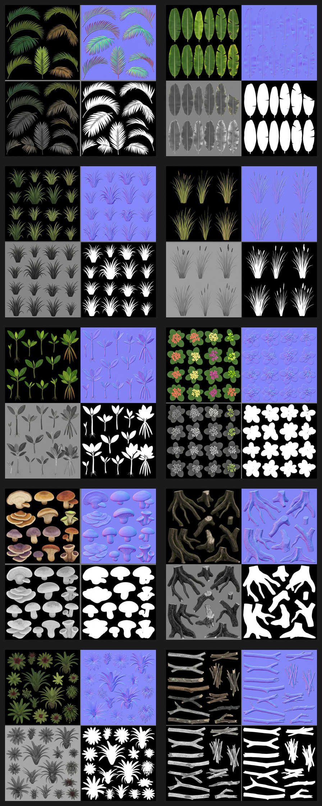

| ID | Vegetation kit | Use | Status and production note |
|---|---|---|---|
| M301 | Palm frond atlas | Palm crowns, fallen fronds and canopy cards | Pass. Excellent arching silhouettes, broad leaflets and useful healthy-to-dry variation. |
| M302 | Banana-leaf atlas | Banana crowns and broad tropical foliage | Pass. Strong intact and wind-split blades with clean alpha and readable central ribs. |
| M303 | Tropical grass clumps | Lawns, roadside edges and jungle clearings | Pass. Dense varied clumps with attractive centers and strong distance silhouettes. |
| M304 | Wetland reed atlas | Marshes, canals and tidal margins | Pass. Clean height variation, broad blades, restrained seed heads and mip-safe alpha. |
| M305 | Mangrove seedlings | Tidal recovery, nurseries and wetland succession | Pass. Excellent paired leaves, propagules and multiple growth stages. |
| M306 | Flowering groundcover | Selective jungle color accents and settlement gardens | Pass. Strong grouped flowers and broad foliage; keep production density restrained. |
| M307 | Jungle fungi | Damp roots, logs, caves and forest floors | Pass. Excellent chunky shelf, cap and cup silhouettes with varied material response. |
| M308 | Exposed roots | Ground contact, buttresses and sculptable root networks | Pass. Strong forks, thick volumes and modular LOD-safe endpoints. |
| M309 | Epiphyte clusters | Trunks, ruins, rocks and canopy decoration | Pass. Excellent rosettes, strap leaves and multiple compact physical scales. |
| M310 | Dead branch debris | Fallen woody carpets and modular debris | Pass. Strong branch and bundle silhouettes without hair-thin clutter. |

## Material Batch 33 — Goblin Creator skin and expression detail

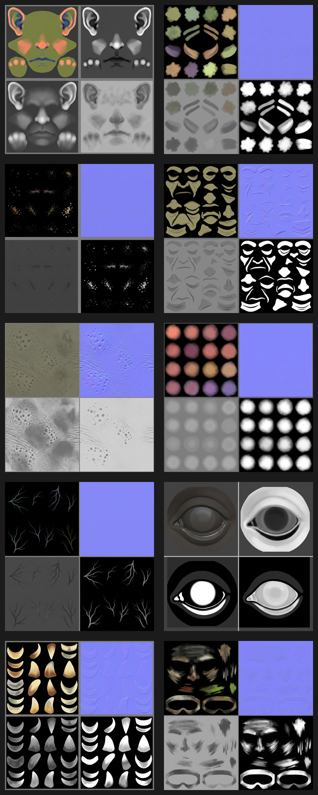

| ID | Creator layer | Use | Status and production note |
|---|---|---|---|
| M311 | Skin thickness and SSS masks | Ears, nose, cheeks, knuckles and thin tissue | Pass after regeneration. Fully abstract detached thickness, edge, curvature and subsurface masks with no assembled anatomy. |
| M312 | Skin pigment variation | Natural runtime-tintable skin diversity | Pass. Strong olive, sage, tan, violet and lime patches with clean soft alpha. |
| M313 | Freckles and beauty marks | Fine identity variation | Pass. Restrained clustered marks and broad placements avoid diseased or noisy skin. |
| M314 | Age wrinkles and expression folds | Brow, smile, eye, nose and neck aging | Pass. Excellent separated fold groups, aligned normals and readable stylized depth. |
| M315 | Skin pores and roughness | Tileable multi-scale skin microdetail | Pass with intensity constraint. Useful pore/roughness structure; production should keep the bubbled patches subtle. |
| M316 | Flush and blush overlays | Emotion, temperature and circulation color | Pass. Excellent broad feathered color clouds with clean alpha and flat normals. |
| M317 | Subtle vein masks | Ears, temples, forearms and hands | Pass. Sparse fantasy-colored branches remain adjustable and non-gory. |
| M318 | Eye wetness masks | Cornea, tearline and inner-corner moisture | Pass. Strong eye-region clearcoat, roughness and thickness masks without baked highlights. |
| M319 | Tooth and horn staining | Teeth, tusks and horn condition | Pass after regeneration. Stain-only mineral discoloration and edge grime with no tooth or horn silhouettes. |
| M320 | Face grime overlays | Dust, grease, paint and goggle-contact condition | Pass with placement constraint. Strong smears and goggle bands; treat the face-like preview only as placement guidance, never a fixed face texture. |

## Material Batch 34 — mobile and low-resolution core materials

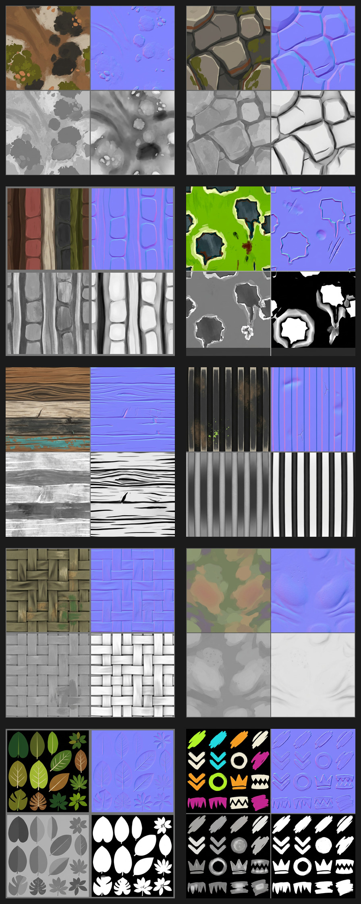

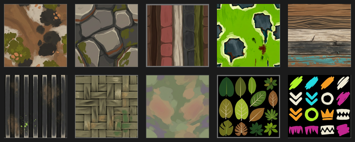

| ID | Mobile material | Intended tier | Status and production note |
|---|---|---|---|
| M321 | Packed dirt | Mobile standard, `128 × 128` | Pass. Five-color macro grouping, broad wear and sparse pebble clusters remain legible at 128 px. |
| M322 | Chunky tropical rock | Mobile standard, `128 × 128` | Pass. Excellent large planes, thick fissures and restrained moss/mineral accents. |
| M323 | Tropical bark | Mobile rectangular, `128 × 256` | Pass. Strong vertical plates, broad grooves and clear dry/damp grouping for low-poly trunks. |
| M324 | Worn racing paint | Mobile standard, `128 × 128` | Pass. Bold acid-green identity, large exposed-metal islands and simple condition masks. |
| M325 | Rough timber | Mobile rectangular, `128 × 256` | Pass. Excellent exaggerated grain flow, pale wear and turquoise transfer without micro-noise. |
| M326 | Ribbed rubber | Mobile standard, `128 × 128` | Pass. Thick stable ribs and large contact-polish bands survive aggressive mip reduction. |
| M327 | Heavy canvas | Mobile standard, `128 × 128` | Pass. Oversized weave and broad abrasion read clearly without relying on fine fibers. |
| M328 | Goblin skin base | Mobile hero, `256 × 256` | Pass. Six-color soft mottling and broad pores preserve appealing skin identity at low resolution. |
| M329 | Tropical foliage atlas | Mobile atlas, `256 × 256` | Pass. Thick silhouettes, simple veins, generous padding and no fragile internal holes. |
| M330 | Goblin racing-mark atlas | Mobile atlas, `256 × 256` | Pass. Excellent bold symbols and paint marks with no thin lines, words or tiny splatter. |

Authoring, packing, mip, alpha, fallback and validation requirements are defined in [`docs/MOBILE_LOW_RES_MATERIAL_STANDARD.md`](../../../docs/MOBILE_LOW_RES_MATERIAL_STANDARD.md).

## Material Batch 35 — mobile architecture, weather, and shoreline expansion

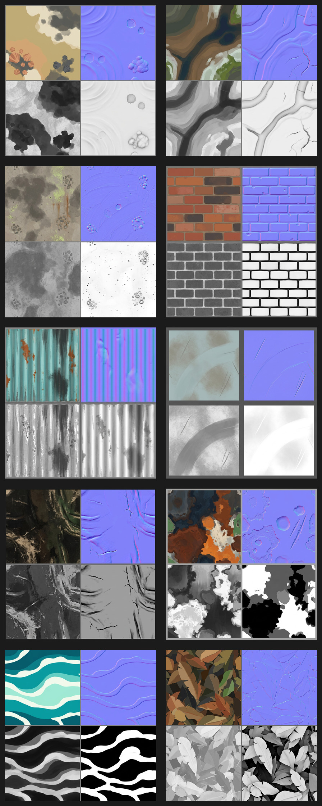

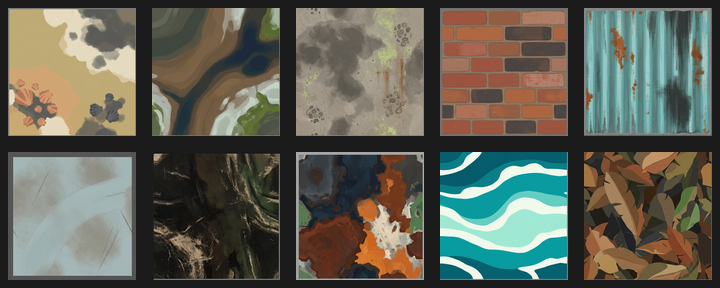

| ID | Mobile material | Intended tier | Status and production note |
|---|---|---|---|
| M331 | Tropical beach sand | Mobile standard, `128 × 128` | Pass. Five broad sand/moisture groups and sparse shell clusters remain distinct at 128 px. |
| M332 | Tidal mud | Mobile standard, `128 × 128` | Pass. Strong low-frequency flow bands, wet/dry grouping and thick drainage cracks. |
| M333 | Rough concrete | Mobile standard, `128 × 128` | Pass. Broad cement values, damp clouds and grouped aggregate avoid grey micro-noise. |
| M334 | Fired brick | Mobile standard, `128 × 128` | Pass. Excellent oversized staggered bond, limited firing palette and thick readable mortar. |
| M335 | Corrugated roof sheet | Mobile rectangular, `128 × 256` | Pass. Strong turquoise waves, dark troughs, worn crowns and large rust islands. |
| M336 | Scratched dusty glass | Mobile standard, `128 × 128` | Pass. Simple haze, broad wipe and very sparse scratches remain useful after downsampling. |
| M337 | Weathered leather | Mobile standard, `128 × 128` | Pass with simplification constraint. Strong dark folds and pale wear; retain only the largest crease masses in production. |
| M338 | Broad rusted steel | Mobile standard, `128 × 128` | Pass. Excellent large steel, oxide, orange rust and exposed-metal regions with clean masks. |
| M339 | Water and foam masks | Mobile standard, `128 × 128` | Pass. Bold independently scrollable teal bands and thick connected foam survive mip reduction. |
| M340 | Packed leaf litter | Mobile standard, `128 × 128` | Pass. Excellent six-color overlapping leaves with no dependence on fine veins or fragments. |

## Material Batch 36 — mobile Goblin Creator and vehicle detail

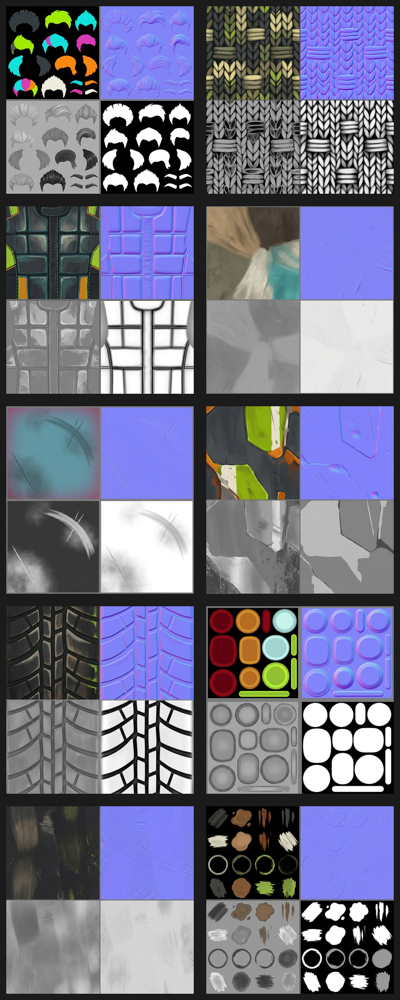

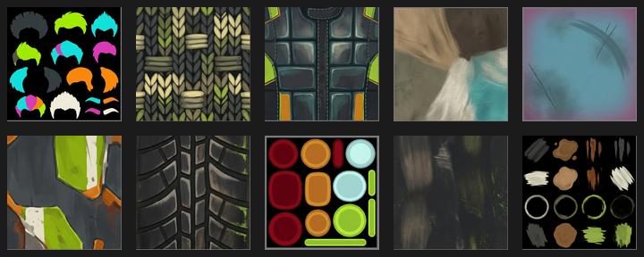

| ID | Mobile material | Intended tier | Status and production note |
|---|---|---|---|
| M341 | Dyed hair atlas | Mobile atlas, `256 × 256` | Pass. Excellent chunky punk silhouettes, six bold colors and no fragile strand detail. |
| M342 | Coarse knit | Mobile standard, `128 × 128` | Pass. Oversized interlocked loops, simple dyed regions and broad compression remain clear. |
| M343 | Padded racing cloth | Mobile hero, `256 × 256` | Pass. Strong intentional rectangular pads and straight seams finally read as racing apparel rather than stone cells. |
| M344 | Worn suede | Mobile standard, `128 × 128` | Pass. Broad directional nap and large tan, brown and turquoise handling zones survive reduction. |
| M345 | Tinted goggle lens | Mobile hero, `256 × 256` | Pass. Simple cyan/magenta tint, one broad wipe and sparse scratches avoid shimmer. |
| M346 | Painted armor metal | Mobile hero, `256 × 256` | Pass. Excellent acid-green, charcoal, orange and exposed-metal armor blocks with clean masks. |
| M347 | Racing tire tread | Mobile rectangular, `128 × 256` | Pass. Large angular tread blocks and wide channels retain a strong vehicle read through LOD. |
| M348 | Vehicle light-lens atlas | Mobile atlas, `256 × 256` | Pass. Eight large red, amber, cyan and green forms provide stable emissive and alpha masks. |
| M349 | Dashboard plastic | Mobile standard, `128 × 128` | Pass. Restrained broad handling wear and grime avoid unstable molded micro-grain. |
| M350 | Grime decal atlas | Mobile atlas, `256 × 256` | Pass. Strong dust, mud, chalk, grease and paint marks with thick padded silhouettes. |

## Material Batch 37 — mobile track, effects, and destruction

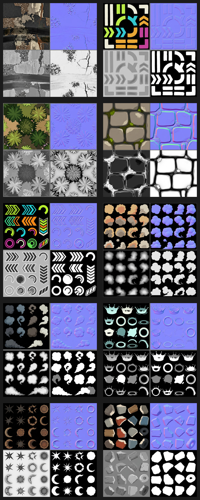

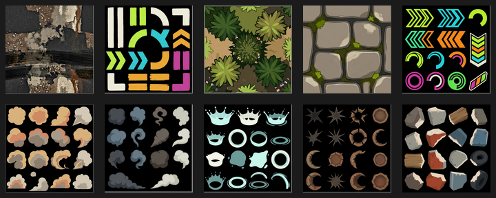

| ID | Mobile material/effect | Intended tier | Status and production note |
|---|---|---|---|
| M351 | Racing-track asphalt | Mobile standard, `128 × 128` | Pass after R02 regeneration. Continuous charcoal road mass, sparse aggregate and a broad polished racing band now read correctly. |
| M352 | Racing-lane paint atlas | Mobile atlas, `256 × 256` | Pass. Excellent thick lines, corners, arcs and chevrons with bold palette and stable alpha. |
| M353 | Tropical grass ground | Mobile standard, `128 × 128` | Pass with identity constraint. Strong packed rosette groundcover; use as broad-leaf turf rather than fine-blade grass. |
| M354 | Mossy stone paving | Mobile standard, `128 × 128` | Pass. Excellent large stones, wide joints, lime moss accents and readable height. |
| M355 | Boost-pad marking atlas | Mobile atlas, `256 × 256` | Pass. Strong neon chevrons and turbine arcs with clean emissive masks and no thin circuitry. |
| M356 | Dust-puff atlas | Mobile VFX atlas, `256 × 256` | Pass. Broad tan impact and trail lobes support low-overdraw animation cards. |
| M357 | Smoke atlas | Mobile VFX atlas, `256 × 256` | Pass. Strong charcoal, soot and steam silhouettes with connected soft volumes. |
| M358 | Rain-splash atlas | Mobile VFX atlas, `256 × 256` | Pass. Thick crowns, rings and puddle arcs avoid fragile droplets and retain clear masks. |
| M359 | Impact-crack atlas | Mobile decal atlas, `256 × 256` | Pass. Excellent thick radial fractures, crater rims and stable-hole edge forms. |
| M360 | Material chunk atlas | Mobile destruction atlas, `256 × 256` | Pass. Strong rock, concrete, wood, metal and rubber silhouettes for velocity, spin, bounce and recycle. |

## Material Batch 38 — mobile weather and vehicle effects

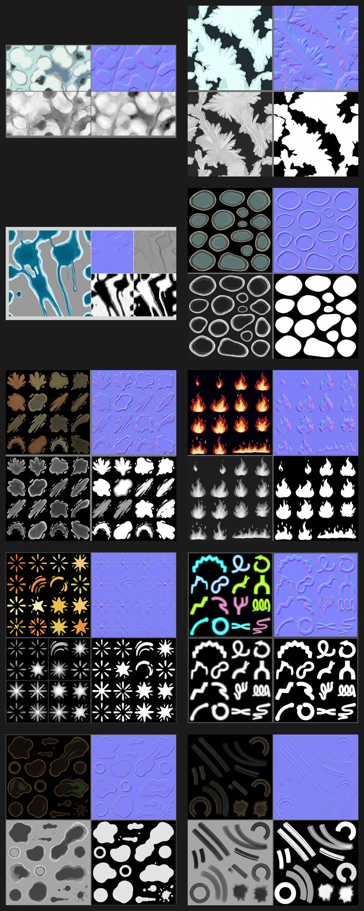

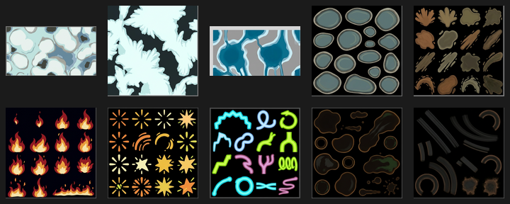

| ID | Mobile material/effect | Intended tier | Status and production note |
|---|---|---|---|
| M361 | Snow cover | Mobile standard, `128 × 128` | Constrained pass after R02 regeneration. Square coordinated drift channels now work; rebuild the decorative colored strip in the lower-right guide before production. |
| M362 | Frost masks | Mobile standard, `128 × 128` | Pass after R02 regeneration. Chunky crystalline edge crust now reads as frost rather than foliage. |
| M363 | Wetness overlay | Mobile standard, `128 × 128` | Pass after R02 regeneration. Square coordinated runoff, roughness and coverage masks. |
| M364 | Puddle atlas | Mobile decal atlas, `256 × 256` | Pass. Excellent large puddles, dark wet rims and simple low ripples with clean alpha. |
| M365 | Mud-splatter atlas | Mobile decal atlas, `256 × 256` | Pass. Strong chunky blobs, wheel arcs and short streaks without unstable tiny droplets. |
| M366 | Fire atlas | Mobile VFX atlas, `256 × 256` | Pass. Excellent limited-palette flame silhouettes and broad intensity masks for low overdraw. |
| M367 | Spark atlas | Mobile VFX atlas, `256 × 256` | Pass. Bold short-ray bursts and compact impact stars remain unmistakable at 128 px. |
| M368 | Electric-arc atlas | Mobile VFX atlas, `256 × 256` | Pass. Strong cyan, green and magenta coils, loops and thick arcs without hairline branches. |
| M369 | Oil-spill atlas | Mobile decal atlas, `256 × 256` | Pass. Excellent pools, rings and drags with restrained amber and contaminated-green variation. |
| M370 | Tire-skid atlas | Mobile decal atlas, `256 × 256` | Pass. Strong braking bars, drift curves, donut arcs and burnout patches for racing-camera distance. |

## Material Batch 39 — nostalgic styles with modern PBR response

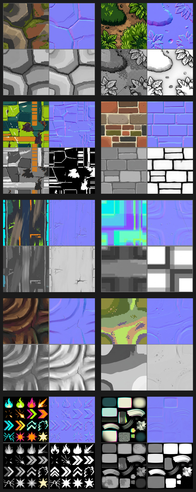

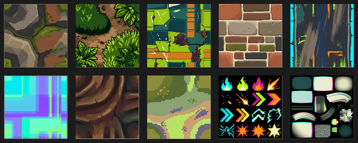

| ID | Nostalgic PBR style | Intended presentation | Status and production note |
|---|---|---|---|
| M371 | Early-3D pixel-painted rock | Fifth-generation terrain | Pass. Excellent stepped planes, hand-dithered transitions and classic limited stone/moss palette. |
| M372 | Dithered 16-bit jungle ground | Top-down and oblique tropical terrain | Pass. Strong sprite-like foliage masses, deliberate pixels and readable soil paths with coordinated PBR depth. |
| M373 | Late-1990s vehicle metal | Low-poly arcade vehicle panels | Pass. Excellent acid-green/teal panel blocks, orange trim and chunky damage without baked reflection. |
| M374 | Classic-console masonry | Settlement walls and ruins | Pass. Strong oversized brick/stone bond, limited palette and thick readable mortar. |
| M375 | Turn-of-the-millennium arcade track | Racing surfaces and trim | Pass with identity constraint. Excellent vertical color scars and wear; use as expressive arcade track/panel surfacing rather than neutral asphalt. |
| M376 | Y2K translucent plastic | Lenses, accessories and interface props | Pass. Excellent cyan, aqua and violet geometric bands with clean roughness/transmission regions. |
| M377 | Hand-painted fantasy leather | Goblin clothing, seats and equipment | Pass. Strong painterly brown folds and broad wear that still drive modern roughness and normal response. |
| M378 | Retro cel-banded Goblin skin | Creator skin-style preset | Pass. Excellent deliberate pixels, olive/lime bands and restrained violet accents without fixed lighting. |
| M379 | Limited-palette effects atlas | Fire, sparks, boosts and electric effects | Pass. Strong point-sampled silhouettes, hard palette steps and clean alpha/emissive masks. |
| M380 | CRT-era overlay atlas | Displays, previews and selective world screens | Pass. Excellent scan bands, phosphor blocks, color fringe and wipe/static patches; never apply as a mandatory full-interface filter. |

All nostalgic presets keep coordinated material channels. Pixel grouping, dithering, palette limits and deliberate texel edges must survive mip generation; baked highlights and fixed illumination remain prohibited.

## Material Batch 40 — nostalgic PBR environment and vehicle expansion

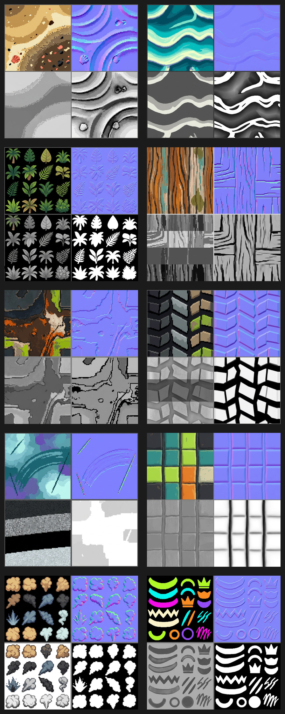

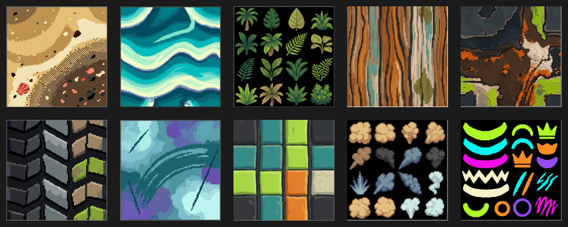

| ID | Nostalgic PBR preset | Canonical use | Status and production note |
|---|---|---|---|
| M381 | Pixel-painted beach sand | Retro shoreline terrain | Pass. Excellent broad sand bands, dithered moisture transitions and chunky shell/mineral groups. |
| M382 | Dithered tropical water | Scrolling retro water | Pass. Strong limited teal/aqua wave bands and thick connected foam with coordinated flow guidance. |
| M383 | Sprite foliage atlas | Point-sampled tropical foliage | Pass. Excellent palms, ferns, shrubs and broad leaves with clean stepped silhouettes and alpha. |
| M384 | Low-poly timber | Classic-console wood | Pass. Strong orange/brown grain, turquoise paint transfer and broad stepped relief. |
| M385 | Retro rusted steel | Industrial and vehicle surfaces | Pass. Excellent steel, oxide, orange rust, pale exposure and green paint regions. |
| M386 | Chunky tire rubber | Racing tires and rubber panels | Pass. Strong oversized tread blocks, wide channels and mip-stable limited palette. |
| M387 | Pixel lens glass | Goggles, visors and vehicle lenses | Pass. Strong broad cyan/violet haze and sparse stepped scratches; runtime Fresnel remains separate. |
| M388 | Hand-painted racing cloth | Suits, seats and padding | Pass. Excellent rectangular quilt pads, straight seams and arcade-racer palette. |
| M389 | Pixel smoke and dust atlas | Low-overdraw nostalgic VFX | Pass. Strong tan, charcoal, blue-grey and steam silhouettes with hard density bands. |
| M390 | Palette-swap Goblin markings | Creator and racing identity | Pass. Excellent chunky marks, clean alpha and six-color runtime-swappable palette. |

Canonical codes and reconstruction recipes for M381–M390 are registered in [`texture-preset-catalog.json`](./texture-preset-catalog.json).

## Material Batch 41 — nostalgic architecture, weather, and world effects

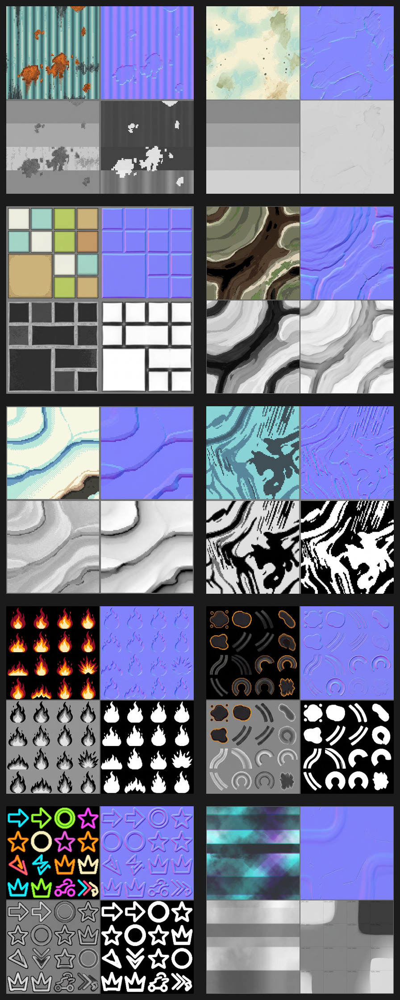

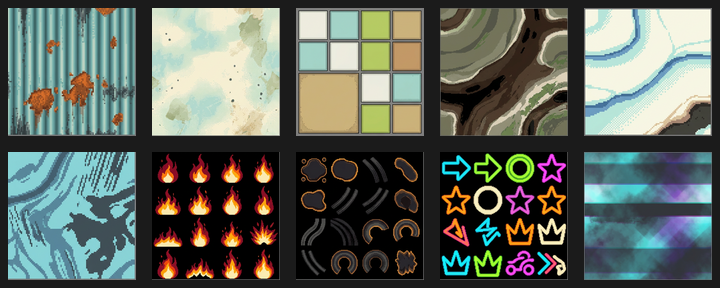

| ID | Nostalgic PBR preset | Canonical use | Status and production note |
|---|---|---|---|
| M391 | Pixel corrugated roofing | Retro roofs and cladding | Pass. Excellent turquoise waves, orange rust islands and crisp metal/paint masks. |
| M392 | Dithered limewashed plaster | Settlement walls and interiors | Pass. Strong ivory/aqua clouding, sparse pixels and broad feathered wear. |
| M393 | Classic-console glazed tile | Service and domestic interiors | Pass. Excellent oversized tile grid, limited aqua/lime/tan palette and thick grout. |
| M394 | Retro pixel tropical mud | Tidal ground and track edges | Pass. Strong olive/brown flow masses, dark pools and chunky drainage channels. |
| M395 | Nostalgic pixel snow | Seasonal highland coverage | Pass. Excellent pale cyan drift bands, dirty melt edge and exposed-ground control. |
| M396 | Chunky rain/wetness masks | Recursive weather condition | Pass. Strong connected runoff, thick streak groups and coordinated wetness/roughness masks. |
| M397 | Limited-palette fire atlas | Fire and boost VFX | Pass. Excellent four-color flames, hard intensity bands and clean emissive alpha. |
| M398 | Arcade oil and skid atlas | Track and vehicle-condition decals | Pass. Strong pools, twin skids, drift arcs and donut marks with point-sampled silhouettes. |
| M399 | Wordless neon sign atlas | In-world racing signs and accents | Pass. Excellent arrows, rings, stars and crowns; runtime emission and bloom stay separate. |
| M400 | Retro interface glass | Instruments and in-world displays | Pass. Strong teal-violet scan bands, chunky haze and modern transmission control. |

Canonical codes and reconstruction recipes for M391–M400 are registered in [`texture-preset-catalog.json`](./texture-preset-catalog.json).

## Material Batch 42 — nostalgic Goblin Creator wardrobe and accessories

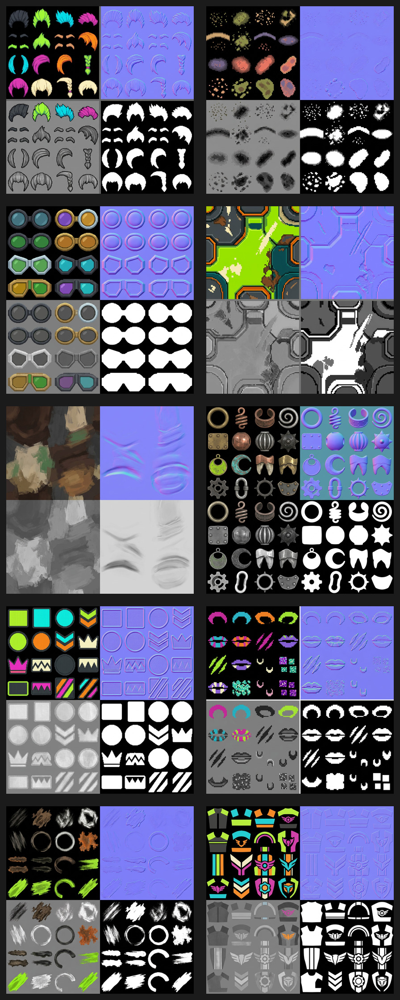

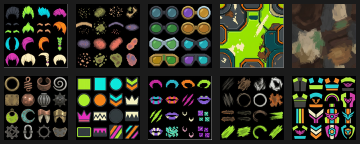

| ID | Nostalgic Creator preset | Canonical use | Status and production note |
|---|---|---|---|
| M401 | Pixel hair cards | Hair, brows and punk silhouettes | Pass. Excellent chunky mohawks, tufts, locks and brows with six-color palette swaps. |
| M402 | Dithered skin details | Pigment, freckles, blush and age layers | Pass. Strong appealing olive, tan, violet and coral clusters without fixed facial texture. |
| M403 | Classic goggle kit | Goggle frames and lenses | Pass. Excellent round, oval and angular variants with clean transmission silhouettes. |
| M404 | Retro protective plate material | Creator protective gear and racing panels | Pass. Strong acid-green enamel, charcoal metal, orange trim and broad exposed wear. |
| M405 | Hand-painted boot leather | Boots, gloves and heavy gear | Pass. Excellent broad flex creases, mud, pale wear and painterly limited palette. |
| M406 | Chunky jewelry atlas | Rings, cuffs, beads and abstract charms | Pass after regeneration. Clean original loops, plates, spirals and machine charms without real-world religious forms. |
| M407 | Arcade cloth patches | Wardrobe and team patches | Pass. Strong geometric shapes, clean alpha and indexed racing palette. |
| M408 | Limited-palette cosmetics | Eye, lip, cheek and nail overlays | Pass. Excellent chunky punk cosmetics without full-face dependency or micro-glitter. |
| M409 | Creator grime atlas | Dust, mud, chalk, grease and paint | Pass. Strong broad wipes, rings and drags with clean material-condition masks. |
| M410 | Palette-swap team kit | Clothing, helmets and vehicle identity | Pass after regeneration. Excellent bold panels, bands and emblems without generated labels. |

Canonical codes and reconstruction recipes for M401–M410 are registered in [`texture-preset-catalog.json`](./texture-preset-catalog.json).

## Material Batch 43 — nostalgic settlement props and signage

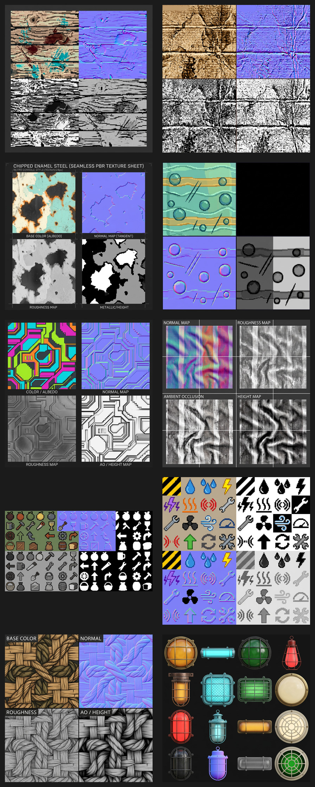

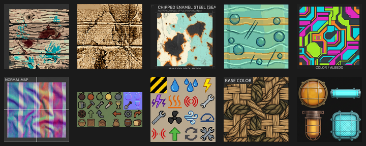

| ID | Preset | Review |
|---|---|---|
| M411 | Pixel crate wood | Pass. Strong pale timber, turquoise transfer and chunky wear. |
| M412 | Dithered cardboard | **Regenerate.** Reads as cracked masonry rather than pressed kraft board. |
| M413 | Classic enamelware | **Regenerate.** Material read is useful, but generated headings and channel labels violate the standard. |
| M414 | Retro bottle glass | **Regenerate.** Broke the required four-quadrant channel layout. |
| M415 | Arcade vending plastic | **Regenerate.** Excellent color language, but generated channel labels must be removed. |
| M416 | Chunky awning cloth | **Regenerate.** Generated labels and inconsistent channel interpretation. |
| M417 | Market symbol atlas | **Regenerate.** Too many tiny symbols; rebuild as sixteen large padded forms. |
| M418 | Utility symbol atlas | Pass. Strong wordless hazard, fluid, electrical, heat and tool symbols. |
| M419 | Rope/basket material | **Regenerate.** Strong weave, but generated labels violate the standard. |
| M420 | Retro light fixtures | **Regenerate.** Attractive fixture family, but returned as a single beauty atlas rather than coordinated channels. |

Canonical codes and reconstruction records for M411–M420 are registered in [`texture-preset-catalog.json`](./texture-preset-catalog.json).

## Material Batch 44 — targeted settlement regeneration

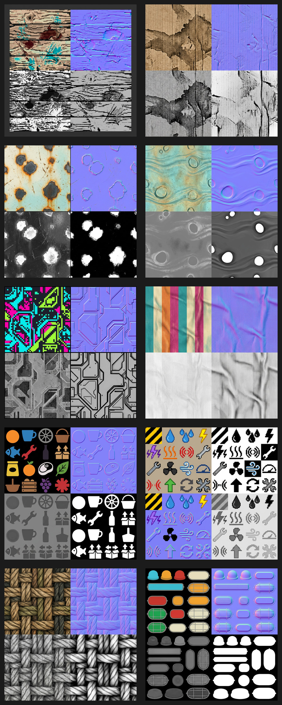

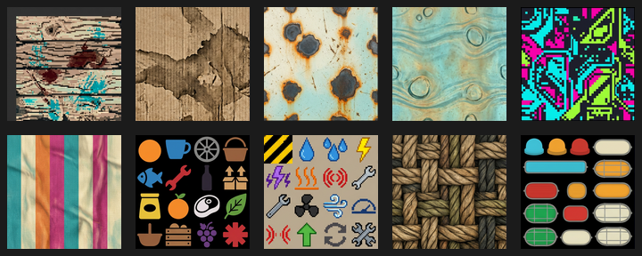

M412–M417 and M419–M420 now pass after regeneration. Cardboard reads as pressed paper; all sheets are square and unlabeled; bottle glass has complete coordinated channels; awning cloth and rope retain clean material separation; the market atlas uses large padded symbols; and the light family now provides matched Normal, Roughness and Alpha/Emissive quadrants. Their canonical recipe revisions advanced from `R01` to `R02`. M411 and M418 remain the approved unchanged anchors.

## Material Batch 45 — nostalgic tracks, transitions, and recovery

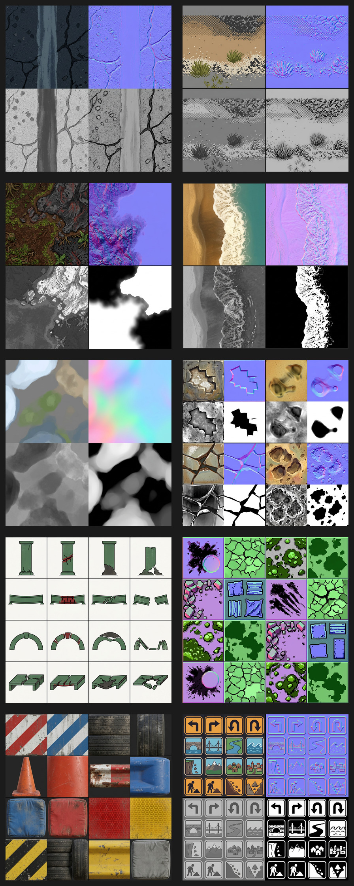

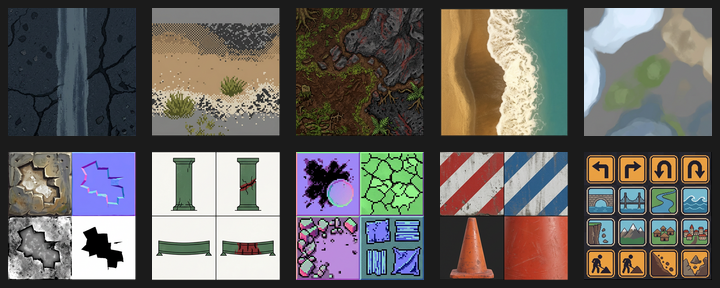

| ID | Preset | Review |
|---|---|---|
| M421 | Corrected pixel asphalt | Pass. Continuous dark road mass, broad racing line and sparse thick cracking. |
| M422 | Dithered road shoulder | Pass. Strong dirt/asphalt/grass hierarchy and readable edge transition. |
| M423 | Retro terrain transition | Pass. Excellent irregular jungle-to-rock signed boundary and coordinated channels. |
| M424 | Water-edge transition | Pass. Excellent sand, wet band, foam and water signed masks. |
| M425 | Weather accumulation | Pass with constraint. Broad masks are useful; derive all production channels from the authoritative grayscale field. |
| M426 | Impact dissolve atlas | Pass. Strong rigid, brittle, soft and granular removal silhouettes. |
| M427 | Support-loss collapse masks | **Regenerate.** Returned as concept diagrams rather than coordinated channel quadrants. |
| M428 | Recovery-stage overlays | **Regenerate.** Returned as a tiled beauty collection rather than matched channels. |
| M429 | Track-prop atlas | **Regenerate.** Attractive prop family, but lacks coordinated PBR quadrants. |
| M430 | Landscape signs | Pass. Strong wordless route, bridge, water, cliff, repair and hazard emblems. |

Canonical codes and reconstruction records for M421–M430 are registered in [`texture-preset-catalog.json`](./texture-preset-catalog.json).

## Material Batch 46 — correction and regeneration pass

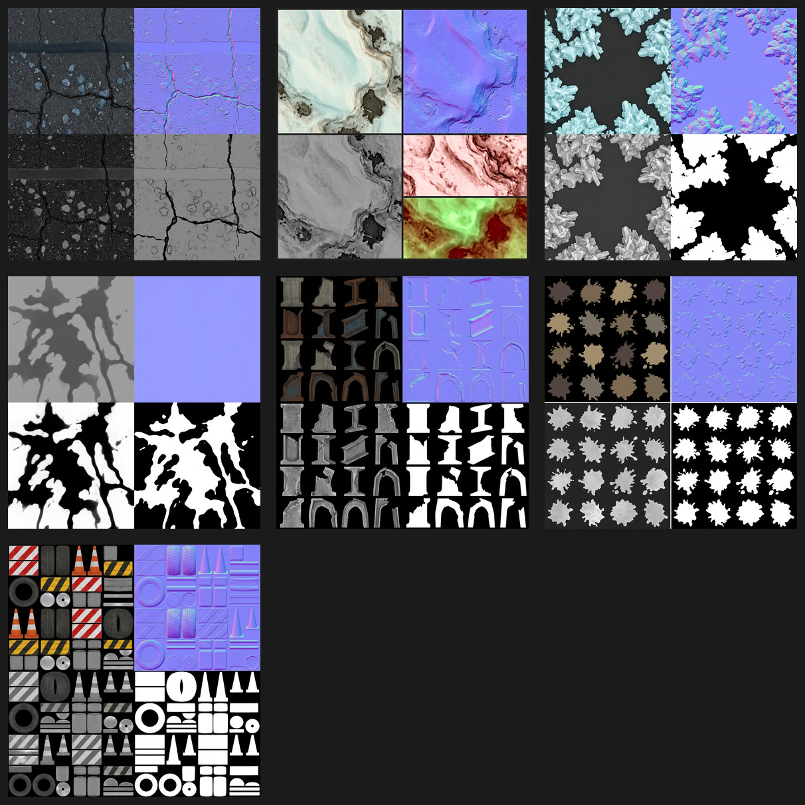

M351, M362, M363 and M427–M429 now pass after regeneration. M361 is a constrained pass: its square snow channels are usable, but the decorative colored strip in the lower-right guide must be removed during production rebuild. Regenerated cataloged presets advanced to `R02`; legacy mobile M351 and M361–M363 now also have canonical reconstruction records.

## Material Batch 47 — mobile grand-landscape overview materials

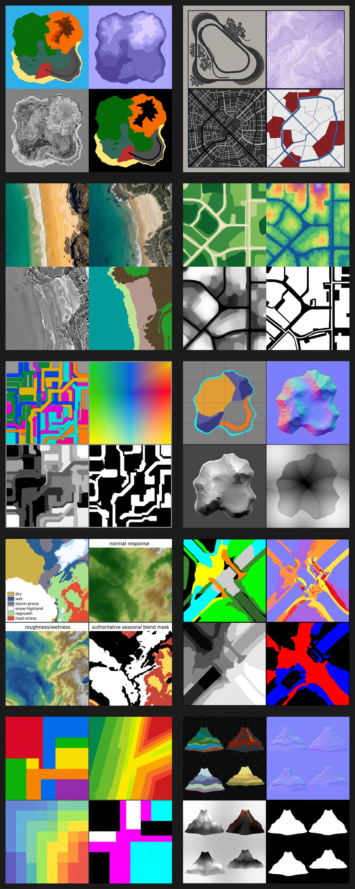

| ID | Overview preset | Review |
|---|---|---|
| M431 | Biome overview | Pass. Excellent broad island biome regions and authoritative mask. |
| M432 | Track/settlement hierarchy | Pass after R02 regeneration. One shared loop, branches, pads, grade and exclusion field now coordinate exactly. |
| M433 | Shoreline readability | Pass after R02 regeneration. Fully stylized chunky coast, shallows, sand, rock, foam and signed mask. |
| M434 | Foliage density | Pass. Strong clearings, corridors, density and exclusion fields. |
| M435 | Infrastructure masks | Pass. Excellent chunky road, bridge, dock and utility hierarchy. |
| M436 | Cinematic lighting zones | Pass. Strong warm/cool/coastal/racing light-volume fields. |
| M437 | Seasonal overview | Pass after R02 regeneration. Clean unlabeled dry, wet, storm, snow, regrowth and heat-stress fields. |
| M438 | Destruction/recovery overview | Pass. Strong intact, damaged, collapsed, repaired and regrown fields. |
| M439 | Route signage fields | Constrained pass. Bold priority fields work; production must derive signage from the authoritative route mask. |
| M440 | Distant-island impostors | Pass. Excellent four-climate silhouettes, normals, haze and alpha. |

Canonical codes and reconstruction records for M431–M440 are registered in [`texture-preset-catalog.json`](./texture-preset-catalog.json).

## Material Batch 48 — grand-landscape correction pass

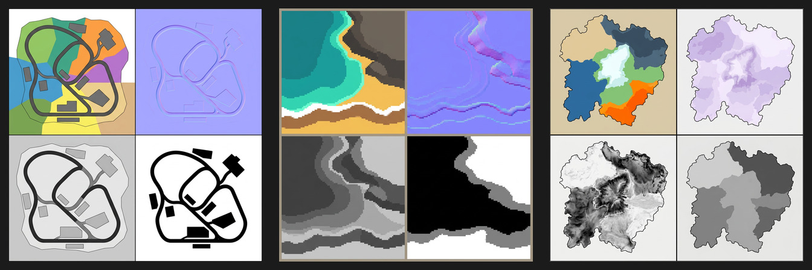

M432, M433 and M437 pass after strict regeneration from shared authoritative fields. All three advanced to recipe revision `R02`. Track/settlement hierarchy, shoreline boundaries and seasonal regions now coordinate across every quadrant, remain clean and unlabeled, and preserve mobile readability.

## Next material batches

## Material Batch 49 — global sports playing surfaces

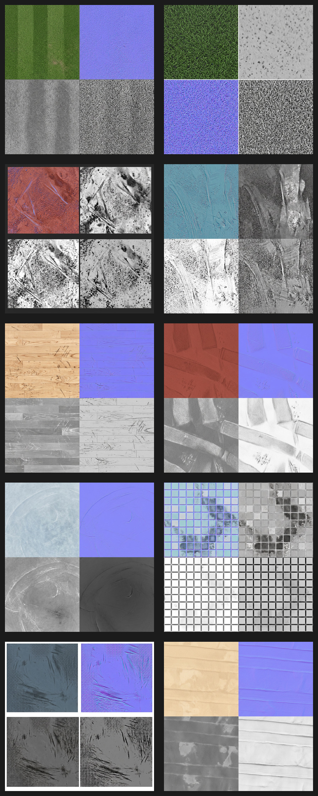

| ID | Sports surface | Primary uses | Review |
|---|---|---|---|
| M441 | Natural turf | Football, rugby, cricket, hockey and field sports | Pass. |
| M442 | Artificial turf | Football, hockey, rugby and multi-sport grounds | Pass. |
| M443 | Clay court | Tennis and regional clay-court sports | Pass. |
| M444 | Acrylic hard court | Tennis, basketball, netball, volleyball, handball and futsal | Pass. |
| M445 | Indoor timber court | Basketball, volleyball, badminton, handball and futsal | Pass after R02 regeneration. |
| M446 | Athletics-track rubber | Running and field-event approaches | Pass. |
| M447 | Maintained sports ice | Ice hockey, curling and skating | Pass after R02 regeneration. |
| M448 | Pool-deck tile | Swimming and water polo venues | Pass. |
| M449 | Combat/gymnastics mat | Judo, wrestling, taekwondo, MMA and landing areas | Pass. |
| M450 | Groomed beach sand | Beach football, volleyball, handball, wrestling and athletics | Pass after R02 regeneration. |

All surfaces remain free of baked sport markings so multiple rule presets can reuse them. Canonical `SPT` records are registered for M441–M450.

## Material Batch 50 — detachable global sports rule masks

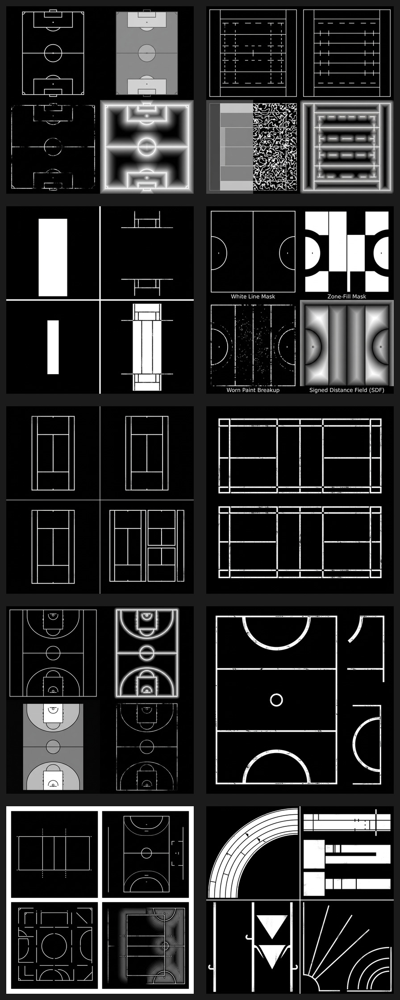

| IDs | Coverage | Review |
|---|---|---|
| M451–M453 | Association football, configurable rugby, cricket pitch/creases | M451–M452 pass; M453 constrained pass pending authoritative dimensional reconstruction. |
| M454–M456 | Field hockey, tennis, badminton | Regenerate: M454 contains generated labels; M455–M456 do not expose the complete four-channel mask contract. |
| M457–M458 | Basketball and netball | M457 passes; regenerate M458 with the complete mask contract. |
| M459–M460 | Volleyball/handball/futsal modular kit and athletics | Pass as derivation references. |

These kits separate semantic line geometry, zone fills, paint breakup and distance-field treatment from the playing surface. Production reconstruction must use authoritative rule dimensions rather than tracing generated pixels. Canonical `SPT` records are registered for M451–M460.

## Material Batch 51 — rule-mask corrections and global play objects

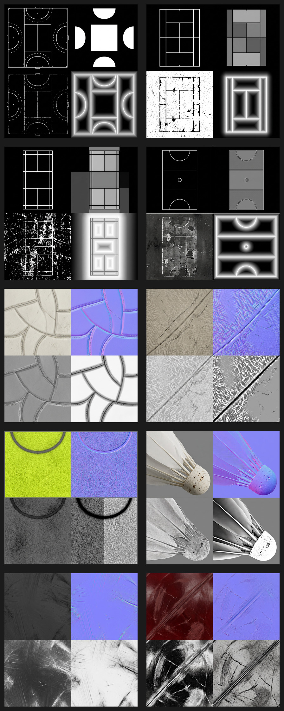

M454–M456 and M458 now expose complete line, zone, wear and signed-distance quadrants and pass at `R02`. M461–M463 and M465–M466 provide brand-neutral stitched round-ball, oval-ball, felt-ball, puck-rubber and lacquered cricket-ball materials. M464 is a useful shuttlecock multi-angle object reference but must be regenerated as a detached material/channel sheet before production use.

The play-object materials remain independent of mesh topology and protected branding. Their seams, palettes, grip, wear and finish remain editable preset parameters.

## Next material batches

### Sports continuation after the interface foundation batches

Complete sports textures in all three established styles: full-fidelity PBR, mobile low-resolution PBR and nostalgic PBR. Continue with:

- universal grass, clay, hard-court, timber-court, track, ice, pool-deck and combat-mat surfaces;
- detachable line/zone masks for association football, rugby, cricket, hockey, tennis, badminton, basketball, netball, volleyball, handball, futsal, athletics and regional variants;
- brand-neutral ball, shuttle, puck and play-object materials;
- goals, nets, posts, wickets, hoops, targets and venue-condition layers.

The global category and naming requirements are defined in [`docs/SPORTS_TEXTURE_PRESET_STANDARD.md`](../../../docs/SPORTS_TEXTURE_PRESET_STANDARD.md). American sports are included but do not define the default taxonomy.

## Material Batch 52 — clean custom-interface icon atlases

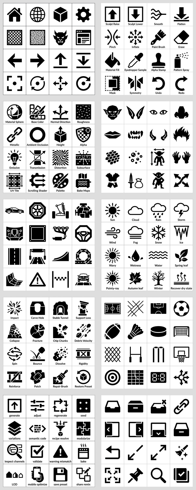

M467–M476 establish ten coordinated 16-slot semantic icon families for navigation, sculpt/paint, material channels, Goblin Creator, vehicle/track creation, weather, destruction/repair, global sports, local AI and detachable drawer controls. Stable semantic IDs are recorded in each machine-readable recipe so repainting or replacing a glyph cannot change its action.

M469 and M472 passed after `R02` corrections. M470, M471, M474 and M476 remain passed; M467 remains a constrained pass because several depth identities need stronger differentiation. M468, M473 and M475 still require text-free regeneration after their `R02` attempts retained generated captions. These atlases are derivation references: production exports require transparent alpha, exact cell alignment and accessibility validation.

## Material Batch 53 — interface icon corrections and style families

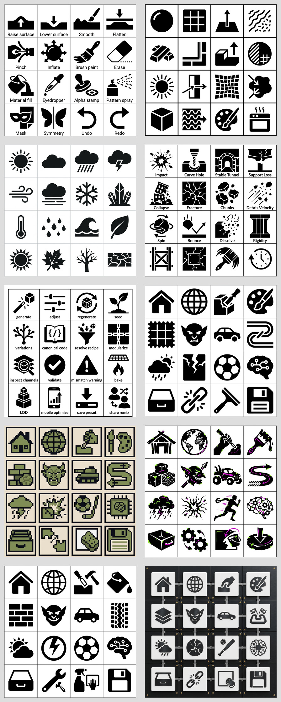

M477–M481 establish mobile, nostalgic, Goblin-punk, accessibility-first high-contrast and restrained tactile-PBR treatments over the same 16 core semantic action IDs. All five style references pass. Styles may alter stroke, fill, palette, wear, depth and accents, but must not alter action identity or scene-first interaction behavior.

## Material Batch 54 — sculptable interface materials and final clean-atlas corrections

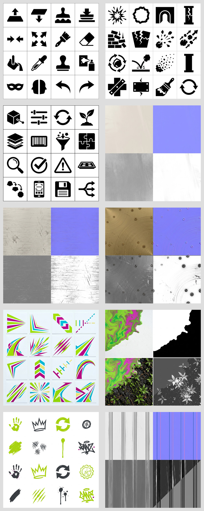

M468, M473 and M475 now pass at `R03` as caption-free semantic atlases. M482–M486 and M488 establish independently editable white stage/panel, smooth connector metal, selective gold rivet, perspective racing-line decal, Goblin paint-to-jungle transition and detachable drawer-rail children. These all pass while preserving the white scene-first baseline, sharp geometry and clean-canvas drawer behavior.

M487 demonstrates the intended sparse handprint, crown, remix, scratch and paint-detail density, but must be regenerated because several generated marks resemble lettering. Production decals remain isolated alpha children rather than irreversible marks baked into the interface stage.

Every entry is a child of a recursively sculptable and paintable interface preset under [`docs/INTERFACE_PRESET_SCULPT_PAINT_STANDARD.md`](../../../docs/INTERFACE_PRESET_SCULPT_PAINT_STANDARD.md). Geometry, placement, palette, roughness, wear and accent intensity remain editable and bake only for the selected runtime tier.

## Material Batch 55 — interface graphs, accessibility and inhabited details

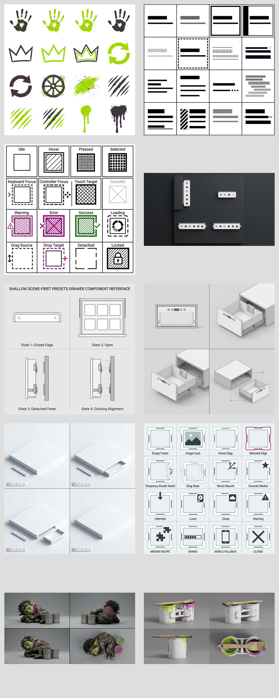

M487 passes at `R02` as a text-free sparse inhabited-detail atlas. M489 supplies abstract typography-state masks without binding the preset to a specific typeface. M494 validates the dominant clean white stage across closed, shallow-drawer, detached-drawer and clean-canvas states. M496–M497 pass as four-view references for the sleeping punk Goblin racer and paired paint-can prop.

M491 and M493 are constrained passes: their component mechanics are useful, but reconstruction must restore the approved bright white scene-first context and avoid domestic-cabinet readings. Regenerate M490, M492 and M495 because generated captions violate the icon and component contract. All interaction meaning comes from registered semantic state IDs, never from generated text or pixel inference.

## Material Batch 56 — complete scene-first parent graph references

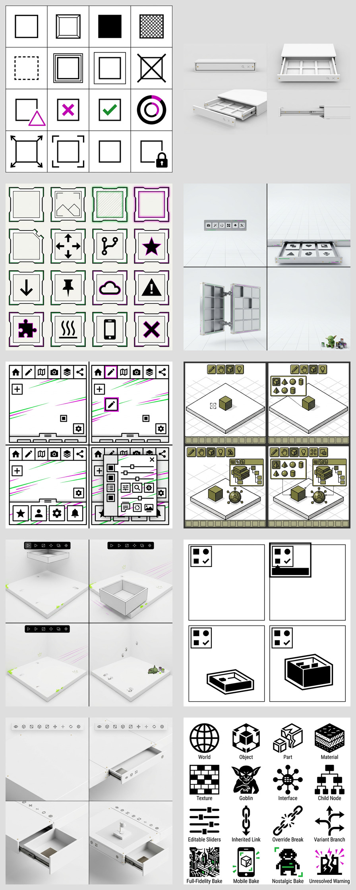

M490, M492 and M495 pass at `R02` after text-free regeneration. M501 and M503 pass as Goblin-punk and restrained tactile-PBR parent graph references. M498 and M502 are constrained passes: retain their sparse composition and state logic while restoring stronger stage continuity and clearer drawer relationships during reconstruction.

Regenerate M499 and M500 because their mobile and nostalgic states accumulated too much persistent interface, violating the dominant-scene requirement. Regenerate M504 without generated captions. Parent graph recipes require at least 78 percent scene, stable semantic action IDs, detachable/closable drawers and a guaranteed clean-canvas state. Style swaps may never alter interaction behavior.

### Next interface work

Correct M499, M500 and M504, then formalize the recursive parent/child graph registry and runtime resolver independently from these visual derivation references.

## Material Batch 57 — automated-ingestion and interface corrections

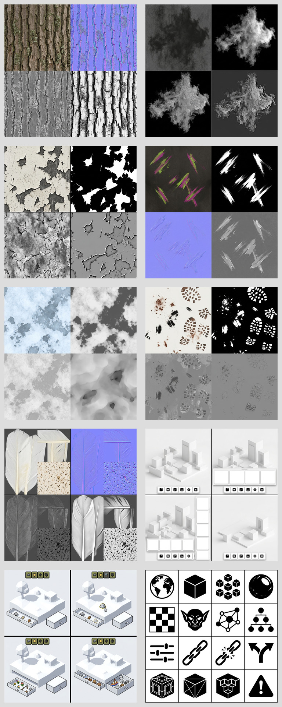

Regenerated M022, M067, M071, M132, M152 and M177 as verified `1024×1024`, text-free sheets with no preview inset and usable relief guides in response to the PR ingestion review. M499, M500 and M504 now pass at `R02` with sparse scene-first layouts and no captions. M464 advances to `R02` as a constrained pass: its channels are usable, but production reconstruction must separate feather-vane and cork regions rather than treating the sheet as finished object geometry.

## Material Batch 58 — automated-ingestion regeneration set

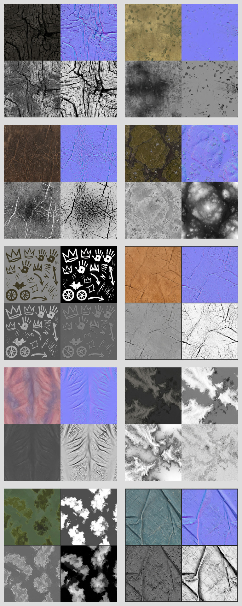

M031, M044, M046, M083, M088, M111, M115, M159, M162 and M265 were regenerated in place as verified `1024×1024`, text-free sheets. They use fixed four-quadrant layouts, omit preview insets and provide non-flat relief guides for the ingestion pipeline.

## Material Batch 59 — text and preview-inset corrections

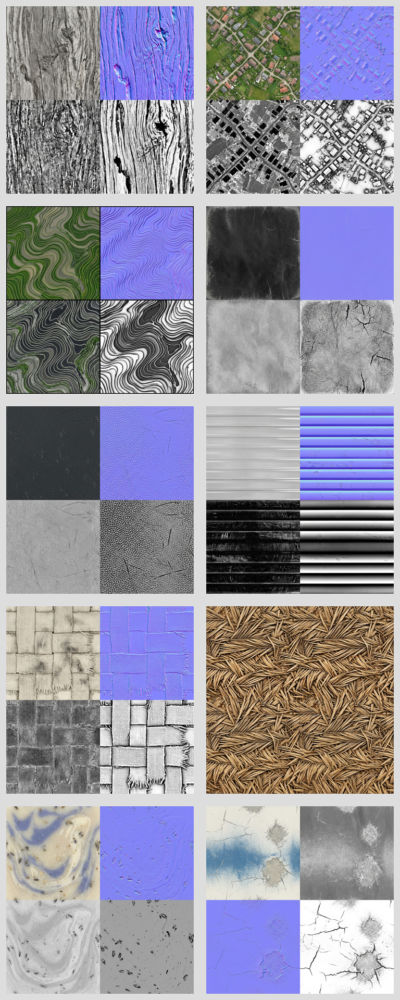

M023, M096, M103, M110, M204, M212, M228, M259 and M275 now pass as verified `1024×1024`, text-free sheets with useful relief guides. M023 no longer contains a tile-preview inset. M234 remains queued because its replacement omitted the required four-quadrant channel layout.

## Material Batch 60 — foundation regeneration set

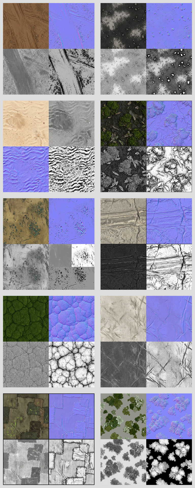

M003, M004, M006, M007, M017, M029, M033, M034 and M060 pass as verified square, text-free replacements with non-flat relief. M010 remains queued because its improved brass sheet still contains a small rectangular preview inset in the roughness quadrant.

## Material Batch 61 — environment and decal regeneration set

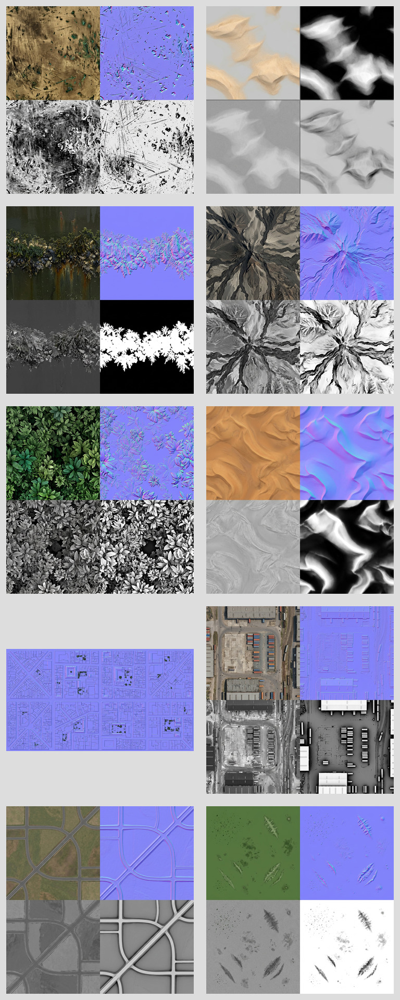

M010, M069, M074, M080, M084, M095, M097 and M106 pass as text-free square replacements with usable relief. M078 remains queued for radial starburst flow; M094 remains queued because its replacement returned at `1408×768`.

## Material Batch 62 — material and transition corrections

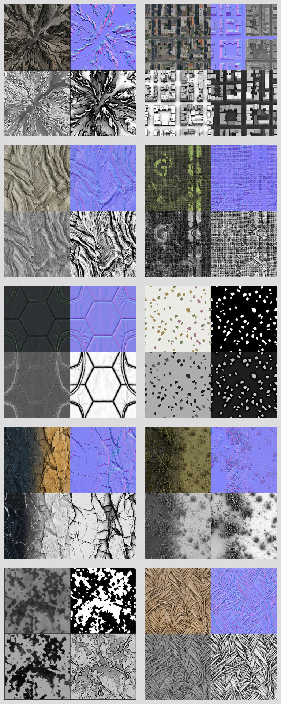

M094, M131, M143, M145, M154 and M234 now pass as square text-free replacements. M078 remains radial; M116 still lacks clear keratin identity; M120 contains letter-like marks; and M127 retains an overly repetitive hexagonal structure. Those four remain queued.

## Material Batch 63 — ingestion-priority corrections

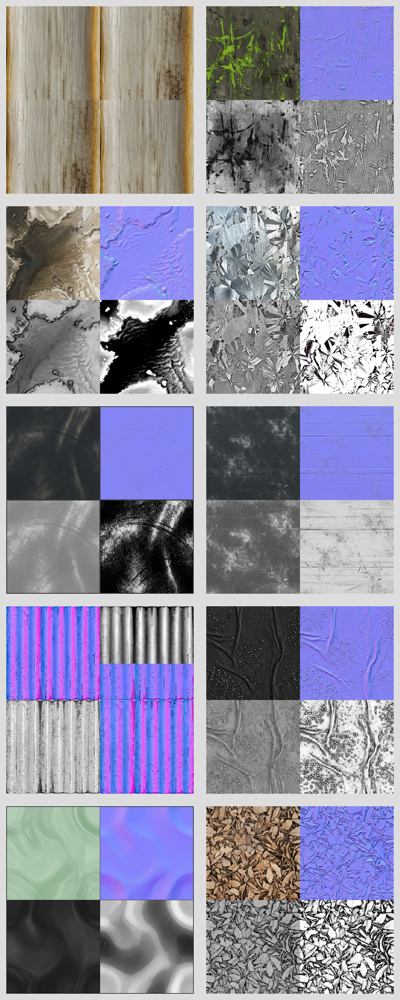

M120, M169, M211, M218, M235, M254 and M298 now pass as square text-free replacements. M116 omitted the four-quadrant contract, M193 retains oversized leafy zinc crystals, and M231 has corrupted BaseColor; those three remain queued.

## Material Batch 64 — island volcanic foundations

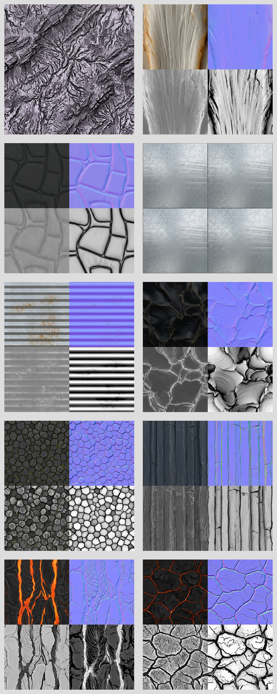

| ID | Island surface | Review |
|---|---|---|
| M505 | Obsidian volcanic glass | Pass. Conchoidal black plates, restrained sheen and amber edges. |
| M506 | Top-down basalt column ends | Pass. Dense irregular column field for rims and sea stacks. |
| M507 | Vertical basalt column faces | Pass. Broad prismatic bands and fine lengthwise striation. |
| M508 | Directional lava river | Pass. Repeats along the vertical flow axis; dark crust rafts over restrained molten channels. |
| M509 | Lava crust with glowing cracks | Pass. Broad cooling plates, recessed emissive cracks and no central focus. |

M116 and M231 corrections pass. M078, M127 and M193 remain queued for channel-layout or material-identity issues.

## Material Batch 65 — island crystal, grass and water foundations

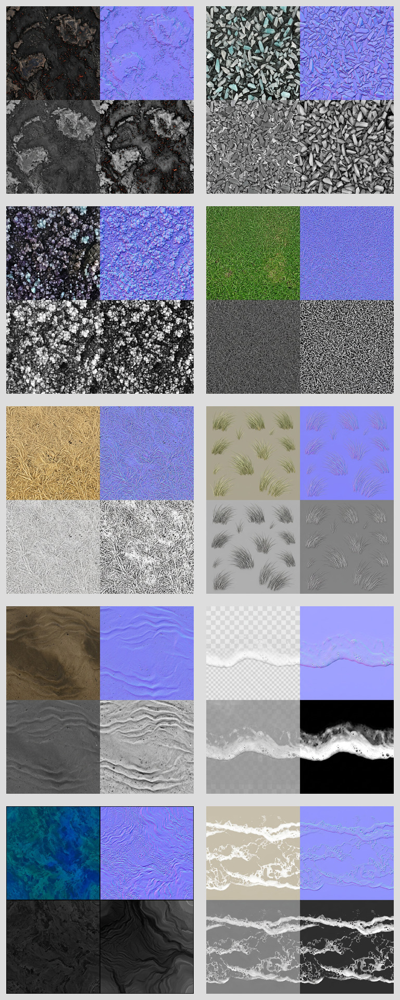

| IDs | Coverage | Review |
|---|---|---|
| M510–M512 | Scorched ground/embers, crystal field and geode lining | Pass. Distributed detail without central focal repetition. |
| M513–M515 | Short tropical grass, dry golden grass and dune-grass tufts | Pass. Dense terrain coverage plus detachable alpha tufts. |
| M516–M519 | Wet sand, tideline foam, deep lagoon water and shore foam | Pass. Water supports independent flow scrolling; foam strips register shoreline-axis repetition. |

These fill the next island-plan priorities from the ingestion agent. All are verified `1024×1024`, text-free references with explicit channel recipes.

## Material Batch 66 — underwater sand and floating-rock undersides

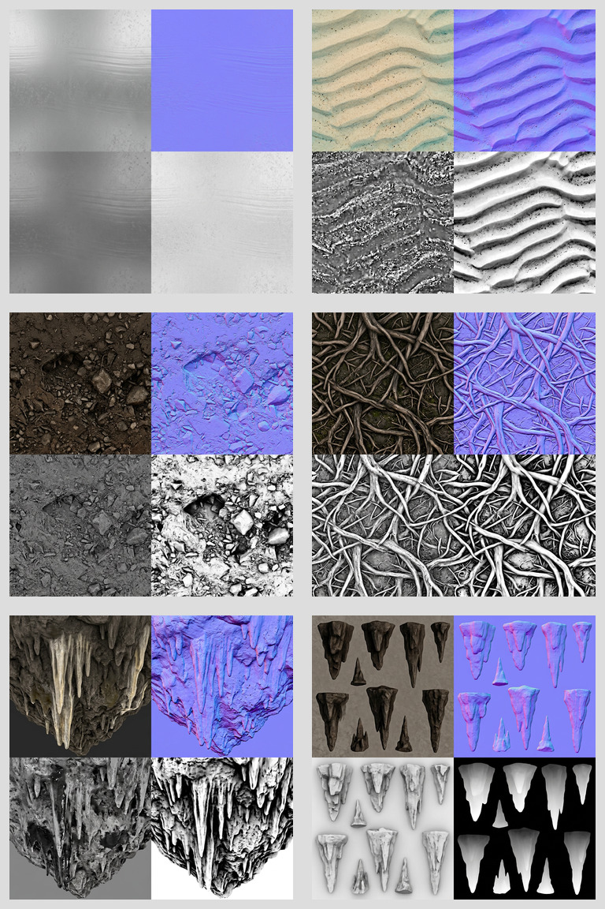

| ID | Surface | Review |
|---|---|---|
| M520 | Rippled underwater sand | Pass. Sandbar-scale current ripples without baked caustics. |
| M521 | Packed-earth underside | Pass. Compact strata, embedded stones and root traces. |
| M522 | Exposed-root underside carpet | Pass. Dense interwoven LOD-safe roots over soil. |
| M523 | Stalactite face material | Pass after R02 regeneration. Continuous mineral face grain and downward drip ridges without separate hanging silhouettes. |
| M524 | Hanging stalactite alpha atlas | Pass. Sturdy varied clusters with corresponding alpha and relief. |

M193 galvanized steel now passes. This completes the planning request’s missing underwater-sand and floating-rock-underside categories, with M523 retained honestly for a cleaner material-only correction.

## Material Batch 67 — legacy and island corrections

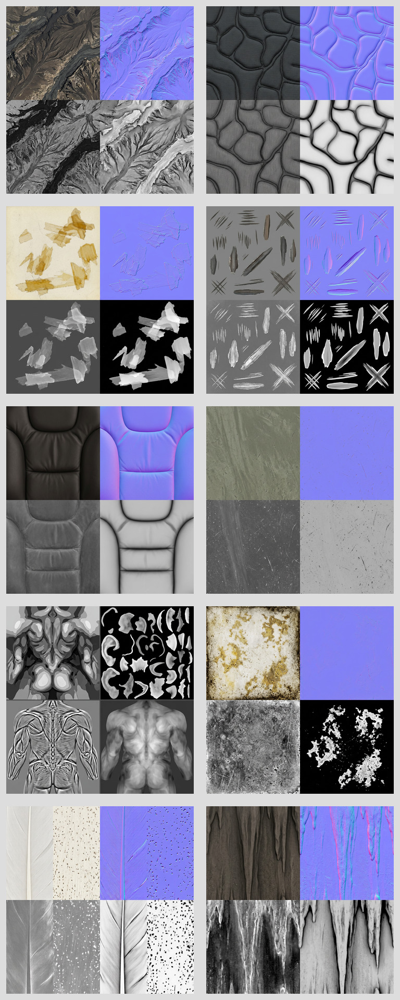

M078, M175, M176, M203, M245, M319, M464 and M523 now pass. M464 advances to `R03`; M523 advances to `R02`. M127 and M311 remain queued because closed padding cells and assembled anatomy still violate their reconstruction recipes.

## Material Batch 68 — mobile volcanic foundations and mask corrections

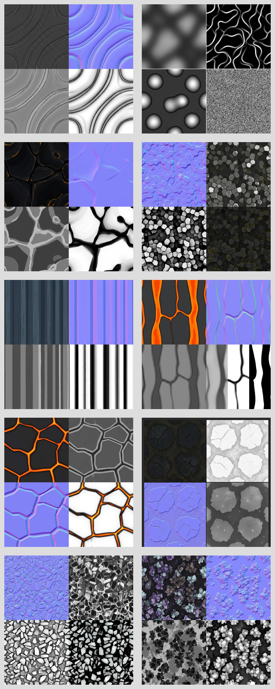

M127 and M311 now pass after removing closed armor-like padding cells and assembled anatomy respectively. M525, M527, M528 and M532 pass as mobile obsidian, basalt-face, lava-river and geode children. Regenerate M526, M529, M530 and M531 because their generated channel quadrants are misordered despite useful visual content.

## Material Batch 69 — mobile island surfaces and corrections

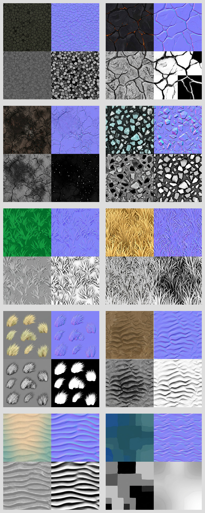

M526, M529, M530 and M531 now pass at `R02` with the fixed BaseColor/Normal/Roughness/guide quadrant order. M533–M538 add passing mobile children for tropical grass, dry grass, dune-grass tufts, wet sand, underwater rippled sand and independently scrolling deep-lagoon water.

## Material Batch 70 — nostalgic island volcanic surfaces

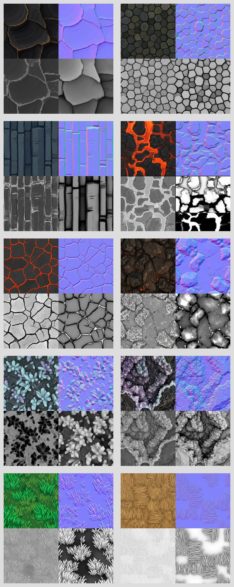

M539–M541 and M543–M548 pass as authored nostalgic-PBR children for obsidian, basalt columns, lava crust, scorched ground, crystals, geode lining and grasses. M542 retains useful lava material response but must be regenerated because its crust arrangement does not communicate a directional river flowing along the repeat axis.

## Material Batch 71 — nostalgic island shore and underside

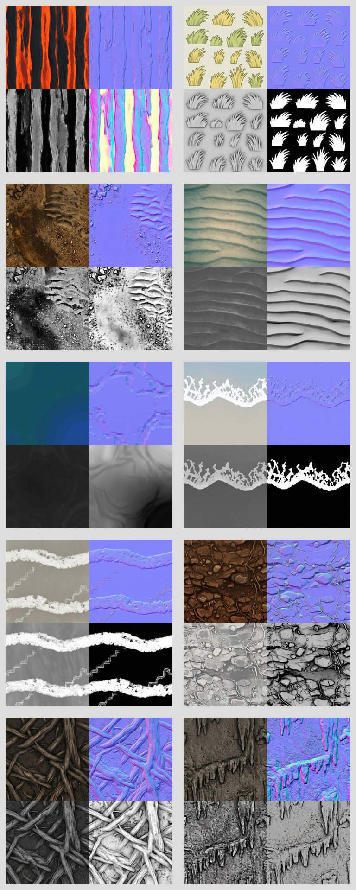

M542 now passes at `R02` with unmistakable top-to-bottom lava flow. M549–M557 pass as nostalgic-PBR children for dune grass, wet and underwater sand, scrolling lagoon water, two shore-foam scales, packed-earth underside, exposed roots and stalactite-face material.

## Material Batch 72 — mobile island underside and transitions

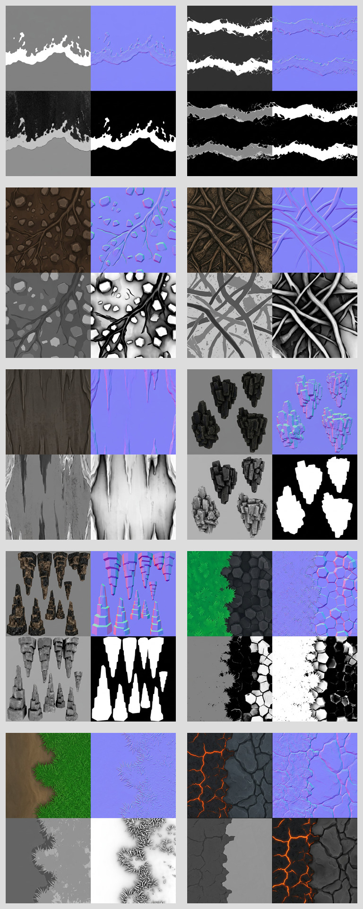

M558–M564 complete mobile shoreline foam, floating-earth, exposed-root, stalactite-face and stalactite-atlas children plus the nostalgic stalactite atlas. M565–M567 add passing mobile grass/basalt, sand/grass and lava/basalt interlocked transition fringes. All preserve explicit parent links and runtime-tier recipes.

## Material Batch 73 — island transition fringes

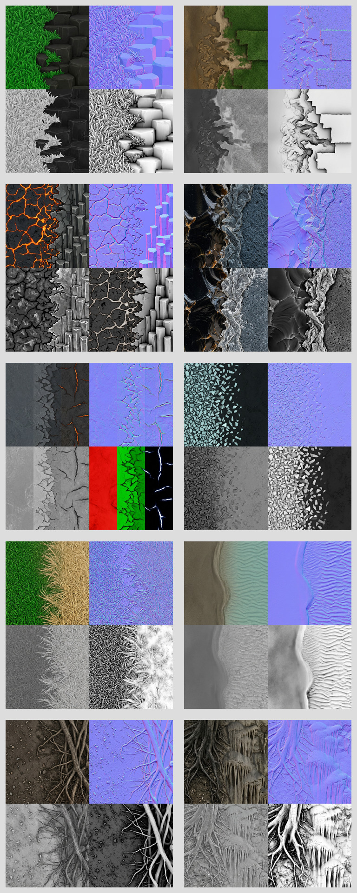

M568–M571 and M573–M577 pass as nostalgic and full-fidelity vertical-fringe transitions covering grass, sand, basalt, lava, obsidian, crystal and floating-island underside materials. M572 retains a good basalt/lava boundary but must be regenerated because its lower-right guide quadrant contains unrelated vivid colors instead of registered grayscale/emissive data.

## Material Batch 74 — runtime island transition variants

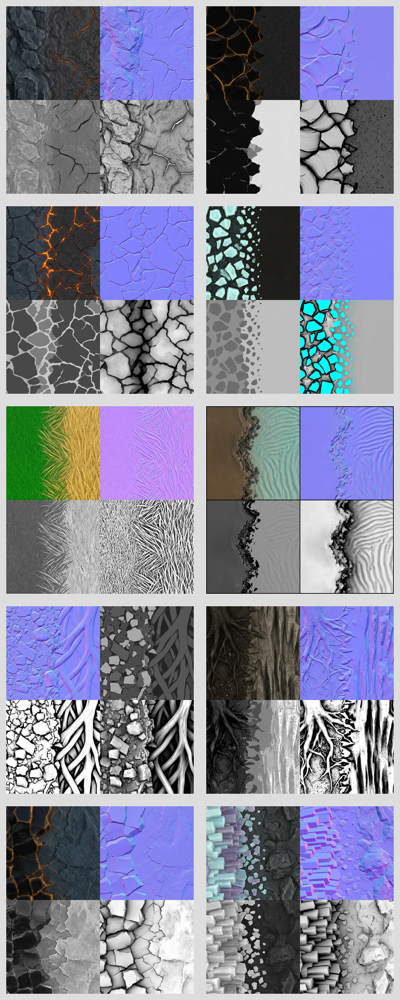

M572 now passes at `R02` with a corrected grayscale/emissive guide. M578–M582 and M584–M586 pass as mobile and nostalgic transition children. M583 is queued because its generated quadrants are misordered: the upper-left slot contains Normal-like data rather than the registered BaseColor transition.

## Material Batch 75 — transition corrections and sports structures

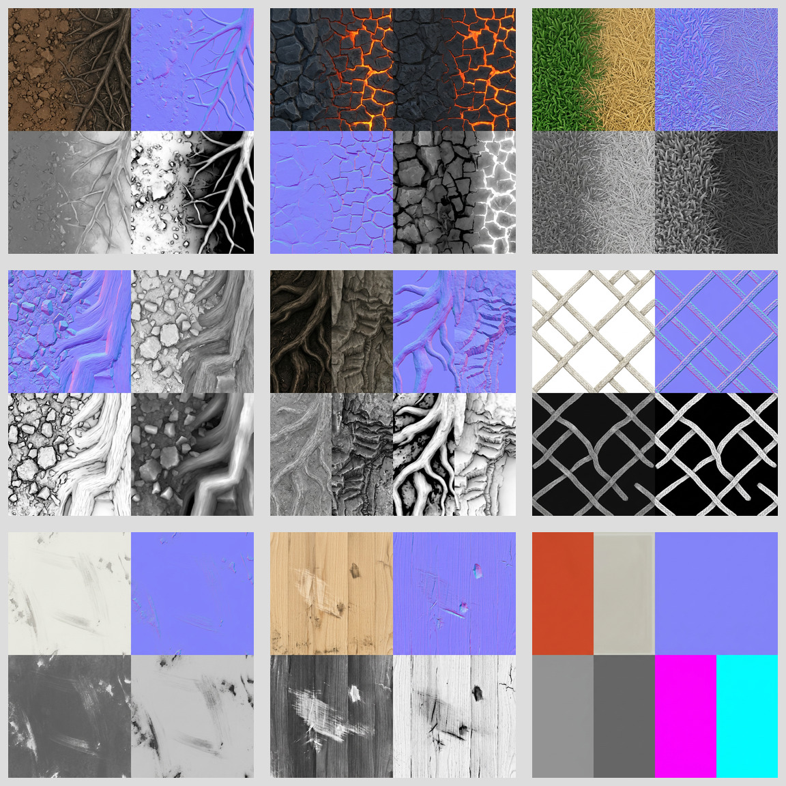

M583 now passes at `R02`. M587, M588 and M591 pass as nostalgic transition children; M590 requires regeneration because its BaseColor quadrant was replaced by Normal-like data. M592–M594 pass as brand-neutral net-cord, painted-post and wicket-timber materials. M595 is a constrained pass: the coordinated hoop/backboard regions are useful, but production must resolve its vivid lower-right transmission/metal guide from the registered recipe rather than pixel color.

M589 was not registered because the image service returned no image; its ID remains unused rather than pointing to a missing asset.

## Material Batch 76 — global sports equipment surfaces

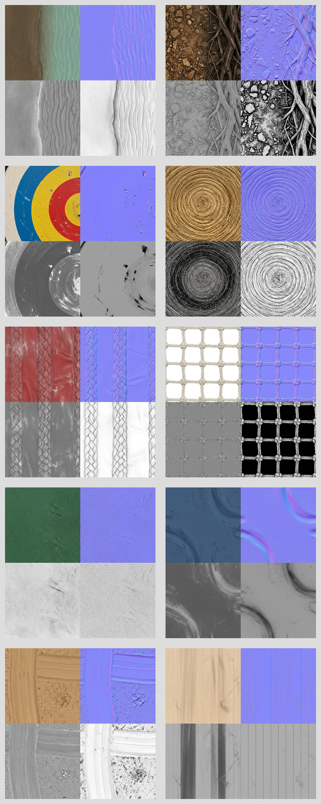

M590 now passes at `R02`, and M589 completes the nostalgic wet-to-underwater-sand transition. M596–M603 pass as brand-neutral target board, archery straw, combat-ring rope, fine court net, table felt, landing foam, equestrian footing and velodrome timber materials. Their recipes keep protected branding out and preserve editable wear and palette controls.

## Material Batch 77 — mobile global sports equipment

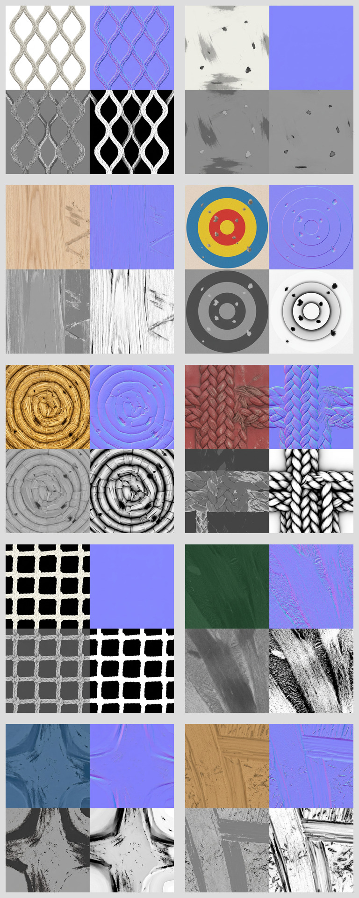

M604–M613 pass as mobile children for goal nets, painted posts, wickets, target faces, archery straw, combat-ring rope, fine court nets, table felt, landing foam and equestrian footing. Each keeps its full-fidelity parent link and a PX64 fallback-readable reconstruction recipe.

## Material Batch 78 — nostalgic global sports equipment

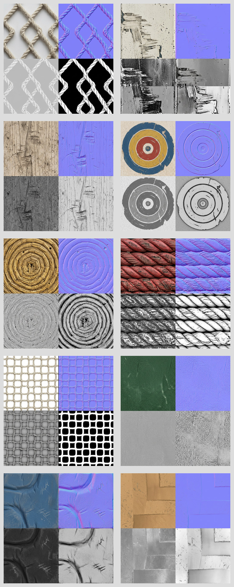

M614–M622 pass as nostalgic-PBR children for nets, painted posts, wickets, target faces, archery straw, ring rope, felt and landing foam. M623 is a constrained pass: its footing palette and channels are useful, but reconstruction should break up the rectangular groomed patches so they cannot read as slabs.
