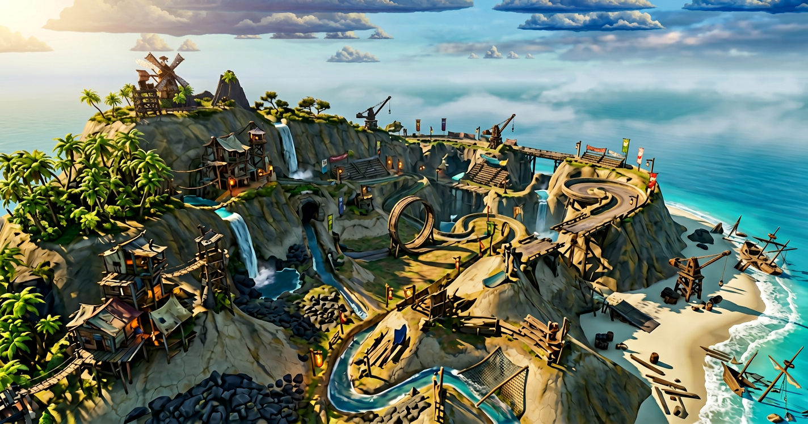
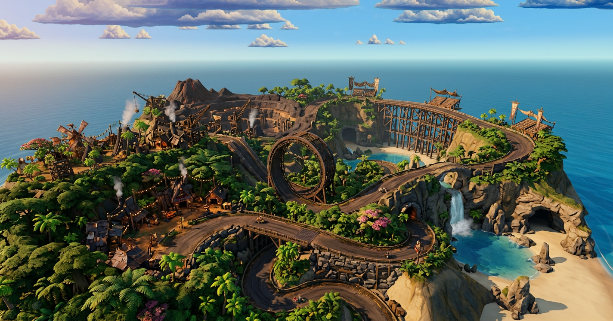
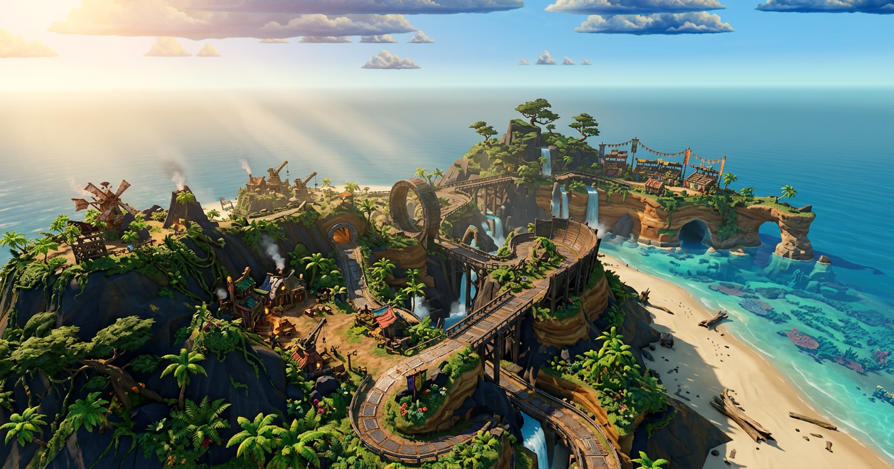

# Basalt Isle high-fidelity environment report

**Review set:** `docs/visual-guides/island-population-08.png`, `09.png`, and `10.png`  
**Source camera:** `docs/visual-guides/source-vantage.png`  
**Purpose:** identify what changed in the final three concepts, define the work required to reach the highest-fidelity target, and specify the reference-image packs needed before Meshy image-to-3D production begins.

> **Production gate:** approve an island **style bible first**. Do not create Meshy-production tickets or generate final reference packs until that bible is approved. The concepts are direction-finding images, not dimensionally reliable construction drawings.

---

## 1. Executive summary

The final three concepts move from a decorated race island to a complete authored world:

- **Variation 08** establishes density and activity: vegetation masses, waterfalls, settlement props, cranes, loops, bridges, tunnels, shoreline wreckage, and repeated track landmarks.
- **Variation 09** improves environmental cohesion: the island reads as a natural tropical formation, the route is better supported by cliffs and trestles, water and beaches are clearer, and the lighting becomes cinematic.
- **Variation 10** is the strongest production target: it combines dense biome coverage, a readable dark race surface, large structural silhouettes, a central loop, major trestles, caves, waterfall-fed lagoons, industry, settlement lighting, and materially richer terrain.

Variation 10 should set the **fidelity bar**, but it cannot be copied literally. Across 08–10 the route, landform, windmill position, loop position, and settlement layout drift. Production must preserve the real game terrain and validated route, then apply the concepts' material, foliage, structure, lighting, and storytelling language to it.

The largest gap is not model count alone. Highest fidelity requires one coordinated system:

1. approved style bible;
2. locked world and route blockout;
3. modular 3D kit with consistent scale and construction logic;
4. calibrated PBR material library, including roughness maps for every material;
5. terrain-to-road integration and natural biome transitions;
6. consistent reference/render lighting;
7. unified in-game sun, sky, fog, water, shadow, reflection, and color grade;
8. LOD, instancing, collision, texture streaming, and performance budgets.

---

## 2. What changed in the last three generated concepts

## 2.1 Variation 08 — dense authored adventure-racing island

### Additions and improvements

- Converts empty rock into a populated environment with large palm masses, shrubs, vines, and scattered canopy trees.
- Adds multiple waterfalls and narrow streams, giving the island a visible water cycle rather than using the sea as the only water feature.
- Adds goblin structures, huts, lookout towers, cranes, banners, lamps, ramps, rope/timber spans, and shoreline wreckage.
- Introduces a large vertical loop as a hero landmark.
- Breaks the road into more varied experiences: cliff edges, tunnels, bridges, elevated timber sections, banked sections, and jumps.
- Adds stronger foreground, middle-ground, and background layering.
- Improves material separation between pale rock, dark rock, timber, track, vegetation, water, and beach sand.

### Weaknesses to resolve

- The environment is visually busy and some route segments become difficult to follow.
- Track supports and settlement pieces do not yet share one construction grammar.
- Foliage distribution is attractive but sometimes reads as painted mass instead of placeable species clusters.
- Waterfalls and pools are illustrative rather than hydrologically connected.
- Several structures appear to sit on terrain rather than being founded into it.
- The route and terrain no longer exactly match the source screenshot.

### Production lesson

Use 08 as the **asset inventory and density study**, not as the final layout. It identifies how many categories are needed: foliage, water features, buildings, industry, track supports, stunt pieces, shoreline dressing, and practical lights.

## 2.2 Variation 09 — cohesive cinematic island

### Additions and improvements over 08

- Clarifies the island as a single natural landform with a beach, turquoise shallows, sea arches, cliff cavities, and a more coherent coastline.
- Uses warm directional sunlight, long atmospheric rays, soft haze, and ocean bounce to create a unified time of day.
- Makes the loop and large elevated track sections easier to read as intentional route landmarks.
- Improves road-to-terrain integration with trestles, cliff cuttings, supported edges, and bridge approaches.
- Creates more convincing biome zoning: dense tropical foreground, drier exposed upper shelves, and wind-shaped trees on higher rock.
- Adds a clearer destination/arena zone and separates industrial, settlement, and natural areas.
- Uses vegetation and flowers to frame the road without filling the racing surface.

### Weaknesses to resolve

- It changes the original geography and vantage more than a production paintover should.
- Some trestles and loops are structurally ambiguous when viewed closely.
- Repeated road material is too uniform; wear, drainage, repairs, and shoulder transitions need authored variation.
- God rays are attractive but should not become the only source of depth; contact shadows and local ambient occlusion remain essential.
- The sea arches, arena, waterfall, and track compete for hero status.

### Production lesson

Use 09 as the **lighting, atmosphere, coastline, and biome-cohesion target**. It demonstrates that fidelity comes from consistent relationships between systems, not merely from adding props.

## 2.3 Variation 10 — highest-fidelity sequel target

### Additions and improvements over 09

- Establishes the most readable premium race surface: a dark, smooth track contrasted against warm rock and saturated foliage.
- Adds a strong hierarchy of route landmarks: foreground bridge, switchback, central loop, waterfall tunnel, upper trestle, and summit/industrial zone.
- Gives structures more weight through dark timber, stone retaining walls, deep foundations, bridge piers, and long trestle rhythms.
- Adds dense multi-height foliage: broad canopy, palms, ferns, flowering shrubs, vines, and occasional highland trees.
- Strengthens environmental storytelling with windmills, workshops, cranes, smoke, practical lights, banners, and trackside activity.
- Improves terrain variety with dark basalt, pale fractured cliffs, layered sediment, boulder fields, cavities, beaches, and water-cut channels.
- Creates richer water staging through waterfall-fed pools, sea caves, wet rock, lagoon color variation, and beach transitions.
- Uses stronger contact shadow, surface roughness contrast, warm key light, cool sky fill, and atmospheric perspective.

### Remaining risks

- The concept contains more road and structures than the current route may support. Gameplay layout remains authoritative.
- Dense vegetation can hide hazards, route splits, pickups, rivals, and recovery points.
- The loop, trestles, caves, and waterfalls require real engineering dimensions and collision—not concept-art approximations.
- The image suggests a single very dense hero view; race-camera performance and visibility must be tested across the entire route.
- Smoke, waterfalls, lights, foliage movement, and reflections can become a large overdraw and GPU cost.
- Texture richness will look inconsistent unless all assets use the same calibrated PBR response and texel density.

### Production lesson

Use 10 as the **quality bar and visual hierarchy target**. Preserve the real game's route and terrain proportions while adopting its material response, layered foliage, structural weight, track contrast, lighting, and environmental storytelling.

---

## 3. Non-negotiable requirements for the highest-fidelity target

## 3.1 Approve the style bible before tickets

The style bible must be a versioned document plus approved image boards. It is the source of truth for prompts, Meshy review, modeling cleanup, material authoring, engine lighting, and acceptance tests.

It must define:

1. **Shape language** — chunky stylized forms, silhouette exaggeration, edge bevel size, curve segmentation, plank/bolt/beam proportions, rock fracture scale, and foliage massing.
2. **World scale** — ball diameter, lane width, guardrail height, door height, plank width, bridge bay spacing, loop diameter, palm height, and cliff module size.
3. **Palette** — measured swatches for basalt, ochre, sand, dirt, vegetation groups, timber, iron, brass, fabric accents, water, foam, lava, and emissives.
4. **Material response** — base-color range, normal strength, metallic values, roughness ranges, AO limits, emissive intensity, opacity treatment, and wetness rules.
5. **Construction grammar** — how goblins build: timber beam sizes, iron straps, rivets, rope, braces, foundations, roof fabrics, cranes, lights, and repairs.
6. **Terrain grammar** — cliff strata, basalt shapes, erosion direction, scree size, soil depth, road cuttings, retaining walls, drainage, and shoreline transitions.
7. **Foliage grammar** — approved species, leaf shape, trunk style, cluster size, color variation, wind direction, growth by altitude/moisture, and exclusion zones around gameplay.
8. **Track grammar** — road layers, surface wear, shoulders, barriers, support rules, ramp and loop construction, tunnel clearance, signage, and readable hazard colors.
9. **Lighting bible** — reference-studio rig and in-game rig, sun azimuth/elevation, color temperature, fill ratio, sky color, fog, exposure, tone mapping, shadow softness, and practical-light range.
10. **Camera bible** — race-camera focal lengths, review distances, hero camera, orthographic checks, and minimum silhouette/readability requirements.
11. **Texture bible** — texel densities, texture-set sizes, UV rules, trim sheets, tileables, decals, channel packing, color space, naming, and export settings.
12. **Performance tiers** — triangle, material, texture, LOD, shadow, foliage, particle, reflection, and draw-call budgets for high/medium/low settings.
13. **Do/don't board** — approved examples and explicit failures: floating roads, visible model bases, baked directional shadows, noisy roughness, repeated trees, inconsistent plank scale, unsupported bridges, and foliage on the race line.

No asset ticket should say only “match the concept.” Every ticket must reference the approved style-bible version and exact applicable sections.

## 3.2 Lock gameplay geometry before decoration

- Freeze the authoritative route centerline, lane widths, split/merge points, jump trajectories, loop dimensions, tunnel clearance, recovery volumes, and collision envelopes.
- Create greybox terrain and route review renders from race height and the source vantage.
- Mark protected gameplay corridors where foliage, supports, and props cannot intrude.
- Resolve bridge foundations, cliff cuttings, drainage, and road shoulders in the blockout.
- Keep concept-only roads out of production unless separately approved by design.

## 3.3 Build a calibrated PBR material library

Every textured asset must ship with a complete, validated PBR set. **Roughness maps are required for all textures**, not only metal or hero assets.

Required maps:

- `BaseColor` / albedo — sRGB; no cast shadows, highlights, ambient occlusion, or arbitrary directional lighting baked in.
- `Normal` — tangent-space OpenGL orientation unless the runtime contract changes; linear data.
- `Roughness` — linear grayscale for every material and texture set.
- `Metallic` — linear grayscale; generally binary for iron/brass versus dielectric rock, wood, cloth, sand, and foliage.
- `AmbientOcclusion` — linear; subtle and separately authored, never multiplied destructively into BaseColor.
- `Height` or displacement — where silhouette/parallax value justifies it, especially cliff, road, timber, and rock materials.
- `Emissive` — lamps, lava, furnace cracks, boost inlays, and selected signs only.
- `Opacity` / alpha coverage — foliage, ropes/nets, fabric tears, foam cards, and other cutout materials.

Preferred packed runtime map: `ORM` = R: AO, G: Roughness, B: Metallic, while retaining lossless source maps separately.

Texture deliverables:

- Hero structures and unique stunt pieces: 4K master sets; ship 2K/4K by graphics tier.
- Standard props and foliage atlases: 2K master sets.
- Small repeated props: 1K–2K.
- Terrain tileables: 4K minimum masters plus macro-variation, detail-normal, and blend masks.
- Trim sheets: timber/iron construction trim, track-edge trim, settlement trim.
- Decal atlases: leaks, soot, rust, repairs, cracks, tire wear, moss, sand drift, painted hazard shapes.

All texture sets need a material validation render on the standard grey lookdev sphere/cube and on the intended asset.

## 3.4 Keep lighting and texture derivation consistent

The generated concepts derive much of their perceived texture from light. That light must therefore be controlled from reference generation through engine review.

- Use one approved neutral reference-light rig for **every Meshy angle** and texture lookdev render.
- Suggested rig: 5500 K large-area key from camera upper-left at approximately 45° azimuth / 35° elevation; neutral broad fill at 25–35% key intensity; weak cool rim only if required for silhouette; fixed exposure and white balance.
- Use a neutral, seamless grey floor and background with no visible horizon. Keep grey color, exposure, shadow softness, and camera response identical across the entire library.
- Permit a soft contact shadow, but never bake the key-light shadow or specular highlight into BaseColor.
- Author roughness from material behavior, not from brightness in the beauty image. A bright painted patch is not automatically smooth; a dark patch is not automatically rough.
- Keep normal, roughness, metallic, AO, height, and emissive maps in linear color space. Keep only BaseColor in sRGB.
- Review all assets under both the neutral reference rig and the approved in-game sun/sky rig.
- Lock tone mapping and exposure before final texture balancing. Otherwise texture values will be adjusted to compensate for a moving lighting target.

## 3.5 Upgrade the environment systems, not only assets

To match Variation 10, production also needs:

- terrain material blending by height, slope, moisture, and biome masks;
- macro color variation and close-range detail normals;
- road cuttings, embankments, shoulders, retaining structures, drainage, and sand/scree accumulation;
- water depth color, shoreline foam, waterfall sheets/meshes, mist, wetness masks, and wet-rock roughness changes;
- instanced foliage with per-instance scale, rotation, hue, wind phase, and LOD variation;
- contact shadows and stable cascaded shadows for hero structures;
- reflection probes or the chosen runtime reflection solution;
- distance fog and aerial perspective matched to sky color;
- practical lights with restrained range and emissive bloom;
- decals and vertex painting for asset-to-ground integration;
- occlusion culling, impostors, HLODs, texture streaming, and quality tiers.

---

## 4. Meshy reference-image standard

## 4.1 Mandatory presentation rules

Every reference image must meet all of these requirements:

- one subject only, complete and uncropped;
- neutral grey seamless background **and grey floor**, with no visible horizon line;
- subject standing directly on the floor where appropriate, with **no base plate, plinth, display disc, terrain cookie, or presentation pedestal**;
- well lit with the approved fixed studio rig;
- identical lighting, exposure, white balance, camera lens, subject scale, and material appearance across every angle in the asset pack;
- no people, labels, dimensions, arrows, scenery, foliage, smoke, particles, depth-of-field blur, or unrelated props unless they are an inseparable part of the asset;
- sharp silhouette and enough margin for the entire subject, including ropes, foliage tips, cranes, and supports;
- neutral perspective, preferably 70–85 mm full-frame equivalent to reduce distortion;
- same object state in every image: identical damage, plank placement, foliage, rope sag, and texture pattern;
- individual PNG files, at least 2048 px on the long edge; lossless masters retained;
- one multi-angle sheet per object: every sheet contains several clearly separated views of the same object, never a single-view object sheet;
- no panel captions, borders, measurements, or arrows; retain individual full-resolution sheets and generate batch contact sheets only for human review.

Ground-contact assets may touch the grey floor but must not carry a modeled decorative base. Floating assets require a clean underside view and must not gain a fake support stand. The multi-angle sheet rule is governed by `ISLAND_HIGH_FIDELITY_STYLE_BIBLE.md` and supersedes the report's original individual-view recommendation.

## 4.2 Standard multi-angle pack

Include this view pack within each model's sheet unless the asset-specific table says otherwise:

| Code | View | Requirement |
|---|---|---|
| `F` | Front | Eye-level, centered, principal gameplay-facing side |
| `FL` | Front-left three-quarter | Hero/readability view, 30–45° above only when needed |
| `FR` | Front-right three-quarter | Mirror coverage without mirroring the actual asset |
| `L` | Left profile | Orthogonal profile for depth and silhouette |
| `R` | Right profile | Required for asymmetric assets |
| `B` | Back | Shows construction and rear materials |
| `BL` | Back-left three-quarter | Reveals hidden depth and connections |
| `BR` | Back-right three-quarter | Reveals opposite hidden depth |
| `T` | Top | Near-orthographic; essential for track alignment and footprint |
| `U` | Underside | Required for bridges, loops, ramps, floating rocks, roofs, and overhangs |

Minimum production pack is eight horizontal views plus top. Use underside whenever any player or camera can see beneath the asset. Complex interiors also require interior views.

## 4.3 Asset-specific 3D reference views to generate

### A. Track and stunt kit

| Asset family | Models required | Extra reference views beyond standard pack |
|---|---|---|
| Road modules | straight, gentle curve, tight curve, S-curve, banked curve, split, merge | strict top orthographic; both end-on connection views; underside |
| Road transitions | dirt-to-timber, timber-to-iron, bridge approach, tunnel approach, shoulder transition | top; each connector end; grazing side view showing thickness |
| Launch ramps | small dirt ramp, timber kicker, large gap ramp, landing ramp | approach eye-line; exit eye-line; side orthographic showing launch angle; underside |
| Vertical loop | timber-and-iron hero loop, low-detail distant loop | exact side orthographic; front through the opening; rear; top; underside; close construction crop for human review |
| Banked/corkscrew modules | banked wall, half corkscrew, descending spiral | top; axis-aligned front/rear; inner-radius and outer-radius views; underside |
| Bridges | timber bridge, iron girder bridge, rope bridge, stone arch bridge | deck-level approach/exit; underside; pier/abutment connection views |
| Trestles | low, medium, and tall timber trestle bays; corner bay | front orthographic; side orthographic; underside; isolated join/end view |
| Tunnels | basalt mouth, timber-braced mine mouth, sea-cave mouth, straight interior module | front into opening; rear; interior looking each direction; top footprint |
| Barriers | timber rail, rope post, iron rail, stone parapet, hazard gate | front, back, profile, top; modular connection-end close views |
| Track details | boost inlay, drainage grate, repair plate, lane marker, blank sign | top orthographic; side/profile; underside if raised |

### B. Settlement and industrial structures

| Asset family | Models required | Extra views |
|---|---|---|
| Windmill compound | windmill, platform, stairs, fence modules, small annex | blades face-on; blade profile; rear machinery; roof/top; underside of platforms |
| Goblin huts | small shack, workshop, watch hut, market/tent shelter | doorway front; rear; both sides; roof top; optional removable-roof interior set |
| Workshop/foundry | furnace hut, chimney, work platform, pipe cluster | front/rear; chimney top; platform underside; open interior if visible |
| Cranes | fixed timber crane, rotating dock crane, mine hoist | boom profile; front; rear; top; underside; hook/rope isolated detail view |
| Watchtowers | short tower, tall tower, race marshal tower | front/back; stair side; platform top; full underside |
| Grandstands | straight bay, corner bay, finish-line bay | spectator-facing front; track-facing front; ends; top; underside/support grid |
| Gates and arches | start gate, finish gate, tunnel gate, blank banner arch | front; rear; end profile; top; attachment-point views |
| Practical lights | torch post, lantern post, hanging lamp, workshop lamp | unlit beauty pack plus one separate emissive-state lookdev image; profile and top |
| Banners and flags | vertical banner, pennant line, gate cloth | front/back; edge profile; neutral unsimulated rest shape; no lettering |

### C. Natural terrain modules

| Asset family | Models required | Extra views |
|---|---|---|
| Cliff modules | basalt cliff straight, inner corner, outer corner, overhang, layered ochre cliff | front orthographic; side profiles; top; underside for overhangs; seamless-edge views |
| Rocks | hero boulder, slab, stack, column cluster, scree cluster, sea stack | all eight horizontal views; top; underside where overhanging |
| Cave and arch kit | sea arch, natural tunnel, cave mouth, cave interior bend | through-opening front/rear; profile; top; interior walls; underside |
| Volcano kit | summit cone, crater rim modules, lava vent, industrial volcanic shelf | high three-quarter; top; crater interior; profiles from four cardinal directions |
| Shore kit | beach shelf, wet-rock shelf, tide pool rim, sandbar, rock-water transition | top orthographic; water-facing profile; land-facing profile; underside |
| Waterfall geology | waterfall lip, stepped channel, plunge-pool rocks, wet cliff | upstream/downstream; profile showing flow; top; front without water FX and separate assembled lookdev |

Large terrain should remain engine terrain or modular cliff geometry—not a single monolithic Meshy island.

### D. Foliage and biome dressing

| Asset family | Models required | Extra views |
|---|---|---|
| Palms | tall leaning, short stout, forked, young palm, three-palm cluster | four cardinal profiles; top canopy; underside canopy; trunk close view |
| Broadleaf trees | hero jungle tree, medium canopy, windswept coastal, highland flat-top | eight horizontal views; top; canopy underside; trunk/branch junction |
| Understory | fern clump, broadleaf clump, flowering shrub, vine cluster, grass tuft | front/back; sides; top; underside where cards are visible |
| Dead growth | dead tree, driftwood trunk, root cluster | all horizontal views; top; underside |
| Vines | hanging vine, cliff vine, bridge vine, ground creeper | front/back; side; top; attachment-end views |

Foliage reference packs must preserve identical leaf count and branch topology across angles. If the generator cannot do that reliably, model from approved orthographic design sheets instead of inconsistent beauty renders.

### E. Shoreline and storytelling props

| Asset family | Models required | Extra views |
|---|---|---|
| Wreckage | shipwreck hull, mast, broken boat, debris cluster | hull broadside both sides; bow; stern; top; interior; underside |
| Dock props | crates, barrels, rope coils, anchors, bollards, nets | standard pack; top; underside; no grouped base plate |
| Mining props | ore cart, rail segment, drill, winch, ore pile, support frame | front/back; profiles; top; mechanism detail views |
| Race props | blank signs, flags, lanterns, repair tools, timing device, marshal post | front/back; profiles; top; attachment points; no lettering |
| Story landmarks | lighthouse, shrine, crashed balloon, sheep statue, skeleton treasure, kraken tentacles | standard pack plus interior/underside/attachment views specific to silhouette |

### F. VFX-support geometry

Generate geometry references separately from effect beauty references:

- waterfall sheet/mesh guides;
- foam ribbon and splash-card meshes;
- smoke-stack emitter housings;
- lava vent and emissive crack meshes;
- mist-plane placement modules;
- lamp flame housing and glow cards.

Do not ask Meshy to reconstruct smoke, fire, spray, mist, god rays, or ocean surfaces as opaque geometry.

---

## 5. Texture and material reference list

The following material library is required in addition to model beauty references. Each material needs a calibrated sphere, cube, and flat-plane lookdev under the standard neutral rig, plus its seamless texture preview. Four-channel generated derivation sheets, review status, physical coverage, validation rules, and the rolling production queue are tracked in [`art-src/meshy/material-refs/README.md`](../art-src/meshy/material-refs/README.md). Generated channel images guide authoring but must be rebuilt from one shared height/mask source before engine import.

### Terrain and road

- dark volcanic basalt;
- wet basalt;
- layered ochre cliff stone;
- pale fractured coastal rock;
- basalt/ochre transition;
- pale dry sand;
- compact damp sand;
- wet shoreline sand;
- scree and mixed gravel;
- dark packed race dirt;
- dusty light dirt;
- worn road aggregate;
- mud and puddle edge;
- mossy soil;
- waterfall mineral staining;
- soot/ash ground;
- lava crust and emissive cracks.

### Built materials

- new and weathered timber;
- dark wet timber;
- timber end grain;
- black wrought iron;
- rusty iron;
- painted iron with chipped edges;
- aged brass;
- rope and heavy cable;
- patched sailcloth;
- banner fabric;
- thatch or palm roofing;
- stone masonry and mortar;
- rail/road metal inlay;
- glass for lanterns;
- ceramic/painted race markers.

### Nature and shoreline

- palm trunk and palm fronds;
- broadleaf bark and leaves;
- fern atlas;
- flowering shrub atlas;
- vines and hanging moss;
- dry grass and green grass;
- driftwood;
- coral/reef rock;
- foam masks and caustic masks;
- wetness and waterline decals.

Every item above requires at least BaseColor, Normal, Roughness, Metallic, and AO as applicable. Height, Emissive, and Opacity are required where materially relevant. “As applicable” does **not** waive roughness: dielectric materials still require authored roughness maps.

---

## 6. Mesh and delivery requirements

Per-asset dimensions, relative scale comparisons, balanced LOD0 triangle targets, LOD ratios, and texture-density guidance are defined in [`ISLAND_ASSET_SCALE_AND_TRIANGLE_BUDGET.md`](./ISLAND_ASSET_SCALE_AND_TRIANGLE_BUDGET.md). Those asset-specific values supersede the broad class estimates below whenever both are present.

Each accepted Meshy result must go through a cleanup pass; raw output is not production-ready by default.

- Real-world scale and documented dimensions.
- Pivot and forward axis set by asset type; road connectors must snap exactly.
- Clean watertight geometry where required; no internal debris or floating fragments.
- Consistent bevel language and weighted/smoothed normals.
- UVs with approved texel density and no accidental overlaps.
- Separate material slots only where needed; avoid one material per small part.
- Full PBR texture set with source files and exported runtime maps.
- LOD0, LOD1, LOD2, and billboard/impostor where appropriate.
- Separate simple collision mesh; no render-mesh collision for complex assets.
- Lightmap UV or the runtime's selected equivalent.
- Named sockets for track connections, lights, particles, ropes, and modular joins.
- GLB delivery plus source scene, texture sources, and review turntable.
- Engine screenshot under neutral review light and approved island light.

Suggested starting budgets, to be finalized by the style bible:

| Class | LOD0 target | Texture target | Notes |
|---|---:|---:|---|
| Hero loop / major bridge / windmill | 20k–60k triangles | 4K master | Split only when culling/material logic benefits |
| Medium structure / cliff module | 8k–25k | 2K–4K | Modular connection accuracy is critical |
| Standard prop / tree | 2k–10k | 2K | Instancing and LOD required |
| Small prop / understory | 300–3k | 1K–2K atlas | Prefer atlas and batches |
| Collision mesh | 100–1,000 | none | Shape only; deterministic gameplay rules win |

---

## 7. Recommended production order

### Phase 0 — visual contract

1. Write and approve the style bible.
2. Approve the source-vantage fidelity target and a race-camera target.
3. Lock palette, material values, lighting rig, scale chart, texel density, and budgets.
4. Produce five benchmark assets: basalt cliff, road module, timber trestle, palm, and windmill.
5. Validate the benchmark set in-engine before opening the full asset backlog.

### Phase 1 — blockout and route integration

1. Freeze gameplay route and terrain.
2. Greybox loop, ramps, tunnels, bridges, trestles, and settlement zones.
3. Run collision, visibility, recovery, and race-camera tests.
4. Approve structure foundations and terrain cuts.

### Phase 2 — references and materials

1. Generate the complete multi-angle reference packs on seamless grey.
2. Human-review cross-angle identity before Meshy submission.
3. Build and approve PBR terrain, track, timber, iron, foliage, and water-adjacent materials.
4. Create trim sheets and decal atlases.

### Phase 3 — modular production

1. Finish, review, and lock the full individual-object reference run.
2. Use the approved sheets as direct image references for a second-generation modular-cluster pass governed by [`ISLAND_MODULAR_CLUSTER_STANDARD.md`](./ISLAND_MODULAR_CLUSTER_STANDARD.md).
3. Build the track and support kit.
4. Build the terrain/cliff and shoreline kit.
5. Build the settlement and industrial kit.
6. Build the foliage kit and optimized cluster variants.
7. Build props and storytelling landmarks.
8. Build VFX-support geometry.

### Phase 4 — world assembly

1. Integrate roads into terrain.
2. Place major landmarks and supports.
3. Paint biome masks and place vegetation clusters.
4. Add water features and shoreline transitions.
5. Add props, decals, practical lights, smoke, and ambient VFX.

### Phase 5 — fidelity, destruction, and optimization

1. Integrate material-aware carving, support checks, authored collapse groups, pooled debris and quality-tier caps under [`ISLAND_DESTRUCTION_AND_CHUNK_STANDARD.md`](./ISLAND_DESTRUCTION_AND_CHUNK_STANDARD.md).
2. Lock sun, sky, fog, exposure, tone map, reflections, and color grade.
3. Tune wetness, roughness, contact shadows, and material variation.
4. Build LODs, impostors, HLODs, occlusion, and quality tiers.
5. Test frame time, VRAM, texture streaming, overdraw, shadows, and draw calls.
6. Review at source vantage, race height, route forks, loops, tunnels, beach, and summit.

---

## 8. Tickets to create only after style-bible approval

1. `ISLAND-HF-STYLE-BIBLE` — visual contract, scale, palette, materials, light, camera, and budgets.
2. `ISLAND-HF-BENCHMARK` — five benchmark assets and in-engine validation scene.
3. `ISLAND-HF-ROUTE-BLOCKOUT` — locked track, loops, ramps, tunnels, bridges, and clearance.
4. `ISLAND-HF-REF-TRACK` — multi-angle track and stunt references.
5. `ISLAND-HF-REF-STRUCTURES` — settlement, industrial, bridge, and trestle references.
6. `ISLAND-HF-REF-NATURE` — rocks, cliffs, shoreline, and foliage references.
7. `ISLAND-HF-REF-PROPS` — dressing and storytelling references.
8. `ISLAND-HF-PBR-TERRAIN` — terrain/road PBR library and blend masks.
9. `ISLAND-HF-PBR-ASSETS` — timber, iron, brass, fabric, foliage, decals, and trim sheets.
10. `ISLAND-HF-MESHY-TRACK` — generated track/stunt models, cleanup, UV, LOD, collision.
11. `ISLAND-HF-MESHY-WORLD` — structures and natural modules, cleanup, UV, LOD, collision.
12. `ISLAND-HF-BIOMES` — biome masks, foliage placement, wind, instancing, and impostors.
13. `ISLAND-HF-WATER` — shoreline, waterfalls, pools, wetness, foam, mist, and performance.
14. `ISLAND-HF-LIGHTING` — sun/sky/fog/reflections/practicals/tone-map lock.
15. `ISLAND-HF-ASSEMBLY` — terrain integration, foundations, decals, storytelling pass.
16. `ISLAND-HF-OPTIMIZATION` — quality tiers, LOD/HLOD, streaming, culling, and budgets.
17. `ISLAND-HF-DESTRUCTION` — sculpt-based carving, support graph, authored collapse groups, pooled chunk recipes, deterministic collision updates, and quality-tier caps.
18. `ISLAND-HF-REVIEW` — source-vantage and race-camera acceptance capture set.

Existing `ISLAND-ART` and `ISLAND-ART-B` should not be executed unchanged for this fidelity pass. Their single three-quarter image requirement and occasional modeled sand/basalt bases conflict with the new multi-angle, grey-floor, no-base-plate standard. Superseding tickets must reference the approved style bible and this report.

---

## 9. Acceptance checklist

### Style and references

- [ ] Style bible approved and versioned before production tickets.
- [ ] Every Meshy asset has a cross-angle-consistent reference pack.
- [ ] Grey background and grey floor are seamless, with no visible horizon.
- [ ] No asset has a base plate or presentation plinth.
- [ ] Lighting, exposure, white balance, lens, and framing are fixed across the library.
- [ ] Every view shows the same model, topology cues, damage, and textures.

### Materials

- [ ] Every textured asset has BaseColor, Normal, Roughness, Metallic, and AO as applicable.
- [ ] Every texture, including foliage and dielectric terrain, has an authored roughness map.
- [ ] Height, Emissive, and Opacity exist where required.
- [ ] No directional lighting, cast shadows, or specular highlights are baked into BaseColor.
- [ ] Texture values are validated under neutral studio and in-game lighting.
- [ ] Texel density and color-space rules pass automated checks.

### Models and gameplay

- [ ] Scale, pivot, axes, sockets, modular joins, UVs, and material slots pass review.
- [ ] LODs, collision meshes, and runtime texture tiers are complete.
- [ ] Roads are supported by terrain, embankments, walls, bridges, or trestles.
- [ ] Props and plants do not obscure the race line, hazards, forks, or recovery points.
- [ ] Loop, ramps, jumps, tunnels, and bridges pass physics and clearance tests.

### Final environment

- [ ] Variation 10's hierarchy and fidelity are achieved without changing the approved route.
- [ ] Biome transitions are natural and repeated assets are visibly varied.
- [ ] Water, wetness, shoreline, waterfalls, foam, and mist form one coherent system.
- [ ] Sun, sky, fog, exposure, reflections, practicals, and color grade are locked.
- [ ] High, medium, and low quality tiers meet agreed frame-time and memory budgets.
- [ ] Final captures pass from the source vantage and all representative race cameras.
