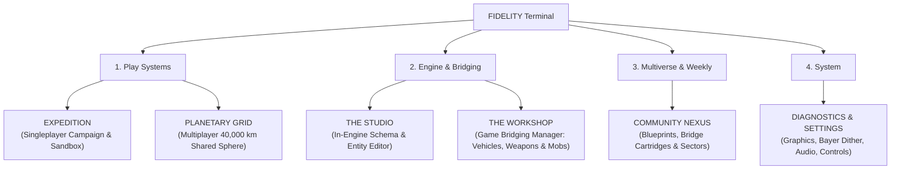

# FIDELITY // Main Menu Architecture & Brand Identity
*The Base Game of the SetMix Multiverse*

## 1. Brand Identity & Logo Mark

### Title: **FIDELITY**
- **Subtitle**: *A SetMix System // Substrate Research Initiative*
- **Design Philosophy**: Solid, balanced, authoritative scientific research aesthetic (CERN meets Weyland-Yutani meets Teenage Engineering).

### The Brand Mark: Substrate Strata Emblem
- **Geometry**: A continuous outer particle containment ring with precision cardinal reticle notches (0°, 90°, 180°, 270°).
- **The Core**: A solid, architectural monogram **"F"** optically centered at (50, 50). The vertical spine and horizontal arms feature precision 45° chamfers matching the typography, with a high-tech cyan substrate inset track.
- **The Meaning**: Unbroken, grounded, and unified—symbolizing the 4 coordinates of the simulation substrate:
  $$\mathbf{S} = (\text{Pxd}, \text{Vtx}, \text{Lx}, \text{Aq})$$
  *(Pixel Density, Vertex Tessellation, Lux/Lighting, Acoustics)*.

---

## 2. Main Menu Hierarchy (Clean 6-Button Suite)

The main menu operates as a live command terminal inside the **Lunar Observation Bunker**, looking out onto the surface of the moon and the glowing gate.

### Button Specifications

1. **EXPEDITION** `[DESYNCED]`
   - *Solo Campaign (Desynced Local Branch)*
   - Launch directly into your private local simulation branch on Lunar Sector 4. Play offline / solo without external interference. At any time during play, you can resync with the planetary grid via majority-rules merge.
2. **PLANETARY GRID** `[SYNCED]`
   - *Shared World Campaign (Synced 40,000 km Substrate)*
   - The exact same campaign world, but live and synchronized across the shared 40,000 km planetary sphere. Changes merge into the planet via majority-rules consensus. You can desync to a private solo branch at any time.
3. **THE STUDIO** `[EDITOR]`
   - *In-Engine World, Terrain & Schema Editor (Substrate Studio)*
   - Reuses and unifies all deep terrain sculpting, voxel brushes, block placement, and vehicle test drive systems into the base game's official editor suite. Submit authenticated diffs for the **Weekly Update Consensus Protocol**.
4. **THE WORKSHOP**
   - *Game Bridging Manager: Vehicles, Weapons & Mobs*
   - Ingest vintage `.wad`, `.pak`, and `.md2` files directly. Configure bridging adapters: 3D vehicle chassis replacement (swap your in-game rover into your favorite car from another game!), weapon adapters (shotguns, containment beams), and mob cartridges.
5. **COMMUNITY NEXUS**
   - *Blueprints, Cartridges & Sector Registry*
   - Browse community base schematics, vehicle blueprints, custom bridge cartridges, and featured lunar sectors.
6. **DIAGNOSTICS & SETTINGS**
   - *Hardware Calibration & Telemetry Configuration*
   - Fidelity stages (Bayer dither matrix, resolution downscale, WebGL/WebGPU PBR toggle), raw mouse look, gamepad bindings, and audio bit-depth.

---

## 3. Telemetry HUD & Environment

1. **Live Substrate Telemetry HUD**:
   - `CONTAINMENT INTEGRITY: 98.4%` (glowing cyan bar, nominal drift).
   - `ACTIVE RESOLUTION VECTOR: S = (1.00, 1.00, 1.00, 1.00)` representing Pxd, Vtx, Lx, Aq.
   - `WEEKLY PROTOCOL: CYCLE 42 // COMMUNITY CONSENSUS ACTIVE`.
   - `LUNAR PORTAL: GATE SHIELDED // READY`.
2. **Dynamic Laboratory Backdrop**: The live 3D `LabHome` viewport looking out the reinforced blast glass at the lunar portal and moving rovers.
3. **Decoupling from Goblins**: Goblins are permanently preserved in `origin/archive/goblin-racing` and will not be erased. The player avatar in FIDELITY is the human researcher in an IVA/EVA space exploration suit.

---

## 4. PINNED FOR NEXT MILESTONE: Modular Base-Building, Substrate Harvesting & Linked Storage

> [!IMPORTANT]
> **Design Directives for Arena.ai Codex Agent & Claude Opus Handover:**
> This architecture is pinned as the primary target immediately following the completion of current stage stabilization.

### A. Freeform Base & Machine Construction (Dune: Awakening / Valheim Style)
- **Shift Away from Machine Spam**:
  - Terraforming machines are made significantly **more expensive, heavier, and far more efficient**. Rather than cluttering the plot with dozens of small repeaters, a few high-output industrial pylons do the heavy lifting.
  - Players are given architectural freedom: building foundations, structural beams, airlocks, pressurized domes, observation towers, and power conduits.
- **Snapping & Stability**:
  - Modular socket grid for foundations, walls, ramps, roofs, and machinery mounts.
  - Structural integrity / power routing lines.

### B. Substrate Resource Harvesting & Material Synthesis
Instead of mining generic stone and iron, the player harvests the literal building blocks of digital reality:
1. **Raw Texture & Pixel Harvesting ($\text{Pxd}$)**:
   - Extract raw raster pixels and color lookup tables from the terrain and anomalous leaks.
   - Refine raw pixels into **Material Texture Maps** (diffuse, roughness, normal maps).
2. **Geometry & Vertex Harvesting ($\text{Vtx}$)**:
   - Excavate topological nodes and vertex point clouds from geological formations.
   - Synthesize raw vertices into **3D Geometric Primitives** (cubes, cylinders, chassis frames, structural panels).
3. **Preset Creation**:
   - Combine synthesized primitives + material maps at a Drafting Table to invent custom building blocks, machine casings, and structural presets.

### C. Linked Quantum Bridge Storage (Inter-Dimensional Inventory)
- **Lore Context**: The lab's quantum bridge technology that powers the lunar portal also enables instantaneous particle transfer.
- **Mechanics**:
  - Storage containers built anywhere in the player's base automatically connect to a shared **Quantum Bridge Network**.
  - No tedious manual chest sorting: crafting stations and fabricators pull directly from linked storage.
  - Portable Substrate Uplink: Players can beam harvested resources back to base storage from their rover or field backpack.

### D. Full Player Inventory & Hotbar System
- Grid inventory with item weight, stack sizes, and category filters (Raw Data, Primitives, Tools, Cartridges).
- 8-slot quick-access hotbar for terrain manipulators, harvesting tools, weapons, and construction gizmos.
- Equipment slots: EVA suit, oxygen recycler, hazard shield, and tool belt.

### E. In-Game Progression Fabricators: Vehicles & Weapons
- **Vehicle Fabricator**:
  - An in-game researchable heavy machine bay.
  - Build rovers from modular chassis, suspension arms, electric wheel motors, and utility hardpoints.
  - **Workshop Integration**: In The Workshop, players can skin their rover chassis with imported car meshes from their favorite games via bridge adapters!
- **Weapon & Tool Fabricator**:
  - Craft and tune the Mining Laser, Scatter Excavator, Containment Tether, and retro Combat Shotgun.
