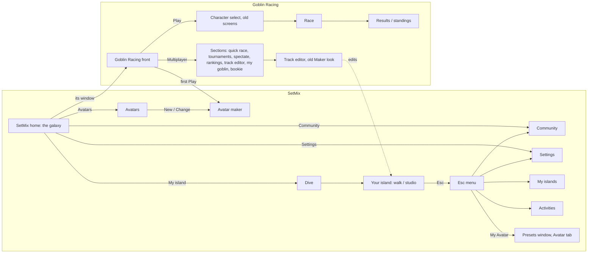

# SetMix master plan: the whole map, start to finish (2026-10-03)

The owner asked (2026-10-03): "re plan everything up to this point and have a full view so it all connects and we have solid start to finish directs ... where are we missing something, then we will continue with confidence", and "rather do all the frontend design stuff together".

`STATUS.md` stays the list of every ask and its state. This file is the map that ties them together: every place in the game, how you get between them, the journeys a player takes from start to finish, what is missing, the decisions only the owner can make, and the one batch of design work that follows. Read it before any UI work. Update it when a place, a journey or a decision changes.

---

## 1. What SetMix is

**SetMix Harness** is the world: a universe of stars and planets you fly through, your own island you walk and build as one of your avatars, the presets everything is made of (every variable reachable, ready-made ones for a 6-year-old, the raw values for a 20-year-old), and a community to share them. **Activities** are games inside it, each on its own planet with its own menu and its own voice. **Goblin Racing** is the first: goblins in glass balls racing round an island that its players evolve each week.

Two launches on RUN (H6): SetMix (home islands, avatars, presets) and Goblin Racing (its island, racing data). One codebase.

---

## 2. The map today: every place and how you get there

| Place | Level | How you get there | What it is for |
|---|---|---|---|
| SetMix home | SetMix | Start; Home from anywhere | The galaxy; Goblin Racing's live window; My island, Avatars, Community, Settings |
| Your island | SetMix | Home, My island (dive) | Walk as your avatar; build with the F1-F10 tabs; studio mode (B) |
| Esc menu | SetMix | Esc on the island | Home, Studio, Settings, My Avatar, Share, tour, Activities, My islands, Community, Back |
| Avatars | SetMix | Home | Every avatar: use, change, remove, new |
| Avatar maker | SetMix / Goblin Racing | Avatars; first Play; first My island | Kind, ready-made looks, parts, colours, name |
| My islands | SetMix | Island Esc menu only | Open, rename, duplicate, delete, new from a template |
| Activities | SetMix | Island Esc menu only | Every activity: play, duplicate, hide, create new |
| Community | SetMix | Home, Esc menu | Shared presets, your shares, credits |
| Settings | SetMix | Home, Goblin Racing, Esc menu | Graphics presets (Potato to Ultra, Auto), card, controls, profile |
| Goblin Racing front | Goblin Racing | Home window | Play, Multiplayer, Settings, Back to SetMix |
| Racing sections | Goblin Racing | Multiplayer | Quick race, tournaments, spectate, rankings, track editor, settings, my goblin, bookie |
| Race flow | Goblin Racing | Play, Quick race | Character select, loading, race, pause, results, standings (older screens with their own settings) |
| Track editor | Goblin Racing | Sections | The old Maker, on your home island |

---

## 3. Journeys, start to finish

Each journey: what happens today, where it breaks, what finishing it needs.

| # | Journey | Today | Breaks or missing | To finish it |
|---|---|---|---|---|
| J1 | **First launch** | The home opens with Goblin Racing selected; two ways in (Play makes a goblin and races; My island makes an avatar, then the tour) | Nothing says "start here"; the progression idea (H9) and "Goblin Racing pre-selected" (H2) pull different ways | Owner decision Q1; then one welcome moment that points at that first step, behind a loading bar |
| J2 | **Play a race** | Play, (first time: make a goblin), character select, loading, race, results | Your avatar is not in the race: racers are separate colour-and-stats cards ("My goblin" is a colour card, not your avatar); the race screens have their own older look and their own settings | Your goblin rides its ball (E2: the goblin is the rider, the ball card holds the stats); character select = your goblins; results lead back to the Goblin Racing front; race screens in Goblin Racing's voice; one Settings |
| J3 | **Make, switch or change an avatar** | Avatars window and the maker; on the island P is a hotbar tab and Esc, My Avatar opens the presets window | Three different ways to do one thing; "My Goblin" in the racing sections is a fourth | One avatar family of pieces used everywhere: avatar mode on the island (E11), the Avatars window, the maker; "New avatar" offers Quick / Wizard / Manual (B13); Goblin Racing's "My Goblin" opens the same pieces |
| J4 | **Build my island** | My island, dive, tour, tabs, studio, share | My islands is only reachable from inside the island; "Create new" island is a template dropdown; the Esc menu mixes harness, island and goblin things | My islands from the home (your planet's islands); new island via the chooser (B13); the Esc menu split by level (H5) |
| J5 | **Share and use others' work** | Share dialog (on this device), Community browse and buy with credits | No place where a bought or shared preset arrives for you to use; no backend | A "From the community" shelf in the presets window; the platform (P6) for real sharing |
| J6 | **Evolve the Goblin Racing island** (H7) | Not started | No place to submit, see submissions, or vote | Goblin Racing front: "The island" (this week's version, submissions, vote); your island: "Submit to Goblin Racing" |
| J7 | **Change settings** | One Settings in SetMix, Goblin Racing and the Esc menu | The race flow has its own older settings screen and pause menu | The race uses the same Settings |
| J8 | **Edit a race track** | Goblin Racing, Multiplayer, Track editor | It opens your home island, in the old Maker look | Owner decision Q4; the studio look |
| J9 | **Come back another day** | The home, every time | No "carry on" (your island, your last race) and no "what's new" (this week's island, community) | A carry-on line on the home |
| J10 | **Explore the universe** (H8) | The galaxy with planets | Stars, orbits, logos, explorer tab, search | H8 plan; owner decision Q5 |
| J11 | **Progress** (H9) | Not started | Lessons, the ship, the flight, classes | Depends on Q1 |
| J12 | **Kids** (grown-up off) | Building tools hidden on the island | Not checked journey by journey | Every journey above walked once in kids mode |

---

## 4. What is missing (found by walking the journeys)

| ID | Gap | Where it hurts |
|---|---|---|
| G1 | No single first step for a new player | J1 |
| G2 | The race does not use your avatar; the racer card is a separate goblin | J2, J3 |
| G3 | Two settings screens (the race flow keeps its own) | J2, J7 |
| G4 | "Multiplayer" opens single-player sections; no online play yet | J2 |
| G5 | Goblin Racing's track editor edits your home island, in the old look | J8 |
| G6 | My islands and Activities only open from inside the island | J4 |
| G7 | "Create new" activity makes an empty activity with nothing to play | Activities |
| G8 | Bought or shared presets have nowhere to land | J5 |
| G9 | No carry-on or what's new for returning players | J9 |
| G10 | Three visual languages (the SetMix galaxy, the white-wall island studio, the old race screens and Maker) and no design system file | Every journey |
| G11 | The loading-bar rule (preload behind a visible bar, never start a screen choppy) is only checked for the race | J1, J2, J4 |
| G12 | The island's Esc menu has ten buttons across three levels | J4 |
| G13 | The tour is written by hand and can go stale (B15) | J1, J4 |
| G14 | Phones: the island needs a mouse and keys (F1-F10, mouse capture); the race has touch controls | All, on RUN |
| G15 | The hierarchy bar's levels (Galaxy > Planet > Island > Goblin) will change with the universe (Universe > Galaxy > Star > Planet > Island > Avatar) | J4, J10 |

---

## 5. Decisions only the owner can make

| ID | Question | Options (recommended first) |
|---|---|---|
| Q1 | What does a brand-new player do first? | **SetMix first**: make your avatar, walk your island, the tour teaches building; Goblin Racing one click away on the home. / **Goblin Racing first**: a race within a minute, SetMix opens up after. / **The progression story** (H9): Goblin Racing is visible but reached by building the ship |
| Q2 | Phones and tablets | **Phones race and walk; building is desktop** / Phones do everything (a touch build mode) / Desktop only for now |
| Q3 | Goblin Racing's "Multiplayer" button until online play exists | **Rename it "Race modes"** (quick race, tournaments, spectate, rankings, bookie); "Multiplayer" returns with online play / Keep the name |
| Q4 | Goblin Racing's track editor edits | **The Goblin Racing island, as your proposal for this week's evolution** (H7) / Your own island's track |
| Q5 | In the universe (H8), a star is | **A creator** (you, the Goblin Racing studio, each player) with their planets round it / **A game** (Goblin Racing's star, its planets = its islands and modes) |

**The universe, owner direction (2026-10-03):** from the galaxy you go to **My planet**, see your islands with previews, and go into one. Recommendation taken as the plan ("go with your recommendation for now"): **your star is your solar system**: your planet (your islands) orbits it, with any activities you make; **friends move in**: adding a friend brings their home planet into your system as a neighbour you can visit; **other creators are other stars** (Goblin Racing's studio is the goblin world's star; players' public creations are theirs); **to reach the goblin planet you fly your rocket** out of your system across the galaxy to its star (H9): a short flight first, later the rocket you built matters (range, speed, stops on the way).

**Defaults in use until the owner decides** (2026-10-03: the owner asked to carry on to a beta without answering; each is easy to change): Q1 as the owner described the home (H2): Goblin Racing selected, its Play is the suggested first step and makes your first avatar; My island is the other way in; the progression story (H9) comes later. Q2 phones race and walk, building is desktop. Q3 "Race modes". Q4 the Goblin Racing island (your track is your proposal for the weekly vote). Q5 a star is a creator.

---

## 5b. Progress toward the beta (owner, 2026-10-03: "lets see if we can get it all the way to beta test version so i can build the maps, and tweak it a bit")

| Gap / ask | Done | Where |
|---|---|---|
| G2 your avatar in the race | Your goblin rides your ball (voxel avatar, animated, upright in the glass); the racer you pick sets the ball (the select screen says "Pick a ball for ...") | `race-view.tsx`, `race-game.ts` `rider`, `CharacterSelect` `rider` |
| G3 one Settings | The race's pause Settings is the same Settings window; Settings has Graphics, Sound, Controls, Racing, You; sound and racing settings are one shared store; the race uses the profile's graphics preset | `shell/settings-body.tsx`, `shell/play-settings.ts`, `app.tsx` |
| G4 "Multiplayer" | Renamed Race modes (Q3 default) | `goblin-front.tsx` |
| G5 track editor | Opens the Goblin Racing island (Q4 default); its exit says Back to Goblin Racing; its Start over only ever clears its own island's map (it used to clear whichever island was active) | `shell.tsx` `editing`, `maker.tsx`, `storage.ts` `clearMapOf` |
| G6 My islands from the home | A line under My island: "All my islands, or a new one" | `goblin-front.tsx` `SetMixHome` |
| G9 carry on | My island says "Carry on at <island>, where you left off" once you have been there | same |
| G12 Esc menu | Back to walking first, then "On this island" and "SetMix" groups; readable headings | `island.tsx`, `studio.css` |
| E11 avatar mode | P / the Avatar tab: the camera faces your avatar (right-drag turns, wheel zooms), a dock with your characters (one click swaps), + New avatar, and this one's Looks, Colours, Wears, Moves; Esc, Done or P goes back | `avatar/avatar-dock.tsx`, `island.tsx` |
| B13 three ways in | `NewChooser` (remembers your last way); New avatar (island dock and the Avatars window) and New island (ready-made maps drawn from above; a five-question wizard whose map redraws as you answer; Manual opens a plain island) | `shell/new-thing.tsx`, `islands/new-island.tsx` |
| B14/B16 screen map | `scripts/ui-map.mjs`: every screen, every control pressed, outcomes, Esc checks, layout flags, screenshots, `ui-map/index.html`; `--approve` / `--check` against `tests/ui-contract.json` | |
| 6.1 design system | `docs/DESIGN.md` | |
| My planet (owner: "from the galaxy it should be my planet, then from the planet you see your islands with previews, then go into the island you want") | The home menu says My planet (with a Carry on at <island> link straight in); picking your planet in the galaxy shows a window of your islands drawn from above; My planet's screen lists every island as its map (an edited island shows its own ground and track), Go in, rename, copy, delete, New island | `islands/my-planet.tsx`, `new-island.tsx` `mapOfBundle` |
| Every planet has a window | Goblin Racing's live window, any other activity's window on the same island, My planet's islands; a loading bar until a live window's island has drawn; the leader line follows whichever window is up | `goblin-front.tsx` `GoblinPreview`, `shell.tsx` |
| The preview spilling a tool window | The home's window never opens studio windows or turns into the studio, whatever mode your island was left in | `island.tsx` |
| The official Goblin Racing island (H7 step 1) | Build it in Goblin Racing's track editor, Map code, Copy my map code, give the code to Claude: it goes in `maker/official-racing.ts` and every player without a Goblin Racing island starts on it. Loading a map code in the editor (and Start over) only touches that editor's own island | `official-racing.ts`, `storage.ts` `seedMap`, `useMapCode(code, rt)` |
| B15 the tour and the interface | Tour steps point at `data-ui` names on real controls (tabs, the presets button, the PBR button); the tour card rings that control; the e2e test fails if a step points at a control that is not there; hints are key names, not capitals | `tutorial/tour-card.tsx`, `island-steps.ts`, `hud.tsx` |

## 6. The design batch: all front-end work, done together

Rule 6 applies: load the frontend-design skill at the start; every screen is checked by screenshot (B14) and measured on Potato and Low.

**6.1 One design system, two voices** (`docs/DESIGN.md`, tokens in one stylesheet, shared components):
- **SetMix voice** (the harness, from the owner's studio prompt): white walls, clean, square corners, no bevels, inner shadows or glows, a stylish modern display face (Oxanium), previews instead of words, shelves that hide themselves, goblin doodles painted on the walls (an art job). The galaxy is the one dark place: space.
- **Goblin Racing voice** (only inside Goblin Racing): its own wordmark and colour, the goblin world's materials. Confirm the look in the design pass.
- **Shared pieces**: the movable window, the preset card and tile (with preview), the side dock, the three-way chooser (B13), tabs and segmented buttons, swatches, the note (toast), the loading bar, empty states that say what to do.

**6.2 Screens, in journey order**

| Step | Screens | Asks it closes |
|---|---|---|
| 1 | Welcome and first launch | Q1, G1, G11 |
| 2 | Home and the universe: stars with logos, orbits, explorer tab with search, carry-on line | H2, H8, G9, G15 |
| 3 | The avatar family: avatar mode on the island (3rd person facing you, your characters in a row, + New avatar, its own presets below), the Avatars window, the maker | H4, E1, E11, G2 (the screens part), G14 |
| 4 | The three-way chooser everywhere something is made: avatar, island, activity, preset, track, lighting | B13, G7 |
| 5 | The island: HUD, Esc menu split by level, My islands from the home, the hierarchy bar on the universe's levels | H5, G6, G12, S1 to S5 polish |
| 6 | Goblin Racing: front, race modes, character select = your goblins, race screens, pause and results in its voice, one Settings, "The island" (evolution) | H3, H7 screens, G2 to G4 |
| 7 | Track editor in the studio look | G5, Q4 |
| 8 | Community: where shares land | G8 |

**6.3 The hotbar: how everything is edited** (owner, 2026-10-03; the full design is `docs/HOTBAR.md`)

The hotbar is how you edit everything, and it is where the game is still thinnest. The owner's instructions, all in HOTBAR.md: Select can select anything (the ground, a surface, a thing, its parts, its blocks: faces, edges and vertices) and change it; each tab holds ways of working, not materials (Paint = brushes, fills, sprays, stamps, clone; Sculpt = the brushes sculptors use most, with symmetry, more/less detail and smoothing toggles); materials go in a **palette**, a film strip at the top middle with the community's presets and scroll buttons; picking a tool shows **its presets previewed on your selection**; **Move** has ways to move a thing and, with nothing selected, the ways to move yourself (walk, fly, orbit, pan, zoom, map, focus, follow, jump to); the hotbar has **Easy / Pro / Studio** built in, arrives with the tour and stays; it is a preset, managed in Settings, Hotbar; deep preset trees (a racing ball's physics) sit behind **More…** in Studio; the screen map audits what the hotbar cannot edit yet.

| Step | What | Gaps it closes |
|---|---|---|
| H-a | The hotbar audit in the screen map (every kind of thing × every tab: selectable? which tool edits it? at which level?) | measures the rest |
| H-b | The skeleton: the hotbar preset with Easy / Pro / Studio, the tool-presets row with previews on the selection, the palette film strip, More… in the Inspector | the loop |
| H-c | Paint as ways to paint (Brush, Spray, Fill, Gradient, Stamp, Pattern, Clone, Smudge, Eraser), the surfaces moved into the palette | owner's example |
| H-d | Sculpt as ways to sculpt (Raise, Lower, Smooth, Flatten, Grab, Clay, Crease, Stamp, Terrace; + Inflate, Pinch, Twist, Noise, Erode, Bridge …), stamps and patterns in the palette, the toggles | |
| H-e | Select picks anything (ground areas, a surface's wand, things, parts, blocks), Move's ways to move a thing and the ways to move yourself (shared with the Camera tab) | "select anything and change it" |
| H-f | Things (Scatter, Row, Swap), Lights (sun and time, place a light, day and night), Animate (Pose, Keys, Blend), Sound (Attach, Zone) | |
| H-g | Editing a thing's blocks on the island (paint, sculpt, select parts and faces) | |
| H-h | Settings, Hotbar: add, remove, reorder tools per tab, back to ready-made, share | "hotbar management in the settings" |

---

## 7. The order of work

1. **The tests that keep it connected (section 8)**: the UI contract and the names (T2), then the screen map crawler (B14: T3, T5, T6). It turns section 2 into the real map and checks every button after each change.
2. **The owner's decisions** Q1 to Q5.
3. **The design system** (6.1).
4. **The design batch** (6.2), in journey order, each step reviewed on the map.
4b. **The hotbar** (6.3, `docs/HOTBAR.md`): H-a to H-h, after the beta pass; the audit (H-a) first.
5. **The tour from names** (B15), checked by the map.
6. Then the rest of STATUS: H7 evolution (local first), H6 two RUN launches, the platform, D15 satellite islands, the day/night cycle, B12 the AI kit. Performance at every step.

---

## 8. Automated testing: everything hooked up, every button there and doing its job

The owner (2026-10-03): "plan the automated testing as well please, we need scripts that test that everything is hooked up, that buttons exist and do what they are supposed to do".

**The idea: every button has a declared job, and scripts check the job gets done.** Today the 60-check e2e walk tests one path by hand-written steps; a button nobody wrote a step for can break unnoticed. From now on every control is named and declared, and a crawler checks all of them.

**8.1 The UI contract** (`apps/web/src/ui-contract.ts`). Every button, tab, menu item and window gets a stable name on the page (`data-ui="home.my-island"`, `island.esc.settings`, `goblin.play`) and one line in the contract: which screen it is on, when it shows (kids mode, studio, first visit ...), and what it must do, as one of a few kinds of outcome:

| Outcome | Example | Checked by |
|---|---|---|
| Goes to a screen | `home.community` goes to `hub` | the screen after the press |
| Opens a window | `island.esc.settings` opens window `settings` | the window is there, on screen, closable, Esc closes it |
| Changes a setting or a preset | `settings.graphics.potato` sets graphics to Potato | the saved profile and the renderer's tier |
| Starts something | `goblin.play` starts a race (or the maker the first time) | the race view or the maker |
| Acts in the world | `island.tab.sculpt`, slot 1, left click raises the ground | the island's data changed, undo puts it back |

**8.2 The layers of tests**

| Layer | What it proves | Script | When it runs |
|---|---|---|---|
| T1 Unit | The packages' logic (presets, sims, quality, looks ...) | existing `*.test.ts` (1150+) | `npm run verify`, every change |
| T2 Contract | The contract itself holds together: every screen in `ROUTES` has a way back, every target screen and window exists, every name is unique, no screen without a way in | `ui-contract.test.ts` | `npm run verify` |
| T3 Screen map (B14) | **Every declared button exists and does its job; every button on screen is declared.** The crawler visits every screen (in each mode: first visit, returning, kids, studio), presses every control in a fresh copy of that state, and compares what happened with the contract. It fails on: a declared button missing, an undeclared button, a button that does nothing, the wrong destination, a dead end (no way back, Esc does nothing), a page error, a control off screen, covered by another, or with text spilling out. It writes `ui-map/index.html`: the real map with a screenshot per screen, failures in red | `scripts/ui-map.mjs` | `npm run check:ui`, after every UI change and before every commit that touches the UI |
| T4 Journeys | Each journey in section 3 works start to finish with its real outcome (J2: a race starts with your goblin riding; J4: what you built is still there after a reload; J6: a submitted evolution shows in the vote) | `scripts/journeys/j1-first-launch.mjs` ... (today's `e2e-smoke.mjs` split by journey) | `npm run check:journeys`, before every commit |
| T5 Tour | Every tour step's button exists on its screen and leads where the step says (B15) | part of T3 (the tour preset names its buttons) | with T3 |
| T6 Looks | Every screen at three sizes (1920x1080, 1366x768, a phone 390x844), reviewed by Claude against `docs/DESIGN.md`; stable screens (menus, windows, the 3D masked) compared with the last approved picture, so an accidental change shows | `ui-map.mjs --shots` | with T3; review after every UI change |
| T7 Speed | Each screen on Potato and Low on the owner's laptop: frame rate, the slowest frames, mouse look without stalls; fails under the target | `scripts/perf.mjs`, `scripts/look-probe.mjs` (moved in from the scratchpad) | `npm run check:perf`, after anything that draws |
| T8 Saves | Old saves load (renamed values such as `calculator` to `potato`, older profile and island versions); a save survives a reload | unit tests per store, plus J4 and J9 | `npm run verify` |

**8.3 Rules for every browser test**: installed Chrome, headless, the real graphics card (`E2E_GPU=1`), slow-machine timing (`E2E_SLOW`); never take the owner's mouse (mouse capture stubbed, the cursor clip released); no network; each test starts from its own clean storage.

**8.4 The order**: the contract and names first (T2), then the crawler (T3, T5, T6) on today's screens, then the journeys split (T4), then the speed thresholds (T7). From then on a new button is not done until it is in the contract and the crawler passes.
