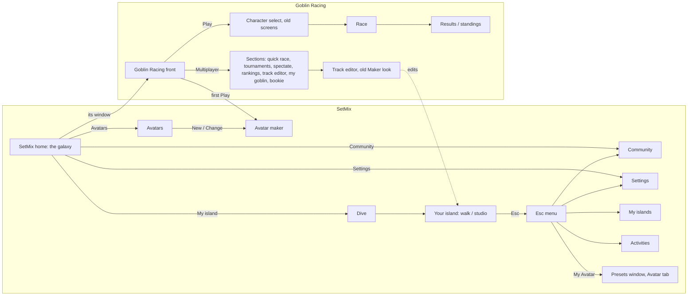

# SetMix master plan: the whole map, start to finish (2026-10-03)

The owner asked (2026-10-03): "re plan everything up to this point and have a full view so it all connects and we have solid start to finish directs ... where are we missing something, then we will continue with confidence", and "rather do all the frontend design stuff together".

`STATUS.md` stays the list of every ask and its state. This file is the map that ties them together: every place in the game, how you get between them, the journeys a player takes from start to finish, what is missing, the decisions only the owner can make, and the one batch of design work that follows. Read it before any UI work. Update it when a place, a journey or a decision changes.

---

## 1. What SetMix is

**SetMix Harness** is the world: a universe of stars and planets you fly through, your own island you walk and build as one of your avatars, the presets everything is made of (every variable reachable, ready-made ones for a 6-year-old, the raw values for a 20-year-old), and a community to share them. **Activities** are games inside it, each on its own planet with its own menu and its own voice. **Goblin Racing** is the first: goblins in glass balls racing round an island that its players evolve each week.

Two launches on RUN (H6): SetMix (home islands, avatars, presets) and Goblin Racing (its island, racing data). One codebase.

---

## 2. The map today: every place and how you get there

| Place | Level | How you get there | What it is for |
|---|---|---|---|
| SetMix home | SetMix | Start; Home from anywhere | The galaxy; Goblin Racing's live window; My island, Avatars, Community, Settings |
| Your island | SetMix | Home, My island (dive) | Walk as your avatar; build with the F1-F10 tabs; studio mode (B) |
| Esc menu | SetMix | Esc on the island | Home, Studio, Settings, My Avatar, Share, tour, Activities, My islands, Community, Back |
| Avatars | SetMix | Home | Every avatar: use, change, remove, new |
| Avatar maker | SetMix / Goblin Racing | Avatars; first Play; first My island | Kind, ready-made looks, parts, colours, name |
| My islands | SetMix | Island Esc menu only | Open, rename, duplicate, delete, new from a template |
| Activities | SetMix | Island Esc menu only | Every activity: play, duplicate, hide, create new |
| Community | SetMix | Home, Esc menu | Shared presets, your shares, credits |
| Settings | SetMix | Home, Goblin Racing, Esc menu | Graphics presets (Potato to Ultra, Auto), card, controls, profile |
| Goblin Racing front | Goblin Racing | Home window | Play, Multiplayer, Settings, Back to SetMix |
| Racing sections | Goblin Racing | Multiplayer | Quick race, tournaments, spectate, rankings, track editor, settings, my goblin, bookie |
| Race flow | Goblin Racing | Play, Quick race | Character select, loading, race, pause, results, standings (older screens with their own settings) |
| Track editor | Goblin Racing | Sections | The old Maker, on your home island |

---

## 3. Journeys, start to finish

Each journey: what happens today, where it breaks, what finishing it needs.

| # | Journey | Today | Breaks or missing | To finish it |
|---|---|---|---|---|
| J1 | **First launch** | The home opens with Goblin Racing selected; two ways in (Play makes a goblin and races; My island makes an avatar, then the tour) | Nothing says "start here"; the progression idea (H9) and "Goblin Racing pre-selected" (H2) pull different ways | Owner decision Q1; then one welcome moment that points at that first step, behind a loading bar |
| J2 | **Play a race** | Play, (first time: make a goblin), character select, loading, race, results | Your avatar is not in the race: racers are separate colour-and-stats cards ("My goblin" is a colour card, not your avatar); the race screens have their own older look and their own settings | Your goblin rides its ball (E2: the goblin is the rider, the ball card holds the stats); character select = your goblins; results lead back to the Goblin Racing front; race screens in Goblin Racing's voice; one Settings |
| J3 | **Make, switch or change an avatar** | Avatars window and the maker; on the island P is a hotbar tab and Esc, My Avatar opens the presets window | Three different ways to do one thing; "My Goblin" in the racing sections is a fourth | One avatar family of pieces used everywhere: avatar mode on the island (E11), the Avatars window, the maker; "New avatar" offers Quick / Wizard / Manual (B13); Goblin Racing's "My Goblin" opens the same pieces |
| J4 | **Build my island** | My island, dive, tour, tabs, studio, share | My islands is only reachable from inside the island; "Create new" island is a template dropdown; the Esc menu mixes harness, island and goblin things | My islands from the home (your planet's islands); new island via the chooser (B13); the Esc menu split by level (H5) |
| J5 | **Share and use others' work** | Share dialog (on this device), Community browse and buy with credits | No place where a bought or shared preset arrives for you to use; no backend | A "From the community" shelf in the presets window; the platform (P6) for real sharing |
| J6 | **Evolve the Goblin Racing island** (H7) | Not started | No place to submit, see submissions, or vote | Goblin Racing front: "The island" (this week's version, submissions, vote); your island: "Submit to Goblin Racing" |
| J7 | **Change settings** | One Settings in SetMix, Goblin Racing and the Esc menu | The race flow has its own older settings screen and pause menu | The race uses the same Settings |
| J8 | **Edit a race track** | Goblin Racing, Multiplayer, Track editor | It opens your home island, in the old Maker look | Owner decision Q4; the studio look |
| J9 | **Come back another day** | The home, every time | No "carry on" (your island, your last race) and no "what's new" (this week's island, community) | A carry-on line on the home |
| J10 | **Explore the universe** (H8) | The galaxy with planets | Stars, orbits, logos, explorer tab, search | H8 plan; owner decision Q5 |
| J11 | **Progress** (H9) | Not started | Lessons, the ship, the flight, classes | Depends on Q1 |
| J12 | **Kids** (grown-up off) | Building tools hidden on the island | Not checked journey by journey | Every journey above walked once in kids mode |

---

## 4. What is missing (found by walking the journeys)

| ID | Gap | Where it hurts |
|---|---|---|
| G1 | No single first step for a new player | J1 |
| G2 | The race does not use your avatar; the racer card is a separate goblin | J2, J3 |
| G3 | Two settings screens (the race flow keeps its own) | J2, J7 |
| G4 | "Multiplayer" opens single-player sections; no online play yet | J2 |
| G5 | Goblin Racing's track editor edits your home island, in the old look | J8 |
| G6 | My islands and Activities only open from inside the island | J4 |
| G7 | "Create new" activity makes an empty activity with nothing to play | Activities |
| G8 | Bought or shared presets have nowhere to land | J5 |
| G9 | No carry-on or what's new for returning players | J9 |
| G10 | Three visual languages (the SetMix galaxy, the white-wall island studio, the old race screens and Maker) and no design system file | Every journey |
| G11 | The loading-bar rule (preload behind a visible bar, never start a screen choppy) is only checked for the race | J1, J2, J4 |
| G12 | The island's Esc menu has ten buttons across three levels | J4 |
| G13 | The tour is written by hand and can go stale (B15) | J1, J4 |
| G14 | Phones: the island needs a mouse and keys (F1-F10, mouse capture); the race has touch controls | All, on RUN |
| G15 | The hierarchy bar's levels (Galaxy > Planet > Island > Goblin) will change with the universe (Universe > Galaxy > Star > Planet > Island > Avatar) | J4, J10 |

---

## 5. Decisions only the owner can make

| ID | Question | Options (recommended first) |
|---|---|---|
| Q1 | What does a brand-new player do first? | **SetMix first**: make your avatar, walk your island, the tour teaches building; Goblin Racing one click away on the home. / **Goblin Racing first**: a race within a minute, SetMix opens up after. / **The progression story** (H9): Goblin Racing is visible but reached by building the ship |
| Q2 | Phones and tablets | **Phones race and walk; building is desktop** / Phones do everything (a touch build mode) / Desktop only for now |
| Q3 | Goblin Racing's "Multiplayer" button until online play exists | **Rename it "Race modes"** (quick race, tournaments, spectate, rankings, bookie); "Multiplayer" returns with online play / Keep the name |
| Q4 | Goblin Racing's track editor edits | **The Goblin Racing island, as your proposal for this week's evolution** (H7) / Your own island's track |
| Q5 | In the universe (H8), a star is | **A creator** (you, the Goblin Racing studio, each player) with their planets round it / **A game** (Goblin Racing's star, its planets = its islands and modes) |

---

## 6. The design batch: all front-end work, done together

Rule 6 applies: load the frontend-design skill at the start; every screen is checked by screenshot (B14) and measured on Potato and Low.

**6.1 One design system, two voices** (`docs/DESIGN.md`, tokens in one stylesheet, shared components):
- **SetMix voice** (the harness, from the owner's studio prompt): white walls, clean, square corners, no bevels, inner shadows or glows, a stylish modern display face (Oxanium), previews instead of words, shelves that hide themselves, goblin doodles painted on the walls (an art job). The galaxy is the one dark place: space.
- **Goblin Racing voice** (only inside Goblin Racing): its own wordmark and colour, the goblin world's materials. Confirm the look in the design pass.
- **Shared pieces**: the movable window, the preset card and tile (with preview), the side dock, the three-way chooser (B13), tabs and segmented buttons, swatches, the note (toast), the loading bar, empty states that say what to do.

**6.2 Screens, in journey order**

| Step | Screens | Asks it closes |
|---|---|---|
| 1 | Welcome and first launch | Q1, G1, G11 |
| 2 | Home and the universe: stars with logos, orbits, explorer tab with search, carry-on line | H2, H8, G9, G15 |
| 3 | The avatar family: avatar mode on the island (3rd person facing you, your characters in a row, + New avatar, its own presets below), the Avatars window, the maker | H4, E1, E11, G2 (the screens part), G14 |
| 4 | The three-way chooser everywhere something is made: avatar, island, activity, preset, track, lighting | B13, G7 |
| 5 | The island: HUD, Esc menu split by level, My islands from the home, the hierarchy bar on the universe's levels | H5, G6, G12, S1 to S5 polish |
| 6 | Goblin Racing: front, race modes, character select = your goblins, race screens, pause and results in its voice, one Settings, "The island" (evolution) | H3, H7 screens, G2 to G4 |
| 7 | Track editor in the studio look | G5, Q4 |
| 8 | Community: where shares land | G8 |

---

## 7. The order of work

1. **The screen map (B14)**: the crawler that presses every button, screenshots every screen and draws the map. It turns section 2 into the real thing and checks every link after each change.
2. **The owner's decisions** Q1 to Q5.
3. **The design system** (6.1).
4. **The design batch** (6.2), in journey order, each step reviewed on the map.
5. **The tour from names** (B15), checked by the map.
6. Then the rest of STATUS: H7 evolution (local first), H6 two RUN launches, the platform, D15 satellite islands, the day/night cycle, B12 the AI kit. Performance at every step.

---

## 8. How it stays connected

- Every screen in `ROUTES` (`shell/shell.tsx`) has a way back (unit test and e2e).
- The map (B14): no dead ends, every button does something, every screen screenshotted and reviewed.
- The tour (B15): every step's button exists and leads where it says.
- The e2e walk covers journeys J1 to J8.
