# Recursive preset system — interface concepts

Ten interface directions for the new preset-based world and goblin building system. These are UX composition studies, not pixel-perfect implementation specifications. Labels, spacing, and accessibility must be rebuilt with real UI components rather than extracted from generated images.

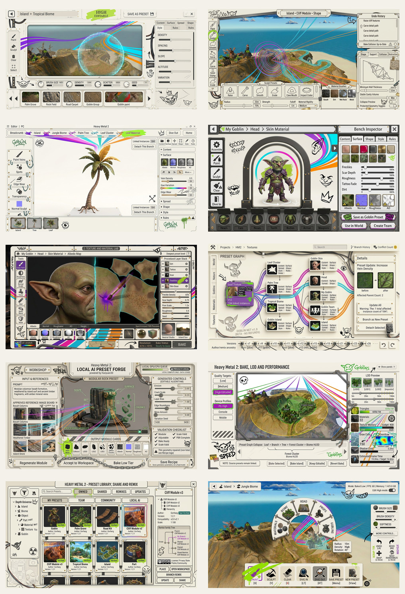

## Shared visual language

The concepts establish a **white-void racing collage with tactile PBR splashes and minimalist goblin doodle-grunge**. [Issue #63](https://github.com/Piskriek/HeavyMetal2/issues/63) is the composition reference for the calm minimalist baseline:

- bright warm-white enamel and pale ceramic/polymer surfaces dominate every screen;
- panels are thin, flat and shaped by useful negative space, stencil apertures, silhouette wells, notches and exposed white void;
- smooth gunmetal connector strips physically join panel islands with small visible gold rivets;
- vivid ultraviolet, hot magenta, electric cyan and racing orange lines form one or two purposeful perspective sweeps rather than filling the interface with glow;
- thumbnails, material chips and selected previews are small windows into tactile PBR surfaces—skin, bark, foliage, stone, paint, cloth, water and metal show coherent neutral lighting, relief, roughness and metallic response;
- acid green appears as an occasional hand-painted swipe behind an active or verified state rather than a full panel fill;
- sparse black hand-inked goblin doodles—teeth, crooked arrows, eyes, crowns, wheels, flames and mischievous faces—bring irreverent South African street-zine energy together with appealing animated-feature character;
- restrained physical weathering consists of chipped white enamel, fine scratches, faded overspray and scuffs—the design remains predominantly clean and flat;
- sharp modern condensed sans-serif typography uses charcoal text, bold numerics and strong editorial hierarchy;
- the 3D viewport remains the primary detailed surface while surrounding UI behaves like lightweight racing bodywork;
- context appears near the action instead of permanently consuming the screen.

### Visual guardrails

- White void must remain the largest color field; do not regress to heavy dark boxed panels.
- Cutouts must clarify grouping or create a useful silhouette, not become random decorative holes.
- Perspective racing lines should point toward interaction and data flow; keep them out of text blocks and viewport focal areas.
- PBR previews use one shared neutral lighting rig so roughness and metallic differences are meaningful; never bake dramatic colored lighting into material thumbnails.
- Detailed material splashes belong inside thumbnails, swatches and selected-preview windows—not behind labels or across whole panels.
- Gold is reserved for physical rivets and tiny connection details, never broad ornamental frames.
- Acid-green paint marks may emphasize only a small number of active, accepted or verified states.
- Doodles are a controlled authored icon library, not random graffiti: place them in dead margins, keep their line weight consistent, and never let them replace icons, labels, focus indicators or accessibility states.
- Use original street-zine/goblin motifs rather than reproducing a specific performer's, studio's or artist's protected characters or artwork.
- Grunge belongs at edges and contact points. Controls, labels, sliders, maps and numeric telemetry remain crisp.
- Purple/magenta denotes active or selected; cyan denotes links, masks and geometry; orange denotes motion or caution; red remains failure/destructive.
- Reuse a controlled library of panel silhouettes, cutouts, rivets, scratches, paint swipes, doodles and racing-line sweeps so every workspace belongs to one system.
- Distress may not reduce minimum contrast, target size, channel-map readability or color-blind status redundancy.

## Shared interaction model

Every workspace reuses the same concepts:

1. **Depth breadcrumb** — shows where the user is in the recursive preset hierarchy.
2. **Adaptive tool rail** — Paint, Sculpt, Clear, Select, Dive In, and Dive Out change meaning by depth.
3. **Six preset dimensions** — Content, Surface, Spread, Shape, Style, and Rules.
4. **Linked state** — changes flow upward to parents unless a branch is detached.
5. **Preset action model** — Save, Branch, Detach, Bake, Place, Share.
6. **Quality state** — Editable, Baked, or Hybrid is always visible.
7. **Progressive disclosure** — common controls remain close; advanced controls live one level deeper.

---

## 01 — World Paint workspace

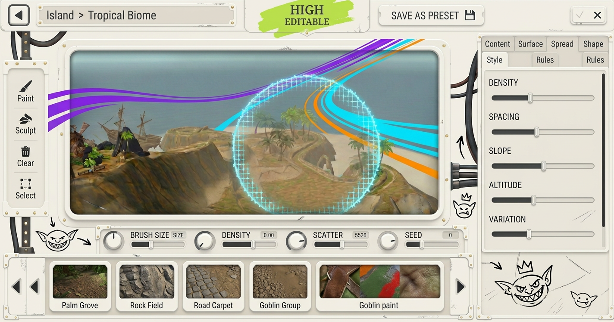

### Purpose

The primary island-building mode. The user paints world-scale presets such as forests, rock fields, roads, props, and goblin groups.

### Layout idea

- Large central 3D world viewport.
- Narrow left tool rail.
- Bottom visual preset shelf and brush controls.
- Right six-tab preset inspector.
- Compact top breadcrumb and save/quality state.

### Key interaction

Selecting a preset turns the cursor into a visible placement brush. Density, scatter, rotation, slope, altitude, and seed are adjusted without leaving the viewport.

### Why it matters

This makes placement feel like environmental painting rather than static model dropping.

---

## 02 — Terrain Sculpt workspace

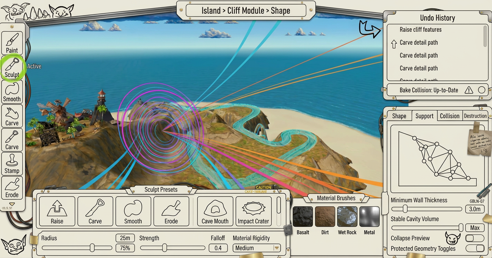

### Purpose

World and object sculpting using one consistent clay-like interaction model.

### Layout idea

- World viewport remains dominant.
- Sculpt presets and radius/strength/falloff sit in the bottom dock.
- Support, collision, destruction, and protected geometry live in the right panel.
- Contour rings and masks visualize what the operation will affect.

### Key interaction

The user previews a carve or push/pull operation before committing it. Support and minimum-thickness analysis indicate whether the result is a stable cavity, edge crumble, or collapse.

### Why it matters

It connects authored sculpting and runtime destruction to the same underlying tools without exposing raw vertex editing.

---

## 03 — Recursive Dive navigation

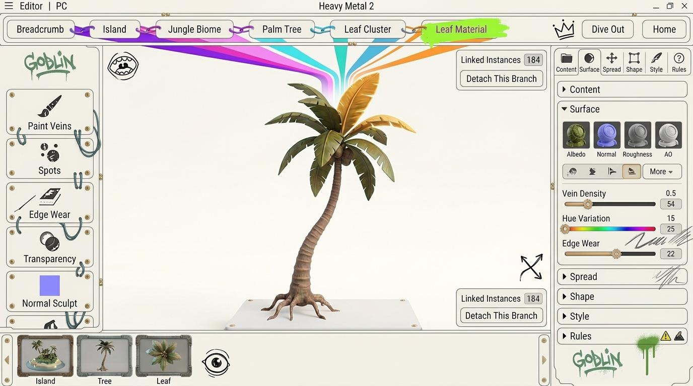

### Purpose

Make movement from world to object, part, material, and texture understandable.

### Layout idea

- Large tactile breadcrumb across the top.
- Current editable object isolated in a neutral stage.
- Parent-context miniatures along the bottom.
- Depth-adaptive brush tools on the left.
- Linked-instance and detach controls remain visible.

### Key interaction

Dive In changes the editor's subject and automatically changes the brush vocabulary. Dive Out returns to the parent while preserving the edited context.

### Why it matters

Recursive editing fails if users become lost. The breadcrumb, parent miniatures, and update ripple communicate both location and consequence.

---

## 04 — 3D Goblin Creator

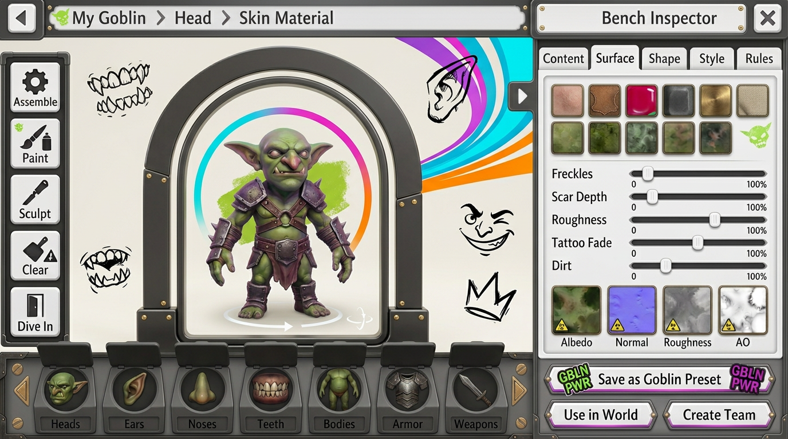

### Purpose

Replace the 2D creator with a full recursive preset workspace specialized for goblins.

### Layout idea

- Large arched workshop mirror containing a rotatable 3D goblin.
- Recessed part wells along the bottom.
- Assemble, Paint, Sculpt, Clear, and Dive In tools on the left.
- Part/material inspector on the right.
- Direct actions for Save as Goblin, Use in World, and Create Team.

### Key interaction

Selecting a body part allows shape sculpting and surface painting. Diving into its material exposes skin, scars, freckles, tattoos, normals, and roughness.

### Why it matters

The goblin creator demonstrates that characters and world assets use the same preset rules without losing a purpose-built character workflow.

---

## 05 — Texture and Material Lab

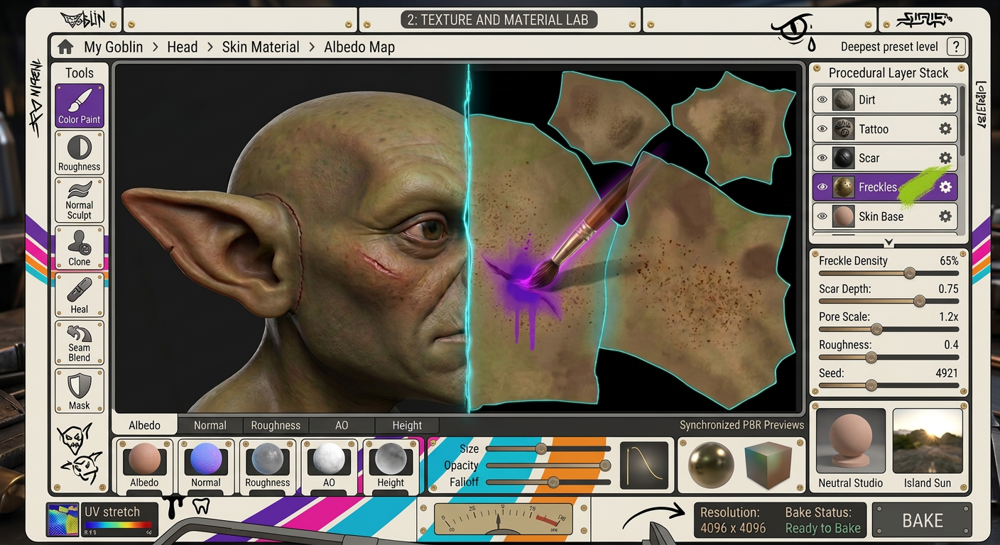

### Purpose

Deepest-level painting of pixels, UVs, procedural layers, and PBR channels.

### Layout idea

- Split 3D model and flat UV canvas.
- Procedural layer stack on the right.
- Channel strip and brush settings below.
- Neutral Studio and Island Sun lookdev previews.
- UV stretch and seam warnings remain visible.

### Key interaction

A brush stroke crosses the 3D model and updates the UV canvas without seams. Users can paint color, roughness, normals, height, masks, and procedural variation.

### Why it matters

The deepest editor needs to feel like the same creative system—not a disconnected external texture application.

---

## 06 — Preset Graph and Dependencies

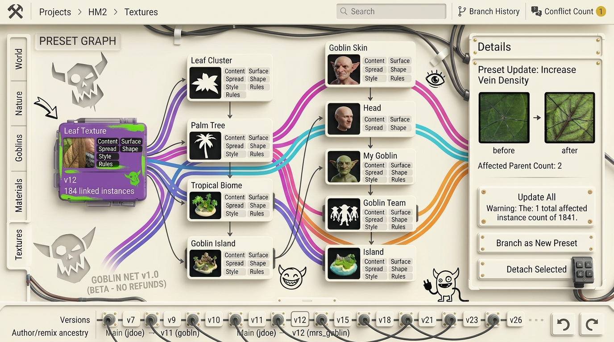

### Purpose

Explain reuse, propagation, branching, versions, and conflicts.

### Layout idea

- Visual dependency graph with rich thumbnail nodes.
- Category filters on the left.
- Selected update and affected parents on the right.
- Version and remix ancestry along the bottom.

### Key interaction

When a shared leaf texture changes, the user chooses Update All, Branch as New Preset, or Detach Selected while seeing every affected parent.

### Why it matters

Automatic recursive updates are powerful but dangerous unless scope and consequences are visible before commitment.

---

## 07 — Local AI Preset Forge

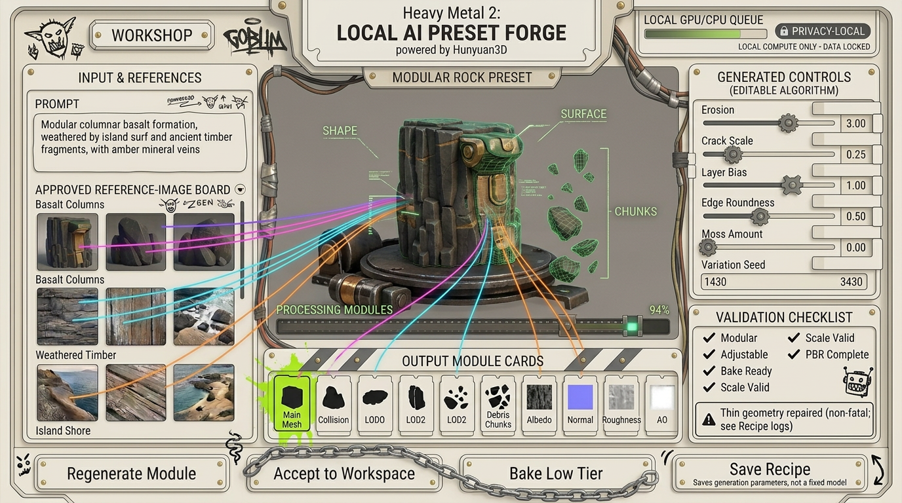

### Purpose

Generate modular, adjustable, bake-ready presets with Hunyuan3D rather than static one-shot meshes.

### Layout idea

- Prompt and approved reference board on the left.
- Large modular preview in the center.
- Generated controls and validation on the right.
- Output cards for mesh, collision, LODs, chunks, and PBR maps below.
- Local compute queue and privacy state remain visible.

### Key interaction

Generation returns a recipe, modules, parameters, PBR channels, LODs, collision, and destruction chunks. The user can modify controls, regenerate one module, or accept the complete preset into a normal workspace.

### Why it matters

The interface makes “editable preset generation” an explicit contract and prevents AI output from being mistaken for a production-ready finished prop.

---

## 08 — Bake, LOD, and Performance workspace

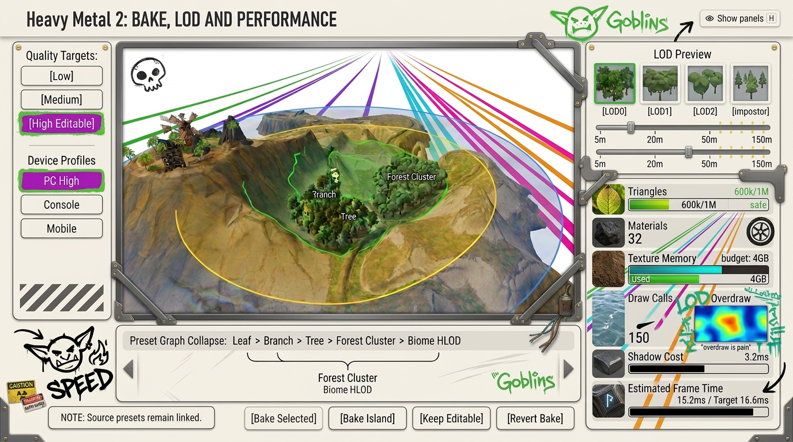

### Purpose

Collapse recursive presets into appropriate runtime representations for different hardware tiers.

### Layout idea

- Island viewport with visible LOD distance rings.
- Device and quality targets on the left.
- Performance budget dashboard on the right.
- Preset-collapse chain and bake controls below.
- Side-by-side LOD0, LOD1, LOD2, and impostor previews.

### Key interaction

The user can keep source presets linked while baking selected branches for Low, Medium, or High Editable targets. Transition handles update estimated frame time immediately.

### Why it matters

Optimization becomes a visual creative workflow rather than an opaque export dialog.

---

## 09 — Preset Library, Share, and Remix

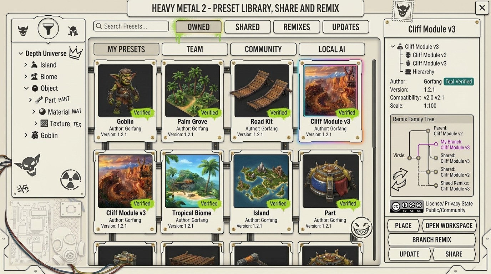

### Purpose

Browse, reuse, branch, update, and share every preset level.

### Layout idea

- Depth taxonomy on the left.
- Visual card grid in the center.
- Detailed dependency/version drawer on the right.
- Owned, Shared, Remixes, and Updates tabs across the top.

### Key interaction

A selected preset can be placed directly, opened in its workspace, branched as a remix, updated, or shared. Compatibility, PBR completeness, LODs, rules, and dependencies are visible before use.

### Why it matters

The library treats community content as a versioned creative lineage instead of a storefront of disconnected assets.

---

## 10 — Compact Adaptive Build mode

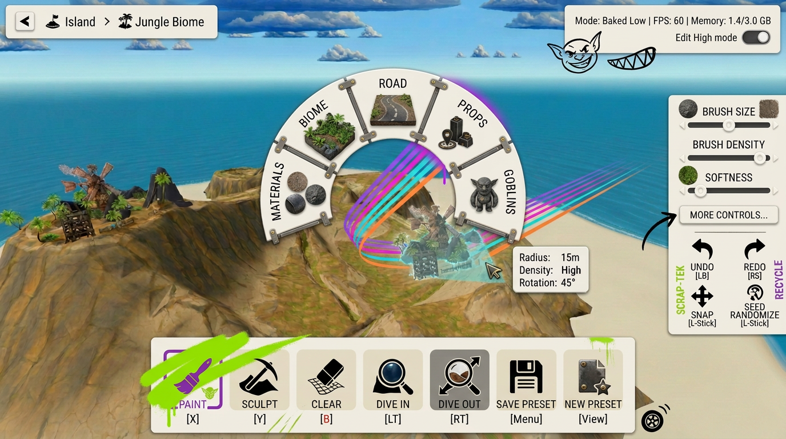

### Purpose

Controller-friendly and lower-compute editing without replacing the full desktop workspace.

### Layout idea

- Nearly full-screen world viewport.
- Seven large actions in the bottom hotbar.
- Hold-to-open radial preset wheel.
- Small context drawer containing only essential parameters.
- Baked/Editable mode and frame budget visible at top-right.

### Key interaction

The same Paint, Sculpt, Clear, Dive In, Dive Out, Save, and New Preset commands work with controller focus. Advanced controls remain available through More rather than permanently occupying screen space.

### Why it matters

The recursive model remains usable on controller and low-end hardware without inventing a second mental model.

---

## Recommended prototype sequence

1. **Recursive Dive navigation** — proves location, context, and adaptive tools.
2. **World Paint workspace** — proves preset placement and Spread controls.
3. **3D Goblin Creator** — proves the same system works for characters.
4. **Texture and Material Lab** — proves editing at maximum depth.
5. **Preset Graph** — proves linked updates, branch, and detach.
6. **Local AI Preset Forge** — integrates modular generation after the preset contract is stable.
7. **Bake/LOD workspace** — validates low/high compute targets.
8. **Library and Remix** — follows after version semantics are reliable.
9. **Compact Build mode** — adapts proven interactions for controller and reduced UI.

## Cross-screen components to prototype once

- `PresetBreadcrumb`
- `AdaptiveToolRail`
- `PresetDimensionTabs`
- `PresetCard` and `PresetShelf`
- `LinkedInstanceBadge`
- `BranchDetachDialog`
- `PbrChannelStrip`
- `ProceduralSlider`
- `BrushCursorHud`
- `QualityStateBadge`
- `BakeBudgetMeter`
- `LodPreviewStrip`
- `ReferenceBoard`
- `PresetValidationChecklist`

## UX questions to validate

- Can users predict what Dive In will select when several nested elements overlap?
- Does changing brush meaning by depth feel powerful or inconsistent?
- Is propagation opt-out or approval-based for shared/community presets?
- How are scene instances pinned to an older preset version?
- Can material painting remain seam-safe after shape sculpting changes UVs?
- Which controls are authored by AI versus generated from schema?
- How much of the preset graph should novice users see?
- What remains editable after each bake tier?
- How does multiplayer identify and transfer exact preset versions?
- How are destructive sculpt changes reconciled with linked presets and saved race state?
