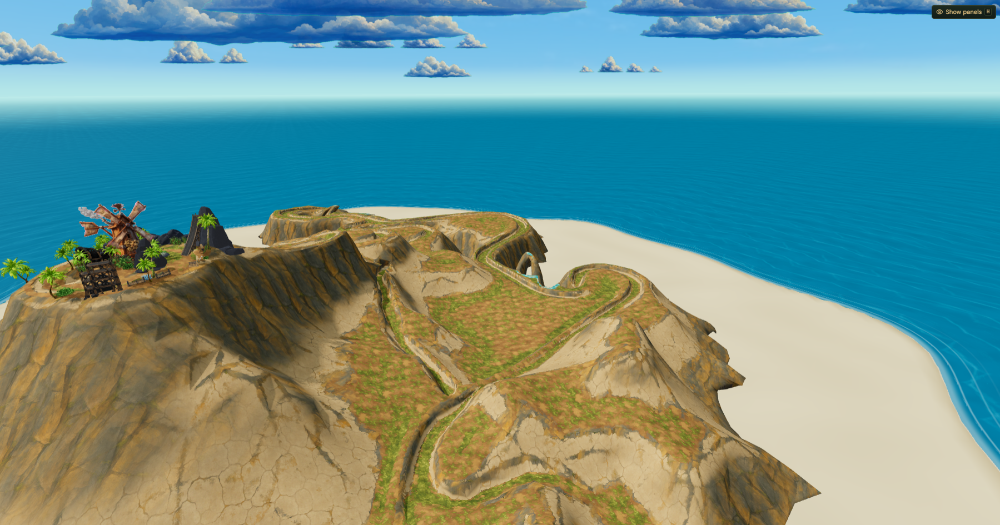
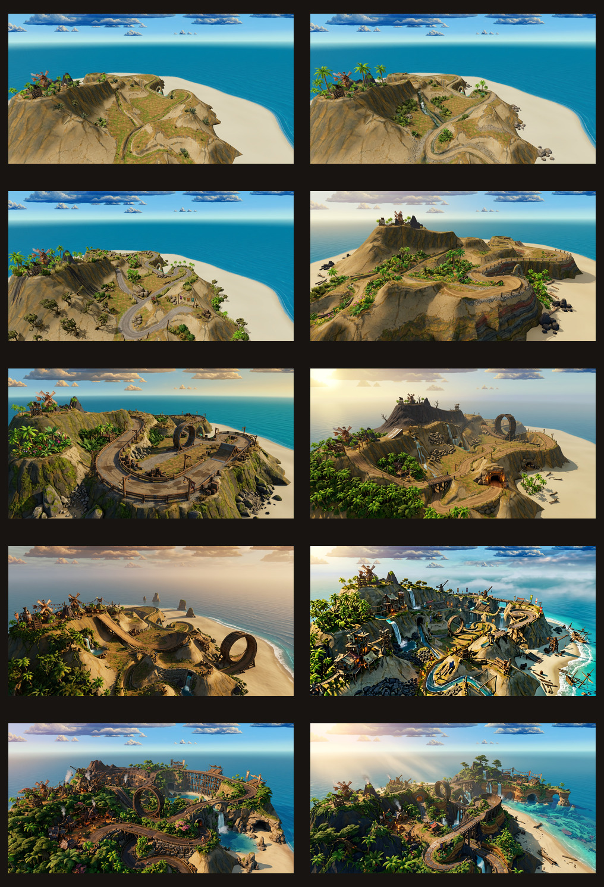
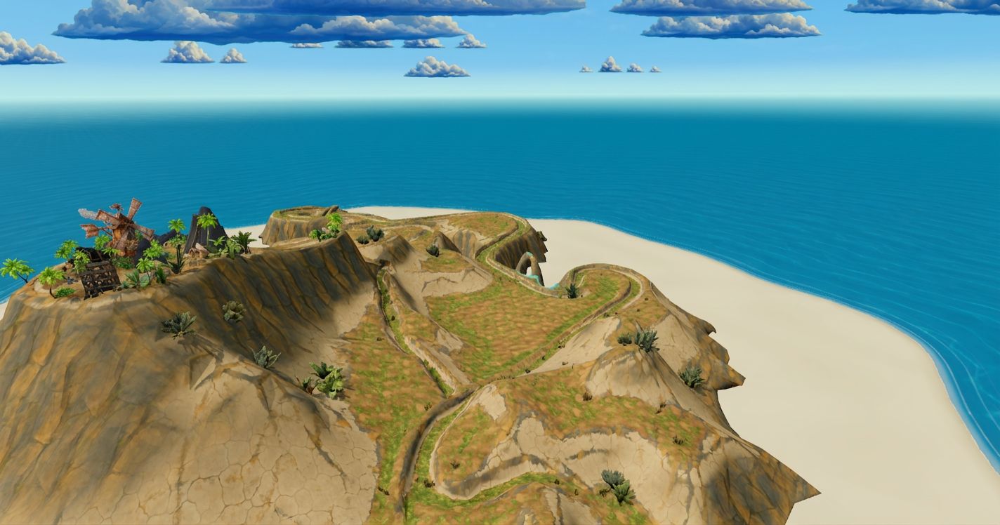
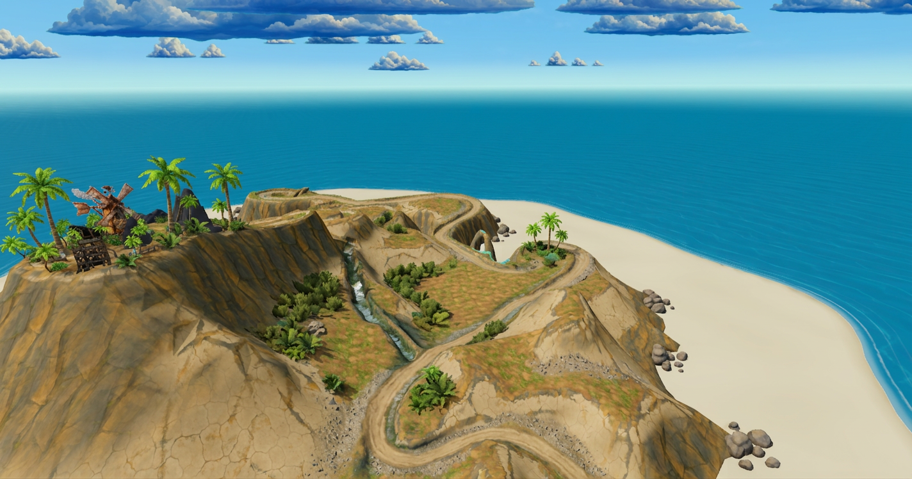
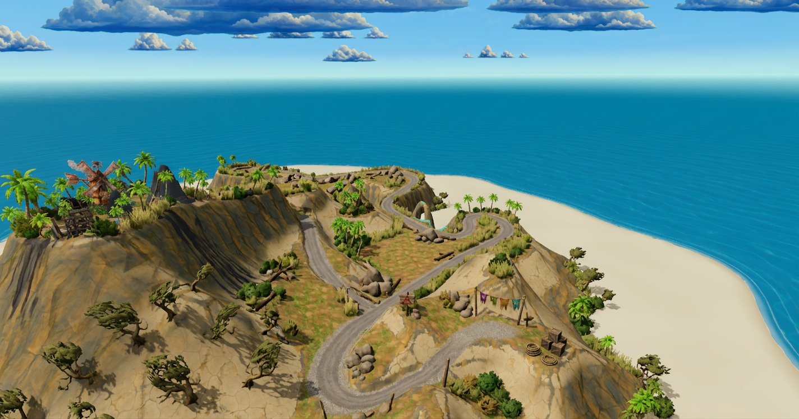
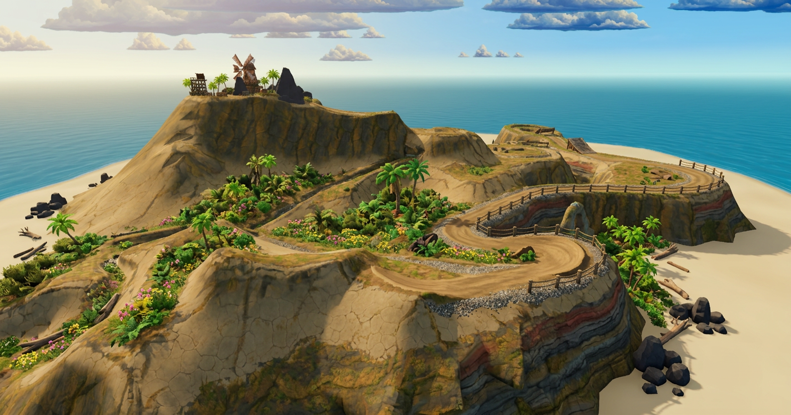
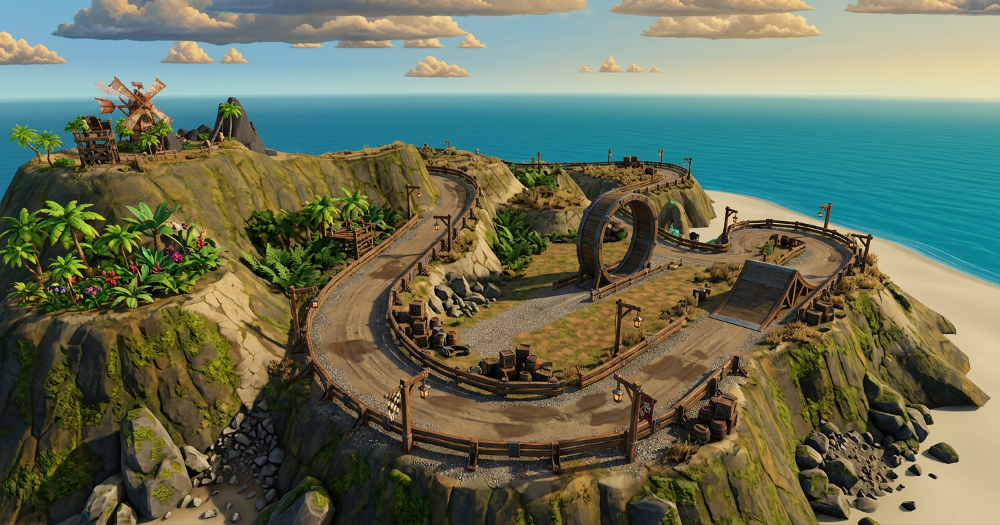
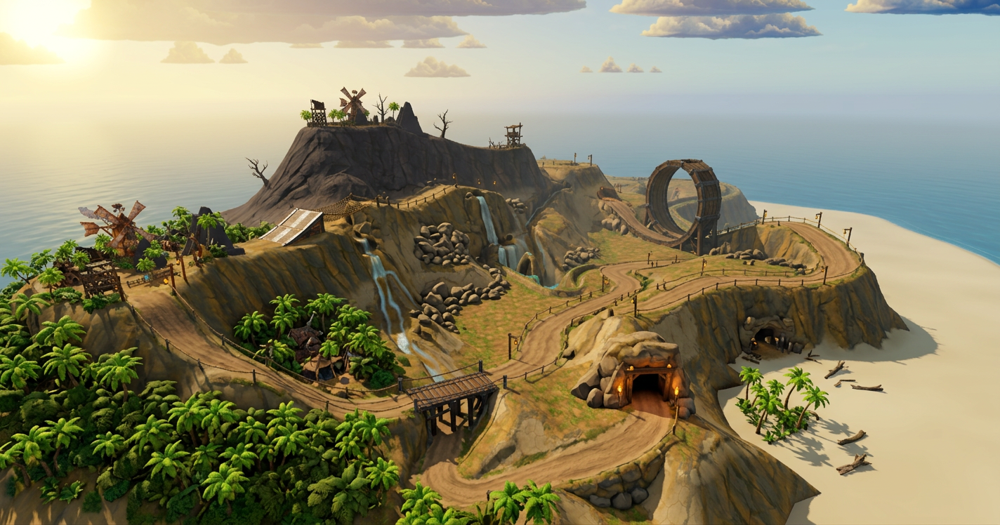
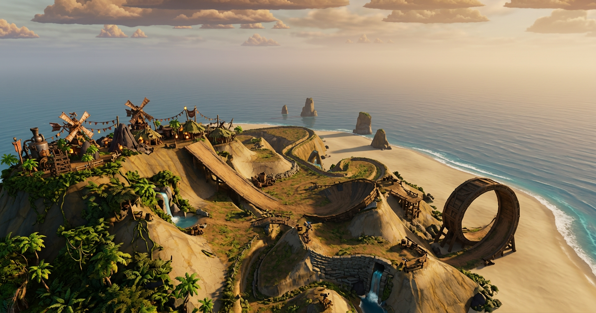

# Island population visual guides — gameplay vantage

See the [high-fidelity environment report](../ISLAND_HIGH_FIDELITY_REPORT.md) for the Variation 08–10 comparison, style-bible gate, Meshy multi-angle reference specification, PBR requirements, and production plan.

Ten paintover directions based on the committed gameplay screenshot [`source-vantage.png`](./source-vantage.png). Every guide uses the same elevated, ocean-facing camera requested by the owner. The sequence deliberately increases in scope: **01** is nearly source-identical with sparse foliage; **10** is a high-fidelity sequel treatment.

## Source vantage

## Escalating visual guide

| Guide | Change level | Main additions |
|---|---:|---|
| 01 | 5% | Sparse foliage only |
| 02 | 12% | Foliage, rocks, scree and damp terrain |
| 03 | 20% | Biome hints and small race props |
| 04 | 30% | Guardrails, restrained ramps and warmer light |
| 05 | 40% | Stronger biomes, decor, launch ramp and compact loop |
| 06 | 52% | Three zones, outposts, trestle, loop and tunnel |
| 07 | 64% | Roads rooted into terrain, bridges and multiple stunt beats |
| 08 | 76% | Dense adventure world, settlement dressing and richer materials |
| 09 | 88% | Near-sequel production design and cinematic atmosphere |
| 10 | 100% | Full next-version fidelity and spectacle |

## Prompts

Use `source-vantage.png` as the image reference for each prompt.

### 01 — Foliage-only preservation pass

> Create variation 1 of an escalating environment-art paintover series using the supplied wide oblique island screenshot as the exact base and vantage point. Preserve the camera position, horizon, ocean, cloud arrangement, island silhouette, visible winding road, windmill compound, ramp, terrain geometry, colors, and lighting as closely as possible. Make only one restrained change: add sparse stylized tropical foliage in believable empty pockets away from the road—small palm clusters around the existing windmill settlement, a few shrubs in protected rock cracks, and tiny grass tufts along selected shoulders. Keep every racing sightline and road width clear. No new structures, no route changes, no labels, no arrows, no border, no UI. It should look virtually identical to the source at first glance, simply less barren.

### 02 — Natural dressing pass

> Create variation 2 of an escalating environment paintover from the supplied wide oblique island screenshot, matching its exact elevated camera, horizon, composition, island shape, road layout, windmill, ocean, and stylized game-art direction. Add modest natural dressing: irregular palm groups around the settlement and sheltered low ground, scrub and ferns in gullies, small boulder clusters at cliff feet, scree blending a few road shoulders into terrain, and subtle darker damp rock near exposed water channels. Do not alter the track path or major terrain. Keep additions sparse, asymmetrical, and gameplay-readable. No text, arrows, callouts, UI, or frame.

### 03 — Light decor and texture pass

> Create variation 3 of an escalating visual guide by painting directly over the supplied wide perspective game screenshot. Preserve the identical camera vantage, horizon, windmill landmark, island silhouette, and visible road centerline. Add medium-light environmental population: palms concentrated near the settlement and water-facing shelves, hardy wind-bent trees on lower slopes, bushes and grasses defining elevation bands, rocks and fallen timber beside but never on the race line, and a few tiny goblin-made props such as crates, rope posts, pennants, and warning markers at turns. Slightly improve terrain texture with gravel shoulders, patchy moss, cracked earth, and dark runoff streaks. Lighting stays essentially unchanged. No labels, arrows, or infographic markings.

### 04 — Restrained gameplay dressing

> Create variation 4 in an escalating island-improvement paintover using the exact wide oblique vantage of the supplied screenshot. Preserve the horizon, ocean, clouds, windmill settlement, recognizable route, and major terrain. Add a planned but restrained gameplay-decor layer: denser foliage clusters in non-drivable pockets; palms, ferns, scrub, driftwood, basalt boulders, and flower patches; timber railings and rope fencing only at dangerous outer bends; one small wooden launch ramp on a broad distant straight and one subtle banked dirt ramp integrated into an existing curve. Add gravel and scree transitions at track edges, richer cliff strata, moss in shade, and gentle warm sunlight from upper left. Clean stylized game look, no words, arrows, labels, border, or UI.

### 05 — Midpoint biome and stunt pass

> Create variation 5, the midpoint of an escalating environment redesign, as a polished paintover from the exact attached wide island vantage. Retain the same camera, horizon, windmill, island shape, and primary winding road. Populate roughly half the barren negative space with coherent biomes: lush palms and broadleaf plants near the settlement and sheltered coast, fern gullies, dry scrub on exposed slopes, moss and lichen on shaded basalt, varied rocks and scree at cliffs. Add tasteful goblin-racing decor—timber guardrails, iron braces, crates, flags, lantern poles, and small spectator platforms—and two integrated stunt elements visible from this camera: a launch ramp on the right-side route and a compact timber loop in a roomy mid-distance section with safe approach and exit. Add road wear, packed dirt, gravel shoulders, damp patches, and warmer directional light with soft ambient shadows. No annotations or UI.

### 06 — Zoned environment upgrade

> Create variation 6 of an escalating next-pass visual guide from the supplied wide oblique island screenshot. Preserve the exact camera and horizon plus the broad island silhouette, windmill landmark, and route identity, while allowing moderate terrain and set-dressing upgrades. Establish three visible zones: lush coastal and settlement growth, rugged ochre mid-slope, dark volcanic high cliffs, with blended transitions. Add clustered palms, jungle understory, dead trees on high rock, boulder fields, waterfalls and runoff stains, driftwood, rope spans, guardrails, lanterns, and small goblin outposts. Enhance the road with a reinforced jump ramp, timber-and-iron vertical loop in the middle distance, short raised trestle, and rock tunnel entrance, all clearly connected. Increase texture fidelity and add golden upper-left sun, soft shadows, ambient occlusion, and light atmospheric haze. No diagram overlay or UI.

### 07 — Integrated terrain and structure pass

> Create variation 7 in an escalating high-quality island concept series from the exact wide cinematic vantage of the supplied screenshot. Keep the horizon, ocean framing, windmill settlement, recognizable island silhouette, and serpentine route, but substantially enrich the world. Sculpt roads into terrain with cuttings, embankments, scree shoulders, cliff retaining walls, timber trestles, and bridges. Add lush coastal vegetation, irregular palm canopies, ferns and vines, dry highland shrubs, volcanic rocks, sea stacks, wet sand, small waterfalls, goblin huts, machinery, pennants, lanterns, crates, and overlook platforms. Add coherent stunt beats visible in perspective: a broad launch ramp, banked switchback, timber loop, and short canyon jump with believable approaches and rails. Upgrade materials and sunset-gold lighting with richer shadows and distance haze while retaining stylized game readability. No text, arrows, UI, or callouts.

### 08 — Ambitious near-sequel pass

> Create variation 8, an ambitious near-sequel environment paintover based on the supplied wide oblique island screenshot, keeping exactly the same camera position, horizon line, and overall composition. Keep the original silhouette, windmill landmark, and route flow recognizable, but redesign empty areas into a dense authored adventure-racing world. Add layered tropical biomes, palm groves, cliff vines and ferns, windswept summit growth, basalt fields, waterfalls, caves, shoreline foam, shipwreck debris, goblin settlements, cranes, watchtowers, rope spans, grandstands, lamps, and banners. Evolve the track into integrated stone cuttings, timber trestles, cliff bridges and tunnels. Include two ramps, a timber-and-iron loop, corkscrew-like banked bend, and dramatic gap jump while preserving a continuous route. Apply richer PBR-like texture, surface wear, warm cinematic upper-left sun, cool turquoise bounce, fog, and strong contact shadows. No labels or UI.

### 09 — Production sequel pass

> Create variation 9, one step below a full sequel, using the supplied screenshot as a strict wide perspective and camera reference. Retain its horizon, ocean, cloud bands, windmill settlement, recognizable winding route, and island outline while greatly increasing environmental storytelling and fidelity. Build a spectacular volcanic tropical race venue: dense layered foliage with varied canopy heights, rugged beaches and lagoons glimpsed beyond cliffs, lava-dark summit rock, waterfalls and streams, sea caves and arches, detailed goblin workshops, huts, mine gear, cranes, bridges, grandstands, flags, and warm practical lights. Re-engineer the road with realistic carved shoulders, retaining structures, patches, and tire wear. Add a giant iron-and-timber loop, integrated ramps, corkscrew descent, cliff jump, tunnel, and elevated trestle with clear route connections. Use high-end stylized materials, cinematic late-afternoon lighting, volumetric haze and cloud shadows. No overlay, labels, border, or UI.

### 10 — Full next-version pass

> Create variation 10, the maximum-change final image, using the supplied screenshot as a strict camera and composition reference: preserve the same wide elevated vantage, horizon, ocean framing, main island silhouette, windmill location, and recognizable serpentine route. Visualize the next major version of the game at dramatically higher fidelity. Create a premium AAA stylized environment with dense art-directed tropical ecosystems, hero palms, vines, ferns, flowers, windswept highland trees, volcanic basalt and ochre strata, waterfalls, mist, wet beaches, turquoise shallows in the distance, caves and sea arches. Turn the route into an epic integrated goblin racing complex with carved rock roads, timber trestles, iron bridges, tunnels, giant loop, corkscrew, banked walls, multiple jump ramps, gap jumps, metal inlays, guardrails, workshops, huts, cranes, spectator stands, banners, lanterns, smoke, and tiny story props. Root every structure into terrain with scree and vegetation. Use richly detailed PBR-quality weathered surfaces, warm low sun from upper left, cool sky fill, volumetric god rays, atmospheric perspective, contact shadows, and cinematic color grading. Keep the race line readable. No words, arrows, labels, legend, border, or UI.

